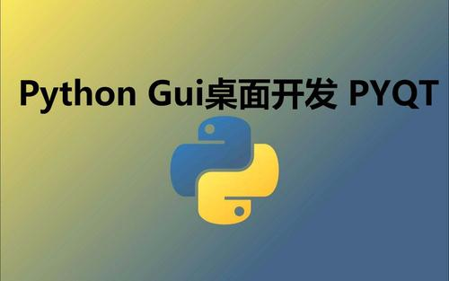

#### PyQt5基础
<hr>

##### 1. GUI编程学什么
( 1 ) 大致了解你所选择的 GUI 库

( 2 ) 基本的程序的结构：使用这个 GUI 库来运行你的 GUI 程序

( 3 ) 各种控件的特性和如何使用

( 4 ) 控件的样式

( 5 ) 资源的加载

( 6 ) 控件的布局

( 7 ) 事件和信号

( 8 ) 动画特效

( 9 ) 界面跳转

( 10 ) 设计工具的使用
<hr>

##### 2. PyQt5是什么
QT 是跨平台 C++ 库的集合，它实现高级 API 来访问现代桌面和移动系统的许多方面。这些服务包括 <font>定位服务，多媒体，NFC和蓝牙连接，基于 Chromium 的 web 浏览器以及传统的UI开发等。</font>PyQt 就是对 QT 库 Python 的绑定。PyQt 可以嵌入在基于 C++ 的应用程序中，以允许这些应用程序的用户配置或增强这些应用程序的功能。
<hr>

##### 3. PyQt5的优势
( 1 ) 简单好用

( 2 ) 功能强大

( 3 ) 跨平台支持

( 4 ) 性能高

( 5 ) 文档齐全：PyQt 本身就是对 QT 库 Python 的绑定，<font>绑定的时候保持了原有的QT库的API</font>。也就是说，PyQt 除了自己的文档外，也几乎可以通用 QT 文档。

( 6 ) 稳定性高：<font>面向对象、信号与槽的机制、界面设计与业务代码完全隔离</font>

( 7 ) 生态支持：Qt Designer 进行图形界面设计、ui 转换成 py 文件、资源处理

( 8 ) 开源免费：PyQt 是双重许可的，开发人员可以在 GPL 和商业许可之间进行选择。采用 GPL 协议，软件著作权属于开发者所有，受国际相关版权法保护，<font>允许其他用户对原作者软件进行复制和发行，可以更改后发行自己的软件</font>。
<hr>

##### 4. 开发环境的安装
首先是 Python3 环境和 PyCharm 开发工具的安装，由于比较简单，这里不再赘述！然后就是 GUI 开发环境的安装，即安装我们的 PyQt5 库。下面是在 Python 的虚拟环境中安装 PyQt5，

( 1 ) 在 Python 全局环境中安装 pipenv：
```python
$ pip3 install pipenv -i https://pypi.tuna.tsinghua.edu.cn/simple
```
( 2 ) 创建并进入项目目录
```python
$ mkdir pyqt5-pro && cd pyqt5-pro
```
( 3 ) 创建虚拟环境：
```python
$ pipenv --three
```
( 4 ) 激活虚拟环境(激活环境后会自动创建Pipfile文件)：
```python
$ pipenv shell
```
( 5 ) 将源改为国内源加速下载，url 换成 “https://pypi.tuna.tsinghua.edu.cn/simple”：
```python
(pyqt5-pro) $ vim Pipfile
```
( 6 ) 安装 pyqt5 库
```python
(pyqt5-pro) $ pipenv install pyqt5
```
这个时候我们使用 Pycharm 打开这个项目文件夹：


可以从设置中看到该项目依赖的Python环境：


<hr>

##### 5. 第一个PyQt5桌面应用
创建一个窗口，在窗口中显示文本信息：
```python
from PyQt5.Qt import *
import sys

if __name__ == '__main__':
    # 创建QApplication类的实例
    app = QApplication(sys.argv)
    # 创建一个窗口
    window = QWidget()
    # 设置窗口标题
    window.setWindowTitle('Hello World!')
    # 设置窗口尺寸
    window.resize(400, 400)
    # 移动窗口位置
    window.move(1000, 300)
    # 创建label控件
    label = QLabel(window)
    # 为控件设置文本
    label.setText('Hello World!')
    # 移动空间的位置
    label.move(160, 160)
    # 显示窗口
    window.show()
    # 进入程序的主循环，并通过exit函数确保主循环安全结束
    sys.exit(app.exec_())
```
效果图：


<hr>

#### QtDesigner
<hr>

##### 1. 安装和配置
安装 Qt 的工具包：
```python
$ pip install PyQt5-tools -i https://pypi.douban.com/simple
```
安装完成后，QTdesigner 就在你的 python 环境下的扩展包里面了!

将 QtDesigner 集成到 Pycharm：


<hr>

##### 2. 快速入门
可以通过配置好的PyCharm扩展工具直接打开 QTDesigner：


简单介绍 QTDesigner 几个主要部分：


Ctrl+S 将其保存到项目根目录：


<hr>

##### 3. 将ui文件转换成py文件
( 1 ) 第一种方法：
```python
$ python -m PyQt5.uic.pyuic demo.ui -o demo.py
```
( 2 ) 第二种方法：
```shell
$ pyuic5 demo.ui -o demo.py
```
( 3 ) 第三种方法：

使用 **`$ which python`** 命令查看当前的 Python 路径：
```python
/home/thanlon/.local/share/virtualenvs/pyqt5-pro-ihgfaRRJ/bin/python
```
把上面的路径加入到 Program 中，然后再把下面命令相关的参数加入到 Arguments 中：
```python
-m PyQt5.uic.pyuic $FileName$ -o $FileNameWithoutExtension$.py
```
最后把下面的内容加入到 Working directory 中：
```python
$FileDir$
```


<hr>

##### 4. 水平布局
使用水平布局的方式在 QtDesigner 中做一些简单的操作，如下图所示：


将 <kbd>.ui</kbd> 文件转换成 <kbd>.py</kbd> 文件后新建 RunMainWinHorizontalLayout.py 文件用来运行转换之后的文件：
<br><br>
```python
import sys
import MainWinHorizontalLayout
from PyQt5.QtWidgets import QApplication, QMainWindow

if __name__ == '__main__':
    # 创建QApplication类的实例
    app = QApplication(sys.argv)
    # 创建一个主窗口
    mainWindow = QMainWindow()
    # 创建Ui_MainWindow的实例
    ui = MainWinHorizontalLayout.Ui_MainWindow()
    # 调用setupUi在指定窗口(主窗口)中添加控件
    ui.setupUi(mainWindow)
    # 显示窗口
    mainWindow.show()
    # 进入程序的主循环，并通过exit函数确保主循环安全结束
    sys.exit(app.exec_())
```
最终的效果图：

<hr>

##### 5. 垂直布局
使用垂直布局的方式在 QtDesigner 中了做一些简单的操作，如下图所示：


将 <kbd>.ui</kbd> 文件转换成 <kbd>.py</kbd> 文件后新建 RunMainWinVerticalLayout.py 文件用来运行转换之后的文件：
<br><br>
```python
import sys
import MainWinVerticalLayout
from PyQt5.QtWidgets import QApplication, QMainWindow

if __name__ == '__main__':
    # 创建QApplication类的实例
    app = QApplication(sys.argv)
    # 创建一个主窗口
    mainWindow = QMainWindow()
    # 创建Ui_MainWindow的实例
    ui = MainWinVerticalLayout.Ui_MainWindow()
    # 调用setupUi在指定窗口(主窗口)中添加控件
    ui.setupUi(mainWindow)
    # 显示窗口
    mainWindow.show()
    # 进入程序的主循环，并通过exit函数确保主循环安全结束
    sys.exit(app.exec_())
```
最终的效果图：


<hr>

##### 6. 同时使用水平布局和垂直布局
“姓名” 和 “薪资” 两行都使用水平布局，“备注+文本框” 和它们一起使用垂直布局：


将 <kbd>.ui</kbd> 文件转换成 <kbd>.py</kbd> 文件后新建 RunMainWinHVLayout.py 文件用来运行转换之后的文件：
<br><br>
```python
import sys
import RunMainWinVHLayout
from PyQt5.QtWidgets import QApplication, QMainWindow

if __name__ == '__main__':
    # 创建QApplication类的实例
    app = QApplication(sys.argv)
    # 创建一个主窗口
    mainWindow = QMainWindow()
    # 创建Ui_MainWindow的实例
    ui = RunMainWinVHLayout.Ui_MainWindow()
    # 调用setupUi在指定窗口(主窗口)中添加控件
    ui.setupUi(mainWindow)
    # 显示窗口
    mainWindow.show()
    # 进入程序的主循环，并通过exit函数确保主循环安全结束
    sys.exit(app.exec_())
```

<hr>

##### 7. 栅格布局
下面是使用栅格布局设计的：


将 <kbd>.ui</kbd> 文件转换成 <kbd>.py</kbd> 文件后新建 RunMainWinGridLayout.py 文件用来运行转换之后的文件：
<br><br>
```python
import sys
import MainWinGridLayout
from PyQt5.QtWidgets import QApplication, QMainWindow

if __name__ == '__main__':
    # 创建QApplication类的实例
    app = QApplication(sys.argv)
    # 创建一个主窗口
    mainWindow = QMainWindow()
    # 创建Ui_MainWindow的实例
    ui = MainWinGridLayout.Ui_MainWindow()
    # 调用setupUi在指定窗口(主窗口)中添加控件
    ui.setupUi(mainWindow)
    # 显示窗口
    mainWindow.show()
    # 进入程序的主循环，并通过exit函数确保主循环安全结束
    sys.exit(app.exec_())
```

<hr>

##### 8. 表单布局
下面是使用表单布局设计的：


将 <kbd>.ui</kbd> 文件转换成 <kbd>.py</kbd> 文件后新建 RunMainWinFormLayout.py 文件用来运行转换之后的文件：
<br><br>
```python
import sys
import MainWinFormLayout
from PyQt5.QtWidgets import QApplication, QMainWindow

if __name__ == '__main__':
    # 创建QApplication类的实例
    app = QApplication(sys.argv)
    # 创建一个主窗口
    mainWindow = QMainWindow()
    # 创建Ui_MainWindow的实例
    ui = MainWinFormLayout.Ui_MainWindow()
    # 调用setupUi在指定窗口(主窗口)中添加控件
    ui.setupUi(mainWindow)
    # 显示窗口
    mainWindow.show()
    # 进入程序的主循环，并通过exit函数确保主循环安全结束
    sys.exit(app.exec_())
```
右键选择布局的时候选择 “在窗体布局中布局”。


<div style="width: 60px;height: auto;z-index: 99;bottom: 30%;position: fixed;right: 0px" id="plug-ins">
    <div style="position: relative;float: right">
        <a target="" href="javascript:;" id="weibo"
           style="display: block;width: 40px;height: 40px;background-color: #c4351b;margin-top: 1px;">
            
        </a>
         <a target="_blank" href="http://sighttp.qq.com/authd?IDKEY=5838160dbeb2a49f264d5e2d13d6336248d74a60cf56ecad" id="qq" style="display: block;width: 40px;height: 40px;background-color:#0e91e8;margin-top: 1px">
            
        </a>
        <a href="javascript:" id="wechat"
           style="display: block;width: 40px;height: 40px;background-color:#01b901;margin-top:1px">
            
        </a>
        <a href="javascript:" id="go_top"
           style="display: none;width: 40px;height: 40px;background-color: #b5b5b5;margin-top: 1px">
            
        </a>
    </div>
</div>
<div style="width: auto;height: auto;z-index: 99;position: fixed;left: 0;bottom: 0;" id="support_us" hidden="hidden">
        <div id="alipei_and_wechat">
            <button type="button" class="close"><span aria-hidden="true">&times;</span></button>
            <br>
            
        </div>
</div>