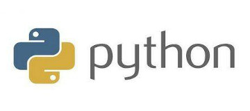

#### Python

##### 简介
Python 是一种跨平台的计算机程序设计语言，是一个高层次的结合了解释性、编译性、互动性和面向对象的脚本语言。最初被设计用于编写自动化脚本 ( shell )，随着版本的不断更新和语言新功能的添加，越多被用于独立的大型项目的开发。

##### 语言风格
Python 在设计上坚持了清晰划一的风格，这使得 Python 成为一门易读、易维护，并且被大量用户所欢迎的、用途广泛的语言。Python 的作者有意的设计限制性很强的语法，使得不好的编程习惯都不能通过编译。其中很重要的一项就是 Python 的缩进规则。

##### 语言特点
优点是：解释性的语言、语法简洁、具有动态特性、可移植性强、面向对象编程、开源、具有可扩展性和可嵌入性、有丰富的社区资源、有很多实用性很强的库 ( 机器学习库、web开发库、科学计算库等 )，可以做很多事情。
缺点是：相较于 C 和 C++ 运行会慢一些等

##### 应用领域
Python 是一种解释型脚本语言，可以应用于以下领域：Web开发、桌面界面开发、网络爬虫、人工智能……

    

        
       
        
        
    

<!--双11 start-->

        

            <button type="button" class="close" style="position: absolute;right: 5px;top: 0;font-size: 28px;opacity: 1;color: white">&times;</button>
              
            
        

<!--双11 stop-->
<!--左侧广告栏start-->

  

    

    
    <!--Vertical-->
    <ins class="adsbygoogle"
         style="display:block"
         data-ad-client="ca-pub-6937898095875663"
         data-ad-slot="2927491642"
         data-ad-format="auto"
         data-full-width-responsive="true"></ins>
    
  

<!--左侧广告栏stop-->
<!--右侧广告栏start-->

  

    

    
    <!--Vertical-->
    <ins class="adsbygoogle"
         style="display:block"
         data-ad-client="ca-pub-6937898095875663"
         data-ad-slot="2927491642"
         data-ad-format="auto"
         data-full-width-responsive="true"></ins>
    
  

<!--右侧广告栏stop-->
