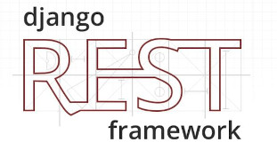
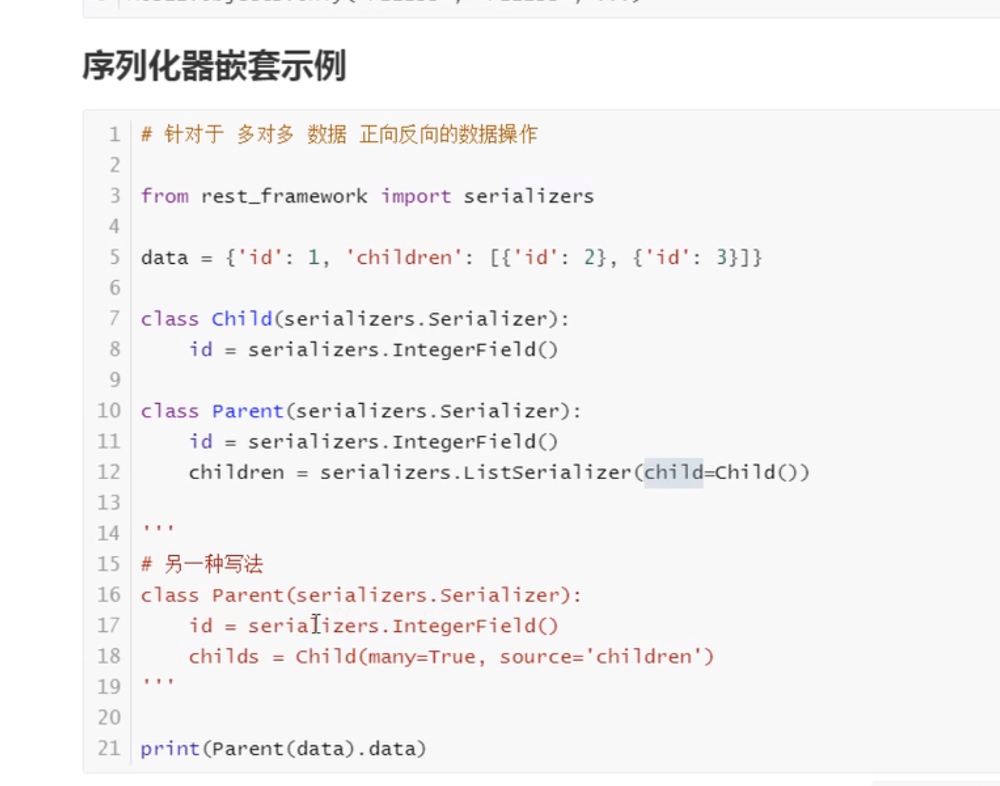

#### RESTful API
<hr>

##### 1. Django实现RESTful API
原来的接口开发是：对于一条数据信息，如订单信息，要写四个 url。如果对多表进行增删改查，就会有更多的 url，很显然这是不够简洁的。
```py
urlpatterns = [
    path('add_order/', views.add_order),
    path('del_order/', views.del_order),
    path('update_order/', views.update_order),
    path('get_order/', views.get_order),
]
def add_order(request):
    return HttpResponse('')

def del_order(request):
    return HttpResponse('')

def update_order(request):
    return HttpResponse('')

def get_order(request):
    return HttpResponse('')
```
如果我们对于一条数据进行增删改查只用一个 url，就简便的多。restful 中有这样一个规范：<font>对于一条数据使用一个url。</font> 逻辑部分，可以根据方法的不同来区分不同的请求操作。下面是遵循 resful 这条规范根据 FBV 来写的实例：
```py
urlpatterns = [
    path('order/', views.order),
]

def order(request):
    '''
    # 根据请求方法的不同做不同的操作
    :param request:
    :return:
    '''
    if request.methos == 'GET':
        return HttpResponse('获取订单')
    if request.methos == 'POST':
        return HttpResponse('创建订单')
    if request.methos == 'PUT':
        return HttpResponse('更新订单')
    if request.methos == 'DELETE':
        return HttpResponse('删除订单')
```
下面是基于 CBV 来实现的：
```py
urlpatterns = [
    path('order/', views.OrderView.as_view()),
]

def OrderView(View):
    def get(request, *args, **kwargs):
        return HttpResponse('获取订单')

    def post(request, *args, **kwargs):
        return HttpResponse('创建订单')

    def put(request, *args, **kwargs):
        return HttpResponse('更新订单')

    def delete(request, *args, **kwargs):
        return HttpResponse('删除订单')
```
><font>推荐使用CBV来实现</font>

##### 2. RESTful API协议
( 1 ) API 与用户的通信协议，总是使用 HTTPS 协议

( 2 ) 域名规范
```js
https://api.bysj39.com：子域名方式，如同时使用www.bysj39.com和https://api.bysj39.com，就可能存在跨域问题，浏览器会阻止不同域名
https://www.bysj39.com/api/：url方式，同一个域名只是url不同
```
( 3 ) 版本：可能存在版本共存
```js
URL：如https://api.bysj39.com/v1或https://www.bysj39.com/api/v1/
请求头：跨域时，引发发送多次请求
```
( 4 ) 路径：视网络上的任何东西都是资源，均使用名词表示(可以是名词复数)
```py
https://api.bysj39.com/v1/order/或https://www.bysj39.com/api/v1/order/
https://api.bysj39.com/v1/orders/或https://api.bysj39.com/api/v1/order/
```
><font>面向资源编程：把网络上的任何东西都认为是资源，可以对这些资源进行增删改查</font>

><font>面向切面编程：通过预编译方式和运行期动态代理实现程序功能的统一维护的一种技术</font>

( 5 ) method：根据请求方法的不同做不同的操作
```py
GET：从服务器取出资源(一项或多项)
POST：从服务器新建资源
PUT：在服务器更新资源，但更新的是全部资源
PATHC：在服务器更新资源，但更新的是局部资源
DELETE：从服务端删除资源
```
( 6 ) 过滤：通过在 url 上传参的形式传递搜索的条件
```py
https://www.bysj39.com/api/v1/order?limit=10：指定返回记录的数量
https://www.bysj39.com/api/v1/order?offset=10：指定返回记录的开始位置
https://www.bysj39.com/api/v1/order?page=2&per_page=100：指定第几页以及每页的记录数
https://www.bysj39.com/api/v1/order?sortby=name&order=asc：指定返回结果按照哪个属性排序，以及排序顺序
```
( 7 ) 状态码：可以写状态码给用户做提示，但状态码是远远不够的，一般还需要自定义 code。code 和状态码可以一块使用，但是一般我们写 code 就可以了。
```js
200系列：表示成功的状态码
200 OK：服务器成功返回用户请求的数据
201 CREATED：用户新建或修改数据成功
202 Accepted：一个请求已经进入后台排队(异步任务)
300系列：重定向的
301永久性重定向和
302临时性重定向
400系列：客户端的错误
400 INVALID REQUEST：用户发送的请求是有错误的，服务器没有新建或修改数据的操作
401 Unauthorized：用户没有权限（令牌、用户名或密码错误）
403 Forbidden：
404 NOT FOUND：用户发送的请求针对的是不存在的记录，服务器没有进行操作
406 Not Accepted：用户请求的格式是不可以被服务器接受的（比如用户请求json格式	，但是只有xml格式）
410 Gone：用户请求的资源被永久删除，且不会再得到的
422 Unprocesable entity：当创建一个对象时，发生一个验证错误
500 INTERNAL SEWRVER ERROR：服务器发生错误，用户无法判断发出的请求是否成功
```
><font>公司里写 api 的时后需要问清楚是用状态码写还是使用 code</font>

( 8 ) 错误处理，状态码是 4xx 的时后应返回错误信息，error 当作 key
```py
{
	error：'Invalid API Key' # 当然，也可以不用error作为key，自定义
}
```
( 9 ) 返回结果：针对不同的操作，服务器向用户发返回的结果应该符合以下规范
```py
GET /order/：返回资源对象的列表
GET /order/1：返回单个资源对象
POST /order/：返回新生成的资源对象
PUT /order/1/：返回完整的资源对象
PATCH /order/1/：返回局部的资源对象
DELETE /order/1/：返回一个空文档
```
( 10 ) Hypermedia API，API 最好做到 Hypermedia，即返回结果提供链接，连向其它 API 方法，使得用户不查文档，也知道下一步应该做什么。
```py
/order/
[
	{
		id:1,
		name:'耳机'，
		url:http://www.bysj39.com/1/	
	},
	{
		id:2,
		name:'音响'，
		url:http://www.bysj39.com/2/	
	},
]
这样就不用再去拼接url:http://www.bysj39.com/1/去请求详细数据了。
```
><font>RESTful 定义了很多规范，但我们应该视项目情况而定，如根据真实的应用场景来定，要灵活地改变。</font>

<hr>

##### 3. RESTful的理解
它本质上是一些规范，比如规范中的 url，可以让我们在写API的时候更好做区分、更容易让后台处理，并且让前端容易记住这些 url。谈谈自己的理解就可。要对使用 RESTful 之前和使用 RESTful 之后的效果做对比，理解着去回答。
<hr>

#### API开发
<hr>

##### 1. 获取数据的接口
获取所有的字段：
```py
from rest_framework import views, serializers, response
from .. import models

class UserSerializer(serializers.ModelSerializer):
    class Meta:
        model = models.User
        fields = "__all__"

class User(views.APIView):
    def get(self, request):
        qs = models.User.objects.all()
        serializer = UserSerializer(qs, many=True)
        return response.Response({
            'status': 0,
            'data': serializer.data
        })
```


获取部分字段：
```py
from rest_framework import views, serializers, response
from .. import models

class UserSerializer(serializers.ModelSerializer):
    class Meta:
        model = models.User
        fields = ('id', 'name') # 只需要修改这里

class User(views.APIView):
    def get(self, request):
        qs = models.User.objects.all()
        serializer = UserSerializer(qs, many=True)
        return response.Response({
            'status': 0,
            'data': serializer.data
        })
```

获取单条数据：
```py
from rest_framework import views, serializers, response
from .. import models

class UserSerializer(serializers.ModelSerializer):
    class Meta:
        model = models.User
        fields = ('id', 'name')

class User(views.APIView):
    def get(self, request):
        qs = models.User.objects.all()
        serializer = UserSerializer(qs.first(), many=False)  # 默认是False，修改这里
        return response.Response({
            'status': 0,
            'data': serializer.data
        })
```

<hr>

##### 2. 添加数据的接口
添加数据：
```py
from rest_framework import views, serializers, response
from .. import models

class UserSerializer(serializers.ModelSerializer):
    class Meta:
        model = models.User
        fields = "__all__"

class User(views.APIView):
    def post(self, request):
        serializer = UserSerializer(data=request.data)
        result = {'status': 0, 'data': None}
        if serializer.is_valid():
            instance = serializer.save()
            result['data'] = instance.pk
            return response.Response(result)
        else:
        	result['status'] = 1
            result['data'] = serializer.errors
        return result
```

<hr>

##### 3. 更新数据的接口
更新数据的接口：
```py
from rest_framework import views, serializers, response
from .. import models

class UserSerializer(serializers.ModelSerializer):
    class Meta:
        model = models.User
        fields = "__all__"
        
class UserDetail(views.APIView):
    def put(self, request, pk):
        instance = models.User.objects.filter(pk=pk).first()
        result = {'status': 0, 'data': None}
        if not instance:
            result['status'] = 1
            result['data'] = '数据不存在！'
        else:
            # 如果没有传入instance，默认是None，表示添加数据而不是更新数据
            serializer = UserSerializer(instance=instance, data=request.data)
            if serializer.is_valid():
                instance = serializer.save()
                result['data'] = instance.pk
            else:
                result['status'] = 1
                result['data'] = serializer.errors
        return response.Response(result)
```
没有查询到要更新的数据：


更新数据成功：


<hr>

##### 4. 删除数据的接口
删除数据的接口：
```py
from rest_framework import views, serializers, response
from .. import models

class UserSerializer(serializers.ModelSerializer):
    class Meta:
        model = models.User
        fields = "__all__"
        
class UserDetail(views.APIView):
    def delete(self, request, pk):
        instance = models.User.objects.filter(pk=pk)
        result = {'status': 0, 'data': None}
        if not instance:
            result['status'] = 1
            result['data'] = '数据不存在，无法删除！'
        else:
            instance.delete()
            result['data'] = []
        return response.Response(result)
```
删除的数据不存在：


删除数据成功：


<hr>

#### API字段的定制
表中的字段有时候是不能满足我们实际需要的，所以大多情况下我们需要 <font>加工从数据库中获取到的字段，以及扩展更多的字段</font>。也可能获取别的表的字段进行数据加工生成新字段，响应给前端让它做数据渲染。下面是对字段处理的几种方式：
<hr>

##### 1. 别名字段
这种是最简单的，返回给客户端的字段和原字段的字段名不同，但是 <font>值相同</font>：
```py
class UserSerializer(serializers.ModelSerializer):
    name = serializers.CharField(max_length=5, error_messages={'max_length': '字段太长！'})
    alias = serializers.CharField(source='name') # 注意这里source='name'

    class Meta:
        model = models.User
        fields = ('name', 'alias')
        
class User(views.APIView):
    def get(self, request):
        qs = models.User.objects.all()
        serializer = UserSerializer(qs, many=True)
        return response.Response({
            'status': 0,
            'data': serializer.data
        })
```

<hr>

##### 2. 字段格式化
对从数据库中获取的日起进行格式化，数据库中格式是：2020-06-20 03:32:28.376772，格式化之后是：2020-06-20 03:32:28，
```py
class UserSerializer(serializers.ModelSerializer):
    name = serializers.CharField(max_length=5, error_messages={'max_length': '字段太长！'})
    alias = serializers.CharField(source='name')
    register_date = serializers.DateTimeField(format='%Y-%m-%d %X') # 在这里进行的格式化

    class Meta:
        model = models.User
        fields = ('name', 'alias', 'register_date')

class User(views.APIView):
    def get(self, request):
        qs = models.User.objects.all()
        serializer = UserSerializer(qs, many=True)
        return response.Response({
            'status': 0,
            'data': serializer.data
        })
```

<hr>

##### 3. 字段创建
字段别名的方式可以认为是创建新的字段，但是它还是依赖于原字段，不是真正意义上的创建新字段：
```py
class UserSerializer(serializers.ModelSerializer):
    name = serializers.CharField(max_length=5, error_messages={'max_length': '字段太长！'})
    alias = serializers.CharField(source='name')
    register_date = serializers.DateTimeField(format='%Y-%m-%d %X')
    """
    创建新字段，自定义名字是id
    """
    # id = serializers.SerializerMethodField(method_name='get_id')  # 可以指定使用的方法名称
    id = serializers.SerializerMethodField()  # 可以不指定默认是：get_id，需要写get_id方法
    
    def get_id(self, instance):
        """
        :param instance: 查询的结果(直接写上instance就可以获取instance)
        :return:
        """
        return instance.pk

    class Meta:
        model = models.User
        fields = ('name', 'alias', 'register_date', 'id')
        
class User(views.APIView):
    def get(self, request):
        qs = models.User.objects.all()
        serializer = UserSerializer(qs, many=True)
        return response.Response({
            'status': 0,
            'data': serializer.data
        })
```

<hr>

##### 4. 字段加工
一般情况下，网站的图片使用 CDN 加速，CDN 可能来自不同的 CDN 服务提供商。如果要换 CDN 服务提供商，那么接口返回的所有图片链接都需要更新。如果我们对链接部分进行处理，让链接的域名部分可以独立出来，这样如果换提供商，直接修改域名就可以了，下面是个简单的示例：
```py
class ImagePathField(serializers.Field):
    def __init__(self, domain=None, *args, **kwargs):
        self.domain = domain
        super(ImagePathField, self).__init__(*args, **kwargs)

    def to_representation(self, value):
        if not self.domain:
            self.domain = 'www.aistudies.com.cn'
        # return '{}' + '{}.png'.format(self.domain, value)
        return f'{self.domain}/{value}.jpg'

    def to_internal_value(self, data):
        return data

class UserSerializer(serializers.ModelSerializer):
    name = serializers.CharField(max_length=5, error_messages={'max_length': '字段太长！'})
    alias = serializers.CharField(source='name')
    register_date = serializers.DateTimeField(format='%Y-%m-%d %X')
    images = serializers.CharField()
    # 如果source=None，则返回给客户端的img是null
    img = ImagePathField(domain='www.baidu.com', source='images')

    def get_id(self, instance):
        """
        :param instance: 查询的结果(直接写上instance就可以获取instance)
        :return:
        """
        return instance.pk

    class Meta:
        model = models.User
        fields = ('name', 'alias', 'register_date', 'id', 'images', 'img')

class User(views.APIView):
    def get(self, request):
        qs = models.User.objects.all()
        serializer = UserSerializer(qs, many=True)
        return response.Response({
            'status': 0,
            'data': serializer.data
        })
```

只是作为例子使用了下，当然这里还是有很多问题的！
<hr>

#### DRF认证
<hr>

##### 1. 自定义认证
有些 API 不需要用户登录就可以访问，但是有些需要用户登录才可以访问。Django REST framework 中内置认证组件，可以实现需要用户登录才可以访问API的功能。借助内置认证组件，可以方便地自定义认证规则：

**`models.py`**
```py
from django.db import models

# Create your models here.
class User(models.Model):
    name = models.CharField(max_length=32, unique=True)
    pwd = models.CharField(max_length=64)
    user_type_choices = (
        (1, '普通用户'),
        (2, 'VIP'),
        (3, 'SVIP')
    )
    user_type = models.IntegerField(choices=user_type_choices)

class UserToken(models.Model):
    token = models.CharField(max_length=64)
    user = models.OneToOneField(to='User',on_delete=models.CASCADE)
```


写一些数据，用于登录认证测试：


**`setting.py`**
```py
DATABASES = {
    'default': {
        'ENGINE': 'django.db.backends.mysql',
        'NAME': 'drftest',
        'USER': 'root',
        'PASSWORD': '123456',
        'HOST': 'localhost',
        'PORT': '3306'
    },
    'mysql': {
        'ENGINE': 'django.db.backends.sqlite3',
        'NAME': os.path.join(BASE_DIR, 'db.sqlite3'),
    }
}
```
**`views.py:`**
```py
import hashlib, time
from rest_framework.views import APIView, exceptions
from .models import User, UserToken
from django.http import JsonResponse

# Create your views here.
def md5(name):
    obj = hashlib.md5(bytes(name, encoding='utf-8'))
    ctime = str(time.time())
    obj.update(bytes(ctime, encoding='utf-8'))
    return obj.hexdigest()

class Authenticate:
    def authenticate(self, request):
        token = request._request.GET.get('token')
        print(token)
        token_obj = UserToken.objects.filter(token=token).first()
        if not token_obj:
            raise exceptions.AuthenticationFailed('用户认证失败！')
        # 在rest framework内部会将整个两个字段赋值给request,共后续操作使用
        # 有三种返回值，None：表示不管；异常：没有通过认证；元组：返回下面两个元素，一个给request.use，一个给request.auth
        return (token_obj.user, token_obj)  # （request.user,request.auth）

    def authenticate_header(self, request):
        pass

class AuthView(APIView):
    def post(self, request, *args, **kwargs):
        """
        用户登录成功后，返回根据时间辍生成的token，每次登录的时间不同，每次生成的token也不同，都被记录到token表中用于与每次请求带着的token进行对比。如果对比成功，则认证成功，是允许访问的。
        :param request:
        :param args:
        :param kwargs:
        :return:
        """
        ret = {'code': 1000, 'msg': None}
        try:
            # 需要以form-data的方式提交
            name = request._request.POST.get('name')
            pwd = request._request.POST.get('pwd')
            instance = User.objects.filter(name=name, pwd=pwd).first()  # User object (1)，
            print(type(instance))  # <class 'app.models.User'>，加不加all()结果一样
            print(instance)  # User object (1)，加不加all()结果一样
            if not instance:
                ret['code'] = 1001
                ret['msg'] = '用户名或密码错误'
            else:
                token = md5(name=name)
                UserToken.objects.update_or_create(user=instance, defaults={'token': token})
                ret['token'] = token
        except Exception as e:
            ret['code'] = 1001
            ret['msg'] = '请求异常'
        return JsonResponse(ret)

class OrderView(APIView):
    # 列表中有写认证类则需要认证，使用自定义的Authenticate类来认证
    authentication_classes = [Authenticate, ]

    def get(self, request, *args, **kwargs):
        # request.user
        # request.auth
        self.dispatch
        order_dict = {
            1: {
                'name': "thanlon",
                'age': 24,
                'gender': '男',
            },
            2: {
                'name': "kiku",
                'age': 26,
                'gender': '女',
            },
        }
        # token = request._request.GET.get('token')
        ret = {'code': 1000, "msg": None, 'data': None}
        try:
            ret['data'] = order_dict
        except Exception as e:
            pass
        return JsonResponse(ret)
```
登录时生成的token：


用于用户登录成功生成 token 的类 AuthView 不需要认证，OrderView 类需要认证，如果不带 token 访问这个接口会返回失败的认证：


带着这 token 来访问这个接口，<font>注意这里从 url 中获取的，要把 token 放在 url 上，不要放到请求头发送过去</font>。结果发现可以访问到请求的数据：


也可以放到请求头中发过去，认证类获取token的时候要到请求头中获取。
<hr>

##### 2. 认证流程
想要更好地使用认证组件，不得不研究和学习下认证组件的实现原理：


认证可以加多个，一般不会使用到多个认证。列表中的认证类中从第一个开始，如果第一个认证没有做处理，返回 None，则交给下一个认证处理：
```py
import hashlib, time
from rest_framework.views import APIView, exceptions
from .models import User, UserToken
from django.http import JsonResponse

# Create your views here.
def md5(name):
    obj = hashlib.md5(bytes(name, encoding='utf-8'))
    ctime = str(time.time())
    obj.update(bytes(ctime, encoding='utf-8'))
    return obj.hexdigest()

class Authenticate:
    def authenticate(self, request):
        token = request._request.GET.get('token')
        print(token)
        token_obj = UserToken.objects.filter(token=token).first()
        if not token_obj:
            raise exceptions.AuthenticationFailed('用户认证失败！')
        # 在rest framework内部会将整个两个字段赋值给request,共后续操作使用
        return (token_obj.user, token_obj)  # （request.name,request.auth）

    def authenticate_header(self, request):
        pass

class FirstAuthenticate:
    def authenticate(self, request):
        pass

    def authenticate_header(self, request):
        pass

class AuthView(APIView):
    def post(self, request, *args, **kwargs):
        print(md5('thanlon'))
        ret = {'code': 1000, 'msg': None}
        try:
            # 需要以form-data的方式提交
            name = request._request.POST.get('name')
            pwd = request._request.POST.get('pwd')
            instance = User.objects.filter(name=name, pwd=pwd).first()  # User object (1)，
            print(type(instance))  # <class 'app.models.User'>，加不加all()结果一样
            print(instance)  # User object (1)，加不加all()结果一样
            if not instance:
                ret['code'] = 1001
                ret['msg'] = '用户名或密码错误'
            else:
                token = md5(name=name)
                UserToken.objects.update_or_create(user=instance, defaults={'token': token})
                ret['token'] = token
        except Exception as e:
            ret['code'] = 1001
            ret['msg'] = '请求异常'
        return JsonResponse(ret)

class OrderView(APIView):
    # 需要认证，使用自定义的Authenticate类来认证
    authentication_classes = [FirstAuthenticate, Authenticate, ]

    def get(self, request, *args, **kwargs):
        # request.name
        # request.auth
        self.dispatch
        order_dict = {
            1: {
                'name': "thanlon",
                'age': 24,
                'gender': '男',
            },
            2: {
                'name': "kiku",
                'age': 26,
                'gender': '女',
            },
        }
        # token = request._request.GET.get('token')
        ret = {'code': 1000, "msg": None, 'data': None}
        try:
            ret['data'] = order_dict
        except Exception as e:
            pass
        return JsonResponse(ret)
```
流程概述：
```py
- dispatch
	- 封装request
		- 获取定义的认证类（全局或者局部），通过列表生成式创建对象
	- initial
		- perform_authentication
			request.user
				内部循环认证类执行authenticate方法
```
##### 3. 全局配置认证
如果我们不使用自己的认证类，默认使用Django REST framework的认证类，路径在配置文件中。源码中有体现：


加下来可以这样来配置全局的认证类。在app目录下创建用于存放认证类的 **`auth,py`** 文件（认证的类不要写在views中，否则可能引用出现问题），然后在 **`settings.py`** 的认证配置项指向这个文件：

**`settings.py:`**
```py
REST_FRAMEWORK = {
    'DEFAULT_AUTHENTICATION_CLASSES': ['app.auth.FirstAuthenticate', 'app.auth.Authenticate', ]
}
```
**`auth.py:`**
```py
from rest_framework.views import exceptions
from .models import UserToken

class FirstAuthenticate:
    def authenticate(self, request):
        pass

    def authenticate_header(self, request):
        pass


class Authenticate:
    def authenticate(self, request):
        token = request._request.GET.get('token')
        print(token)
        token_obj = UserToken.objects.filter(token=token).first()
        if not token_obj:
            raise exceptions.AuthenticationFailed('用户认证失败！')
        # 在rest framework内部会将整个两个字段赋值给request,共后续操作使用
        return (token_obj.user, token_obj)  # （request.name,request.auth）

    def authenticate_header(self, request):
        pass
```
这样配置之后全部请求的方法都需要认证，但是有些是需要认证的，比如登录的方法，也需要认证：


只需要在类中把 **`authentication_classes`** 设置为空列表即可：
```py
class AuthView(APIView):
    authentication_classes = []

    def post(self, request, *args, **kwargs):
        print(md5('thanlon'))
        ret = {'code': 1000, 'msg': None}
        try:
            # 需要以form-data的方式提交
            name = request._request.POST.get('name')
            pwd = request._request.POST.get('pwd')
            instance = User.objects.filter(name=name, pwd=pwd).first()  # User object (1)，
            print(type(instance))  # <class 'app.models.User'>，加不加all()结果一样
            print(instance)  # User object (1)，加不加all()结果一样
            if not instance:
                ret['code'] = 1001
                ret['msg'] = '用户名或密码错误'
            else:
                token = md5(name=name)
                UserToken.objects.update_or_create(user=instance, defaults={'token': token})
                ret['token'] = token
        except Exception as e:
            ret['code'] = 1001
            ret['msg'] = '请求异常'
        return JsonResponse(ret)
```
正常访问，不需要认证：


<hr>

##### 4. 匿名用户配置
可以根据源码，来配置匿名用户：


**`settings.py:`**
```py
REST_FRAMEWORK = {
    # 'DEFAULT_AUTHENTICATION_CLASSES': ['app.auth.FirstAuthenticate', 'app.auth.Authenticate', ]
    'DEFAULT_AUTHENTICATION_CLASSES': ['app.auth.FirstAuthenticate', ],  # FirstAuthenticate中什么也没有做
    # 'UNAUTHENTICATED_USER': lambda x: '匿名用户',
    'UNAUTHENTICATED_USER': None,  # request.user = None，默认是AnonymousUser
    'UNAUTHENTICATED_TOKEN': None  # request.auth = None
}
```
<hr>

##### 5. 内置基本认证
Django REST framework 中内置了很多内部认证类，


导入这些认证类的方式：
```py
from rest_framework.authentication import BaseAuthentication,BasicAuthentication, SessionAuthentication,TokenAuthentication, RemoteUserAuthentication
```
**`BaseAuthentication`** 类有两种方法，所有的认证类必须继承这个类：
```py
class BaseAuthentication:
    """
    All authentication classes should extend BaseAuthentication.
    """

    def authenticate(self, request):
        """
        Authenticate the request and return a two-tuple of (user, token).
        自定义认证操作的方法
        """
        raise NotImplementedError(".authenticate() must be overridden.")

    def authenticate_header(self, request):
        """
        Return a string to be used as the value of the `WWW-Authenticate`
        header in a `401 Unauthenticated` response, or `None` if the
        authentication scheme should return `403 Permission Denied` responses.
        认证失败之后给浏览器返回的响应头，
        """
        pass
```
自定义认证类的时候，必须继承 **`BaseAuthentication`**，其它的认证类中 BasicAuthentication 是浏览器对用户名和密码进行base64加密，
```py
HTTP_AUTHORIZATION:basic base64(用户名和密码)
```
然后放到请求头里面发送给服务端。服务端接收数据后进行处理，之后做一系列的校验：


剩下的认证则是基于 Django 的 session 和 token 等实现的认证。

<hr>

#### DRF权限
<hr>

##### 1. 权限的基本使用
对于不同的视图应该有不同的访问权限，下面是权限的基本使用：

**`permission.py:`**
```py
class MyPermission1:
    def has_permission(self, request, view):
        # 超级用户可以访问
        if request.user.user_type != 3:
            return False
        return True


class MyPermission2:
    def has_permission(self, request, view):
        # 普通用户可以访问，超级用户不可以访问
        if request.user.user_type == 3:
            return False
        return True
```
**`views.py:`**
```py
from rest_framework.views import APIView
from .models import User, UserToken
from django.http import JsonResponse
from utils.md5 import md5
from django.http import HttpResponse
from app import permission

class AuthView(APIView):
    authentication_classes = []

    def post(self, request, *args, **kwargs):
        ret = {'code': 1000, 'msg': None}
        try:
            # 需要以form-data的方式提交
            name = request._request.POST.get('name')
            pwd = request._request.POST.get('pwd')
            instance = User.objects.filter(name=name, pwd=pwd).first()  # User object (1)，
            print(type(instance))  # <class 'app.models.User'>，加不加all()结果一样
            print(instance)  # User object (1)，加不加all()结果一样
            if not instance:
                ret['code'] = 1001
                ret['msg'] = '用户名或密码错误'
            else:
                token = md5(name=name)
                UserToken.objects.update_or_create(user=instance, defaults={'token': token})
                ret['token'] = token
        except Exception as e:
            ret['code'] = 1001
            ret['msg'] = '请求异常'
        return JsonResponse(ret)

class OrderView(APIView):
    # 需要认证，使用自定义的Authenticate类来认证，已经在全局中做了认证
    # authentication_classes = [FirstAuthenticate, Authenticate, ]
    permission_classes = [permission.MyPermission2, ]

    def get(self, request, *args, **kwargs):
        # request.user
        # request.auth
        print(request.user)  # User object (1)
        print(request.auth)  # print(request.auth)#User object (1)
        """
        权限:
        if request.user.user_type != 3:
            return HttpResponse('无权访问')
        """
        self.dispatch
        order_dict = {
            1: {
                'name': "thanlon",
                'age': 24,
                'gender': '男',
            },
            2: {
                'name': "kiku",
                'age': 26,
                'gender': '女',
            },
        }
        # token = request._request.GET.get('token')
        ret = {'code': 1000, "msg": None, 'data': None}
        try:
            ret['data'] = order_dict
        except Exception as e:
            pass
        return JsonResponse(ret)
```
使用权限MyPermission1，普通用访问拒绝：


使用MyPermission2，普通用户正常访问：


<hr>

##### 2. 权限源码流程
通过源码熟悉权限的流程：


可以在自定的权限类中自定义权限拒绝的 message：
```py
class MyPermission1:
    message = '必须是超级用户才可以访问'
    def has_permission(self, request, view):
        # 超级用户可以访问
        if request.user.user_type != 3:
            return False
        return True

class MyPermission2:
    def has_permission(self, request, view):
        # 普通用户可以访问，超级用户不可以访问
        if request.user.user_type == 3:
            return False
        return True
```

<hr>

##### 3. 全局权限配置
根据权限的流程，可以对权限进行全局的配置：

**`settings.py:`**
```py
REST_FRAMEWORK = {
    'DEFAULT_PERMISSION_CLASSES': ['app.permission.MyPermission1', ]  # 所有的视图对应的方法都被加上这样的权限
}
```
**`permission.py:`**
```py
class MyPermission1:
    message = '必须是超级用户才可以访问'
    def has_permission(self, request, view):
        # 超级用户可以访问
        if request.user.user_type != 3:
            return False
        return True

class MyPermission2:
    def has_permission(self, request, view):
        # 普通用户可以访问，超级用户不可以访问
        if request.user.user_type == 3:
            return False
        return True
```
源码流程概述：
```py
1. self.dispatch
2. def dispatch(self, request, *args, **kwargs)
3. self.initial(request, *args, **kwargs)
4. self.check_permissions(request)
5. def get_permissions(self)
6. permission.has_permission(request, self)
```
<hr>

##### 4. 内置权限类
Django REST framework内置了一些权限类：


按照代码规范，我们自己写的权限类应该继承这个 BasePermission 权限类：
```py
from rest_framework.permissions import BasePermission

class MyPermission1(BasePermission):
    def has_permission(self, request, view):
        return True

class MyPermission2(BasePermission):
    def has_permission(self, request, view):
     	return True
```
这里的权限类基本上都是基于 Django 来做的，我们一般不使用这些类，而是自己定制。
<hr>

#### DRF访问频率控制/节流
<hr>

##### 1. 访问频率控制基本实现
可以根据 <font>ip地址</font> 来对用户访问频率进行限制，还可以通过具有唯一标识意义的用户名或者用户ID等！：

**`throttle.py:`**
```py
import time

VISIT_RECORD = {}


class VisitThrottle:
    def allow_request(self, request, view):
        """
        设定10s之内只能访问10次
        :param request:
        :param view:
        :return: True or False
        返回值为True表示可以访问;返回值为False或None表示访问频率太高被限制
        """
        # 获取用户的ip地址,当前request(封装)中有的就取当前的request，如果没有就到_request中取
        remote_addr = request._request.META.get('REMOTE_ADDR')
        print(remote_addr)  # 127.0.0.1
        ctime = time.time()
        if remote_addr not in VISIT_RECORD:
            VISIT_RECORD[remote_addr] = [ctime]
            return True
        history = VISIT_RECORD.get(remote_addr)
        while history and history[-1] < ctime - 10:
            history.pop(-1)
        if len(history) < 10:
            history.insert(0, ctime)
            return True
        return False  # 写不写都可以,如果执行到这里说明不可访问的，返回False或None都可以表示不可以访问

    def wait(self, *args, **kwargs):
        pass
```
**`views.py:`**
```py
from rest_framework.views import APIView
from .models import User, UserToken
from django.http import JsonResponse
from utils.md5 import md5
from app.throttle import VisitThrottle


class AuthView(APIView):
    authentication_classes = []
    permission_classes = []
    throttle_classes = [VisitThrottle, ]

    def post(self, request, *args, **kwargs):
        ret = {'code': 1000, 'msg': None}
        try:
            # 需要以form-data的方式提交
            name = request._request.POST.get('name')
            pwd = request._request.POST.get('pwd')
            instance = User.objects.filter(name=name, pwd=pwd).first()  # User object (1)，
            print(type(instance))  # <class 'app.models.User'>，加不加all()结果一样
            print(instance)  # User object (1)，加不加all()结果一样
            if not instance:
                ret['code'] = 1001
                ret['msg'] = '用户名或密码错误'
            else:
                token = md5(name=name)
                UserToken.objects.update_or_create(user=instance, defaults={'token': token})
                ret['token'] = token
        except Exception as e:
            ret['code'] = 1001
            ret['msg'] = '请求异常'
        return JsonResponse(ret)
```
10s内只能发送10次请求，超出10次请求，则会返回。请求被限制：


当请求被拒绝后，系统还可以返回 <font>距离下次可以请求的时间</font>，可以通过 <kbd>wait</kbd> 方法来设置：

**`throttle.py:`**
```py
import time
# 可以放到缓存中，默认Django REST framework中就是放在缓存中
VISIT_RECORD = {}


class VisitThrottle:
    def __init__(self):
        self.history = None
        self.ctime = None

    def allow_request(self, request, view):
        """
        设定10s之内只能访问10次
        :param request:
        :param view:
        :return: True or False
        返回值为True表示可以访问;返回值为False或None表示访问频率太高被限制
        """
        # 获取用户的ip地址,当前request(封装)中有的就取当前的request，如果没有就到_request中取
        remote_addr = request._request.META.get('REMOTE_ADDR')
        print(remote_addr)  # 127.0.0.1
        self.ctime = time.time()  # 1593151531.1494734
        print(self.ctime)
        if remote_addr not in VISIT_RECORD:
            VISIT_RECORD[remote_addr] = [self.ctime]
            return True
        self.history = VISIT_RECORD.get(remote_addr)
        while self.history and self.history[-1] < self.ctime - 10:
            self.history.pop(-1)
        if len(self.history) < 10:
            self.history.insert(0, self.ctime)
            return True
        return False  # 写不写都可以,如果执行到这里说明不可访问的，返回False或None都可以表示不可以访问

    def wait(self, *args, **kwargs):
        """
        设置距离下次可以请求的时间
        :param args:
        :param kwargs:
        :return:默认返回None，表示使用默认
        """
        """
        当请求被拒绝，会执行wait方法
        """
        ctime = time.time()
        print(ctime)
        print(self.history[-1])
        """
        return False
        {
          "detail": "Request was throttled. Expected available in 0 seconds."
        }
        """
        return 60 - (ctime - self.history[-1])
```

<hr>

##### 2. 访问频率控制源码流程
请求过来先走 <kbd>dispatch</kbd> 方法：


执行当前self.initialize_request方法：


执行self.check_throttles方法：


执行self.get_throttles方法，遍历访问控制类对象列表：


通过列表生成式生成访问控制类对象列表：


默认的访问控制类是从配置文件中获取的，也是全局的访问控制类：


如果访问被拒绝，即执行allow_request方法返回False或者None，则执行throttle.wait()方法：


<hr>

##### 3. 访问频率全局配置
同认证和权限一样在配置文件中进行配置：

**`settings.py:`**
```py
REST_FRAMEWORK = {
    'DEFAULT_THROTTLE_CLASSES': ['app.throttle.VisitThrottle',]
}
```
同样某些请求可以不使用访问频率控制：
```py
class AuthView(APIView):
    authentication_classes = []
    permission_classes = []
    # 访问频率控制
    throttle_classes = []

    def post(self, request, *args, **kwargs):
        pass
```
##### 4. 内置访问频率控制类
Django REST framewor 中内置了五个访问频率控制类，所有的访问权限控制类应该继承 **`BaseThrottle`** 并重写其中的 <kbd>allow_request(self, request, view)</kbd> 方法：


内置的访问控制类 **`SimpleRateThrottle`** 其实帮助我们实现了基于IP的访问权限控制，我们看它内部是怎么实现的：


所以之前自定义的类实现的功能完全可以继承 **`SimpleRateThrottle`** 来实现，首先自定义类继承 **`SimpleRateThrottle`**，并设置 scope：
```py
from rest_framework.throttling import SimpleRateThrottle

class VisitThrottle(SimpleRateThrottle):
    # scope被当作key使用的，根据它到配置文件中取值
    scope = 'erics'
```
在配置文件中添加 **`DEFAULT_THROTTLE_RATES`**：
```py
REST_FRAMEWORK = {
    'DEFAULT_THROTTLE_RATES': {
        # 每分钟访问3次
        'erics': '3/m'
    }
}
```
**`SimpleRateThrottle`** 类中的逻辑是首先根据 **`scope`** 从配置文件中获取访问频率配置 **`3/m`**：


然后执行将获取到的 **`rate`** 也就是 **`scope`** 传入 **`parse_rate`** 函数进行解析：


**`__init__`** 构造函数执行完成之后，执行 <kbd>allow_request</kbd> 方法：


获取 key，把 ip 当作 key：
```py
class VisitThrottle(SimpleRateThrottle):
    # scope被当作key使用的，根据它到配置文件中取值
    scope = 'erics'

    def get_cache_key(self, request, view):
        """获取key"""
        return self.get_ident()
```
接下来到缓存获取所有记录：


之前自定义的时间，<kbd>wait</kbd> 方法也已经做好，我们不需要去写：


最终我们只需要几行代码就可以完成对匿名用户的访问频率的控制：
```py
from rest_framework.throttling import SimpleRateThrottle

class VisitThrottle(SimpleRateThrottle):
    # scope被当作key使用的，根据它到配置文件中取值
    scope = 'erics'

    def get_cache_key(self, request, view):
        """获取key"""
        return self.get_ident(request)
```
```py
REST_FRAMEWORK = {
    'DEFAULT_THROTTLE_CLASSES': ['app.throttle.VisitThrottle', ],
    'DEFAULT_THROTTLE_RATES': {
        # 每分钟访问5次,/右边只要首字母是m就可以了
        'erics': '5/m'
    }
}
```
匿名用户每分钟只能访问5次：


上面是对匿名用户的访问登录控制，也可以对登录用户做访问频率控制。只需要根据用户名来做频率控制条件：
```py
from rest_framework.throttling import SimpleRateThrottle

class UserVisitThrottle(SimpleRateThrottle):
    # scope被当作key使用的，根据它到配置文件中取值
    scope = 'user_erics'

    def get_cache_key(self, request, view):
        """获取key"""
        print(request)  # <rest_framework.request.Request object at 0x7f155c6b86d0>
        # 用户认证成功之后就会有request.user
        print(request.user)  # User object (1)
        print(request.user.name)  # thanlon
        return request.user.name
```
```py
REST_FRAMEWORK = {
    # 'DEFAULT_THROTTLE_CLASSES': ['app.throttle.VisitThrottle', ],
    # 登录的用户使用根据用户名来做频率限制，匿名用户使用IP来做频率限制。这里全局配置了登录用户的，匿名用户需要可以单独设置通过ip来控制
    'DEFAULT_THROTTLE_CLASSES': ['app.throttle.UserVisitThrottle', ],
    'DEFAULT_THROTTLE_RATES': {
        # 每分钟访问5次,/右边只要首字母是m就可以了
        'erics': '5/m',
        'user_erics': '10/m'
    }
}
```
登录的用户每分钟只能访问10次：


<hr>

#### DRF版本
<hr>

##### 1. GET传参获取版本
RESTful规范中规定版本可以放到URL上，如 **`http://127.0.0.1:8000/api/users/?version=v2`** 通过GET进行传参。自定义版本实现：
```py
from django.shortcuts import render, HttpResponse
from rest_framework.views import APIView
from rest_framework.request import Request
from rest_framework.versioning import BaseVersioning

class ParamVersion:
    def determine_version(self, request, *args, **kwargs):
        # version = request._request.GET.get('version')
        version = request.query_params.get('version')
        return version

class UsersView(APIView):
    versioning_class = ParamVersion  # request.version就会有值

    def get(self, request, *args, **kwargs):
        # request是Request的对象，如果封装的request没有回通过getattr方法到原生的Django的request中找
        # version = request._request.GET.get('version')
        # version = request.query_params.get('version')
        version = request.version
        # print(request.version)
        return HttpResponse('%s' % version)
```
如果使用内置的版本类，实际上我们 <font>不需要再自定义获取版本的类</font>，直接在视图类方法中通过 **`request.version`** 获取就可以，因为内置已经帮我们实现了。借助内置类，我们可以少写很多代码：
```py
from django.shortcuts import render, HttpResponse
from rest_framework.views import APIView
from rest_framework.versioning import QueryParameterVersioning

class UsersView(APIView):
    versioning_class = QueryParameterVersioning

    def get(self, request, *args, **kwargs):
        version = request.version
        return HttpResponse('%s' % version)
```
可以在配置文件中做默认的配置：
```py
REST_FRAMEWORK = {
    'DEFAULT_VERSION': 'v1',  # 不传参或者version写错了则获取到的版本号是v1
    'ALLOWED_VERSIONS': ['v1', 'v2'],  # 版本号必须是v1或者v2，否则报错如：http://xxx/api/users/?version=v3
    'VERSION_PARAM': 'version',
}
```

<hr>

##### 2. URL路径获取版本
通过 GET 进行传参用的相对少一些，比较多的是在 URL 路径上传参。只需要修改 URL，然后在视图中引入 **`URLPathVersioning`** 内置版本类：

**`api/urls.py:`**
```py
from django.urls import path, re_path
from . import views

urlpatterns = [
    # path('/users/', views.UsersView.as_view()),
    re_path('(?P<version>[v1,v2]+)/users/', views.UsersView.as_view()),
]
```
版本是一次性配置，可以把版本的类加入到配置文件中：

**`settings.py:`**
```py
REST_FRAMEWORK = {
    'DEFAULT_VERSIONING_CLASS': 'rest_framework.versioning.URLPathVersioning',  # 使用URL路径，下面的参数可以不配置，只要URL正则匹配就可以
    'DEFAULT_VERSION': 'v1',  # 不传参或者version写错了则获取到的版本号是v1
    'ALLOWED_VERSIONS': ['v1', 'v2'],  # 版本号必须是v1或者v2，否则报错如：http://xxx/api/users/?version=v3
    'VERSION_PARAM': 'version',
}
```
<font>GET 传参适用的内置类 QueryParameterVersioning 也可以放到配置文件中，这样降低了类和类之间的耦合度。</font>

**`views.py:`**
```py
from django.shortcuts import render, HttpResponse
from rest_framework.views import APIView

class UsersView(APIView):

    def get(self, request, *args, **kwargs):
        version = request.version
        return HttpResponse('%s' % version)
```

<hr>

##### 3. 内置版本类源码流程


通过 <kbd>reserve</kbd> 反向生成 url：
```py
from django.urls import path, re_path
from . import views

urlpatterns = [
    # path('users/', views.UsersView.as_view()),
    re_path('(?P<version>[v1,v2]+)/users/', views.UsersView.as_view(), name='user'),
]
```
```py
from django.shortcuts import HttpResponse
from rest_framework.views import APIView


class UsersView(APIView):

    def get(self, request, *args, **kwargs):
        # 获取版本
        version = request.version
        # 获取处理版本的对象
        versioning_scheme = request.versioning_scheme
        # 所有的版本类对象中有reverse方法用来反向生成url的，版本自动生成。不需要加上version参数，request=request表示在request自动设置上当前的版本
        url = request.versioning_scheme.reverse(viewname='user', request=request)
        self.dispatch
        return HttpResponse('%s' % (url,))
```


也可以适用 Django 的反向生成 url，只不过要手动加上版本参数：


<hr>

##### 4. 内置版本类
Django REST framework 内置了5个版本类，自定义版本类需要继承 **`BaseVersioning`**，但是一般我们不需要自定义，内置的已经够我们使用的。**`QueryParameterVersioning`** 是通过在 URL 中使用 GET 传参；**`URLPathVersioning`** 是 URL 路径；**`HostNameVersioning`** 是基于子域名做的；**`NamespaceVersioning`** 是基于 namespace，但是不常用；**`AcceptHeaderVersioning`**是基于请求头。


放到 cookie 中也是可以的，只要后端能正常接收。
<hr>

#### DRF解析器
<hr>

##### 1. Django中数据的解析
Django 接收请求和请求相关的数据时对请求头和数据格式有一定的要求，首先看下对请求头要求。只有请求头中有 **`application/x-www-form-urlencoded`**，request.POST 中才可能有值（去 request.body 中解析数据）：

**`urls.py:`**
```py
from django.urls import path, re_path
from . import views

urlpatterns = [
    re_path('(?P<version>[v1,v2]+)/django_request/', views.DjangoRequest.as_view()),
]
```
**`views.py:`**
```py
from django.shortcuts import HttpResponse
from rest_framework.views import APIView

class DjangoRequest(APIView):
    def post(self, request, *args, **kwargs):
        from django.core.handlers.wsgi import WSGIRequest
        print(type(request._request))  # <class 'django.core.handlers.wsgi.WSGIRequest'>
        return HttpResponse()
```
可以看下源码中是如何做的：


上面说过即便带着这个 Content-Type 也不一定有值，数据解析（转换）时对数据格式也是有要求的，数据格式需要是 **`?name=thanlon&age=23`** 这种格式。<font>之后遇到 request.POST 没有值，可以考虑这两个因素。</font>

Form 表单提交默认的 Content-Type 就是 **`application/x-www-form-urlencoded`**，数据格式也是 **`?name=thanlon&age=23`**。如果是 Ajax 提交：
```js
$.ajax({
	url:...,
	type:POST,
	data:{'name':'thanlon','age':23}, // 内部也会转换成?name=thanlon&age=23，再带上Content-Type：application/x-www-form-urlencoded提交过去
})
```
Ajax 可以定制请求头，这种情况下 request.body 中有值，但是 request.post 中没有值：
```js
$.ajax({
	url:...,
	headers:{'Content-Type':'application/json'},
	type:POST,
	data:{'name':'thanlon','age':23},
})
```
Ajax 将数据转换为 JSON 字符串传到后台，这种情况下 request.body 中有值，但是 request.post 中还是没有值：
```js
$.ajax({
	url:...,
	headers:{'Content-Type':'application/json'},
	type:post,
	data:JSON.stringfy({'name':'thanlon','age':23}), // {'name':'thanlon','age':23}
})
```
这种情况下request.body中是有值，可以使用 <kbd>json.loads(request.body)</kbd> 拿到 json 数据。当然，需要先把字节类型转换为字符串类型。
<hr>

##### 2. 内置解析类的使用
常用的内置解析类有 **`JSONParser`** 和 **`FormParser`**，JSONParser 类可以解析请求头中 Content-Type 是 **`application/json`** 的头的数据，FormParser 类可以解析请求中 Content-Type 是 **`application/x-www-form-urlencoded`** 的头的数据。Content-Type 是 application/json 时：

**`urls.py:`**
```py
from django.urls import re_path
from . import views

urlpatterns = [
    re_path('(?P<version>[v1,v2]+)/parser/', views.ParserView.as_view()),
]
```
**`views.py:`**
```py
from django.shortcuts import HttpResponse
from rest_framework.views import APIView
from rest_framework.parsers import JSONParser

class ParserView(APIView):
    parser_classes = [JSONParser, ]

    def post(self, request, *args, **kwargs):
        """
        允许用户发送JSON格式数据，请求头中Content-Type是application/json，数据是{'name': 'erics'}
        :param request:
        :param args:
        :param kwargs:
        :return:
        """
        # request.data会触发解析类进行数据的解析
        data = request.data
        print(type(data), data)  # <class 'dict'> {'name': 'erics'}
        return HttpResponse(f'{data}')
```

Content-Type 是 application/x-www-form-urlencoded 时：
```py
from django.shortcuts import HttpResponse
from rest_framework.views import APIView
from rest_framework.parsers import JSONParser, FormParser

class ParserView(APIView):
    parser_classes = [JSONParser, FormParser,]

    def post(self, request, *args, **kwargs):
        data = request.data
        """
        1、获取用户请求
        2、获取用户请求体
        3、获取用户请求头，需要与parser_classes = [JSONParser, FormParser]中支持的请求头进行比较
        4、JSONParser、FormParser对象解析请求体
        5、解析的结果放到request.data中
        """
        print(type(data), data)  # <class 'django.http.request.QueryDict'> <QueryDict: {'name': ['erics']}>
        return HttpResponse(f'{data}')
```


Content-Type 是 multipart/form-data 时，需要用到 **`MultiPartParser`** 解析类：


如果都不可以解析请求的数据：


<font>配置多个请求类时，请求头中的Content-Type与哪一个解析类匹配就使用哪个解析。</font>

全局配置只需要在配置文件中添加解析类的路径即可：
```py
REST_FRAMEWORK = {
    'DEFAULT_PARSER_CLASSES':
        [
            'rest_framework.parsers.JSONParser',
            'rest_framework.parsers.FormParser',
            'rest_framework.parsers.MultiPartParser',
        ]
}
```
##### 3. 内置解析类
Django REST framework 内置的解析类实际上有 4 种，都是根据请求头中 Content-Type 值的不同来对数据做不同的解析：


<hr>

##### 4. 解析源码流程


<hr>

#### DRF序列化
<hr>

##### 1. 序列化基本使用
数据准备：

**`models.py:`**
```py
from django.db import models


class UserInfo(models.Model):
    user_type_choices = (
        (1, '普通用户'),
        (2, 'VIP用户'),
        (3, 'SVIP用户'),
    )
    user_type = models.IntegerField(choices=user_type_choices)
    name = models.CharField(max_length=32, unique=True)
    pwd = models.CharField(max_length=64)
    user_group = models.ForeignKey('UserGroup', on_delete=models.CASCADE)
    role = models.ManyToManyField('Role')


class Token(models.Model):
    user_info = models.OneToOneField(to='UserInfo', on_delete=models.CASCADE)
    token = models.CharField(max_length=64)


class UserGroup(models.Model):
    title = models.CharField(max_length=32)


class Role(models.Model):
    title = models.CharField(max_length=32)
```
生成的数据表：


在角色表中添加如下数据：


原先使用 <kbd>json.dumps()</kbd> 方法对从数据库中获取到的数据进行序列化：

**`urls.py:`**
```py
from django.urls import path, re_path
from . import views

urlpatterns = [
    re_path('(?P<version>[v1,v2]+)/roles/', views.RolesView.as_view()),
]
```
**`views.py:`**
```py
from django.shortcuts import HttpResponse
from rest_framework.views import APIView
from . import models
import json

class RolesView(APIView):
    def get(self, request, *args, **kwargs):
        roles = models.Role.objects.all()
        print(roles)  # <QuerySet [<Role: Role object (1)>, <Role: Role object (2)>]>
        roles = models.Role.objects.all().values('id', 'title')
        print(roles)  # <QuerySet [{'id': 1, 'title': '管理员'}, {'id': 2, 'title': '超级管理员'}]>
        roles = list(roles)  # [<Role: Role object (1)>, <Role: Role object (2)>]
        print(roles)  # [{'id': 1, 'title': '管理员'}, {'id': 2, 'title': '超级管理员'}]
        ret = json.dumps(roles, ensure_ascii=False)
        return HttpResponse(ret)
```


现在我们可以使用 Django REST framework 中的序列化来对从数据库中的获取的数据进行序列化：

**`views.py:`**
```py
from django.shortcuts import HttpResponse
from rest_framework.views import APIView
from . import models
import json
from rest_framework import serializers

class MySerializers(serializers.Serializer):
    """
    自定义序列化类
    """
    id = serializers.IntegerField()
    title = serializers.CharField()

class RolesView(APIView):
    def get(self, request, *args, **kwargs):
        roles = models.Role.objects.all()
        # 因为对象不止一个，序列化[obj,obj,obj]这种,要使用many=True
        serializers = MySerializers(instance=roles, many=True)
        print(serializers)
        """
        MySerializers(instance=<QuerySet [<Role: Role object (1)>, <Role: Role object (2)>]>, many=True):
        id = IntegerField()
        title = CharField()
        """
        # serializers.data是已经转换完成的结果
        print(serializers.data) # [OrderedDict([('id', 1), ('title', '管理员')]), OrderedDict([('id', 2), ('title', '超级管理员')])]
        
        ret = json.dumps(serializers.data, ensure_ascii=False)
        return HttpResponse(ret)
```


对于从数据库中获取一条数据，如果适用序列化：

**`views.py:`**
```py
from django.shortcuts import HttpResponse
from rest_framework.views import APIView
from . import models
import json
from rest_framework import serializers


class MySerializers(serializers.Serializer):
    """
    自定义序列化类
    """
    id = serializers.IntegerField()
    title = serializers.CharField()


class RolesView(APIView):
    def get(self, request, *args, **kwargs):
        roles = models.Role.objects.first()
        # 因为就一个对象，序列化obj,要使用many=False
        serializers = MySerializers(instance=roles, many=False)  # 默认也是False
        print(serializers)
        """
        MySerializers(instance=<Role: Role object (1)>):
        id = IntegerField()
        title = CharField()
        """
        print(serializers.data)  # {'id': 1, 'title': '管理员'}
        # serializers.data是已经转换完成的结果
        ret = json.dumps(serializers.data, ensure_ascii=False)
        return HttpResponse(ret)
```

<hr>

##### 2. 自定义字段
Django REST framework 的序列化可以允许我们自定义字段，从数据库中获取字段值也特别方便：
```py
from django.urls import path, re_path
from . import views

urlpatterns = [
    re_path('(?P<version>[v1,v2]+)/userinfo/', views.UserinfoView.as_view()),
]
```
```py
from django.shortcuts import HttpResponse
from rest_framework.views import APIView
from . import models
import json
from rest_framework import serializers

class UserinfoSerializer(serializers.Serializer):
    username = serializers.CharField()
    pwd = serializers.CharField()
    user_type_id = serializers.CharField(source='user_type')  # source对应数据库中字段,row.user_type
    user_type_title = serializers.CharField(source='get_user_type_display')  # row.get_user_type_display()
    group_title = serializers.CharField(source='user_group.title')
    rls = serializers.SerializerMethodField()  # 自定义展示

    def get_rls(self, row):
        row_obj_list = row.role.all()
        ret = []
        for item in row_obj_list:
            ret.append({'id': item.id, 'title': item.title})
        return ret


class UserinfoView(APIView):
    def get(self, request, *args, **kwargs):
        userinfo = models.UserInfo.objects.all()
        userinfo_serializer = UserinfoSerializer(userinfo, many=True)
        ret = json.dumps(userinfo_serializer.data, ensure_ascii=False)
        return HttpResponse(f"{ret}")
```

<hr>

##### 3. ModelSerializer
**`ModelSerializer`** 类继承了 **`Serializer`**，内部做了一些操作可以自动生成所有的字段：
```py
class UserinfoSerializer(serializers.ModelSerializer):
    class Meta:
        model = models.UserInfo
        fields = "__all__"

class UserinfoView(APIView):
    def get(self, request, *args, **kwargs):
        userinfo = models.UserInfo.objects.all()
        userinfo_serializer = UserinfoSerializer(userinfo, many=True)
        ret = json.dumps(userinfo_serializer.data, ensure_ascii=False)
        return HttpResponse(f"{ret}")
```


简单的可以直接用数据库的字段适用 ModelSerializer 生成，复杂的可以自定义：
```py
class UserinfoSerializer(serializers.ModelSerializer):
    user_type_title = serializers.CharField(source='get_user_type_display')
    group_title = serializers.CharField(source='user_group.title')
    rls = serializers.SerializerMethodField()

    class Meta:
        model = models.UserInfo
        # fields = "__all__"
        fields = ['id', 'username', 'pwd', 'rls', 'user_type_title', 'group_title',]

    def get_rls(self, row):
        row_obj_list = row.role.all()
        ret = []
        for item in row_obj_list:
            ret.append({'id': item.id, 'title': item.title})
        return ret


class UserinfoView(APIView):
    def get(self, request, *args, **kwargs):
        userinfo = models.UserInfo.objects.all()
        userinfo_serializer = UserinfoSerializer(userinfo, many=True)
        ret = json.dumps(userinfo_serializer.data, ensure_ascii=False)
        return HttpResponse(f"{ret}")
```


生成字段的时候可以额外加一些参数，可以不用再定义 group_title：
```py
class UserinfoSerializer(serializers.ModelSerializer):
    user_type_title = serializers.CharField(source='get_user_type_display')
    # group_title = serializers.CharField(source='user_group.title')
    rls = serializers.SerializerMethodField()

    class Meta:
        model = models.UserInfo
        # fields = "__all__"
        fields = ['id', 'username', 'pwd', 'rls', 'user_type_title', ]
        extra_kwargs = {'group_title': {'source': 'user_group.title'}}  # 和上面自定义一样

    def get_rls(self, row):
        row_obj_list = row.role.all()
        ret = []
        for item in row_obj_list:
            ret.append({'id': item.id, 'title': item.title})
        return ret

class UserinfoView(APIView):
    def get(self, request, *args, **kwargs):
        userinfo = models.UserInfo.objects.all()
        userinfo_serializer = UserinfoSerializer(userinfo, many=True)
        ret = json.dumps(userinfo_serializer.data, ensure_ascii=False)
        return HttpResponse(f"{ret}")
```


##### 4. 深度控制
只需要在 Meta 中设置 **`depth`** 字段就可以 <font>自动序列化连表</font> 获取关联表中的字段：
```py
class UserinfoSerializer(serializers.ModelSerializer):
    class Meta:
        model = models.UserInfo
        fields = "__all__"
        """
        depth：0~10，0表示只获取UserInfo中的表中的字段的值
        """
        depth = 1

class UserinfoView(APIView):
    def get(self, request, *args, **kwargs):
        userinfo = models.UserInfo.objects.all()
        userinfo_serializer = UserinfoSerializer(userinfo, many=True)
        ret = json.dumps(userinfo_serializer.data, ensure_ascii=False)
        return HttpResponse(f"{ret}")
```

```py
class UserinfoSerializer(serializers.ModelSerializer):
    class Meta:
        model = models.UserInfo
        fields = ['id', 'username', 'pwd', 'user_type', 'user_group', 'role']
        depth = 1
```

<hr>

##### 5. 生成链接
Django REST framework 中的序列化也可以帮助我们生成超链接：

**`urls.py:`**
```py
from django.urls import path, re_path
from . import views

urlpatterns = [
    re_path('(?P<version>[v1,v2]+)/userinfo/', views.UserinfoView.as_view()),
    re_path('(?P<version>[v1,v2]+)/group/(?P<pk>\d+)', views.GroupView.as_view(), name='gp'),
]
```
```py
from django.shortcuts import HttpResponse
from rest_framework.views import APIView
from . import models
import json
from rest_framework import serializers

class UserinfoSerializer(serializers.ModelSerializer):
    group = serializers.HyperlinkedIdentityField(view_name='gp', lookup_url_kwarg='pk',
                                                 lookup_field='user_group_id')  # pk和url上自定义的pk有关系

    class Meta:
        model = models.UserInfo
        fields = ['id', 'username', 'pwd', 'user_type', 'user_group', 'role', 'group']
        depth = 1

class UserinfoView(APIView):
    def get(self, request, *args, **kwargs):
        userinfo = models.UserInfo.objects.all()
        userinfo_serializer = UserinfoSerializer(userinfo, many=True, context={'request': request})
        ret = json.dumps(userinfo_serializer.data, ensure_ascii=False)
        return HttpResponse(f"{ret}")


class GroupSerializer(serializers.ModelSerializer):
    class Meta:
        model = models.UserGroup
        fields = '__all__'


class GroupView(APIView):
    def get(self, request, *args, **kwargs):
        pk = kwargs.get('pk')  # url传过来的pk对应/(?P<version>[v1,v2]+)/group/(?P<pk>\d+)/
        obj = models.UserGroup.objects.filter(pk=pk).first()
        group_serializer = GroupSerializer(instance=obj, many=False)
        ret = json.dumps(group_serializer.data, ensure_ascii=False)
        return HttpResponse(f"{ret}")
```


<hr>

##### 6. 请求数据校验
Django REST framework 序列化还可以做 <font>请求数据校验</font>，简单的数据校验：
```py
class UserGroupSerializer(serializers.Serializer):
    # title = serializers.CharField(error_messages={'required':'dsdsd'}) # error_messages暂时没作用
    # 写需要校验的字段
    title = serializers.CharField()
    
    def validate_title(self, value):
        from rest_framework import exceptions
        raise exceptions.ValidationError('错误！')
        return value

class UserGroupView(APIView):
    def post(self, request, *args, **kwargs):
        print(request.data)  # {'title': ''} 
        ser = UserGroupSerializer(data=request.data)
        if not ser.is_valid():
            print(
                ser.errors['title'][0])  # {'title': [ErrorDetail(string='This field may not be blank.', code='blank')]}
        else:
            print(ser.validated_data,
                  type(ser.validated_data))  # OrderedDict([('title', '3组')]) <class 'collections.OrderedDict'>
            print(ser.validated_data['title'])  # 3组
        return HttpResponse()
```


<hr>

##### 7. 自定义验证规则
简单的数据校验一般不能满足需求，很多情况下需要自定义验证规则校验数据：
```py
class UserGroupValidator:
    def __init__(self, base):
        self.base = str(base)

    def __call__(self, value):
        """数据一提交过来就会执行这个__call__方法"""
        print('提交过来title的值', value)  # value是提交过来的值
        if not value.endswith(self.base):
            message = '标题必须以%s结尾！' % self.base
            raise serializers.ValidationError(message)

    def set_context(self, serializer_field):
        """执行验证之前调用，serializer_field是当前字段对象，这里用不到"""
        pass


class UserGroupSerializer(serializers.Serializer):
    title = serializers.CharField(validators=[UserGroupValidator('组'), ])


class UserGroupView(APIView):
    def post(self, request, *args, **kwargs):
        # print(request.data)  # {'title': '3'}
        ser = UserGroupSerializer(data=request.data)
        if not ser.is_valid():
            print(
                ser.errors['title'][0])  # {'title': [ErrorDetail(string='This field may not be blank.', code='blank')]}
        else:
            print(ser.validated_data,
                  type(ser.validated_data))  # OrderedDict([('title', '3组')]) <class 'collections.OrderedDict'>
            print(ser.validated_data['title'])  # 3组
        return HttpResponse()
```


自定义验证规则时，需要用到钩子函数，需要从 **`is_valid()`** 方法开始找。
<hr>

#### DRF分页
<hr>

##### 1. 内置分页
( 1 ) 查看第 n 页，每页显示 m 条数据。**`settings.py`** 中配置的是默认显示的数据条数。使用到的内置类：**`PageNumberPagination`**，

**`settings.py`**
```py
REST_FRAMEWORK = {
    'PAGE_SIZE': 2,
}
```
**`views.py:`**
```py
from rest_framework import serializers
from api import models
from rest_framework.response import Response
from rest_framework.pagination import PageNumberPagination


class PagerSerializer(serializers.ModelSerializer):
    class Meta:
        model = models.Role
        fields = "__all__"


class PagerView(APIView):
    def get(self, request, *args, **kwargs):
        # 获取所有数据
        roles = models.Role.objects.all()
        # 创建分页对象
        pg = PageNumberPagination()
        # 获取数据库中分页的数据
        pager_roles = pg.paginate_queryset(queryset=roles, request=request, view=self)
        """
        print(pager_roles) # [<Role: Role object (1)>, <Role: Role object (2)>]
        """
        # 序列化数据
        serializer = PagerSerializer(instance=pager_roles, many=True)
        """
        ret = json.dumps(serializer.data)
        return HttpResponse(ret)
        """
        return Response(serializer.data)
```


( 2 ) 第 n 页向前向后查 m 条数据，使用到的内置类：**`LimitOffsetPagination`**

**`settings.py`**
```py
REST_FRAMEWORK = {
    'PAGE_SIZE': 2,
}
```
```py
from rest_framework import serializers
from api import models
from rest_framework.response import Response
from rest_framework.pagination import LimitOffsetPagination


class PagerSerializer(serializers.ModelSerializer):
    class Meta:
        model = models.Role
        fields = "__all__"


class PagerView(APIView):
    def get(self, request, *args, **kwargs):
        # 获取所有数据
        roles = models.Role.objects.all()
        # 创建分页对象
        pg = LimitOffsetPagination()
        # 获取数据库中分页的数据
        pager_roles = pg.paginate_queryset(queryset=roles, request=request, view=self)
        """
        print(pager_roles) # [<Role: Role object (1)>, <Role: Role object (2)>]
        """
        # 序列化数据
        serializer = PagerSerializer(instance=pager_roles, many=True)
        """
        ret = json.dumps(serializer.data)
        return HttpResponse(ret)
        """
        return Response(serializer.data)
```


( 3 ) 解决数据量比较大时，降低扫描的数据量。同时要对页码进行加密，防止因用户随意指定页码没有实现降低扫描数据量而提高查询效率的目的。使用到的内置类：**`CursorPagination`**，<font>这部分需不能直接使用内置累，需要自定义类来实现！</font> 下面会有介绍。
<hr>

##### 2. 自定义分页
( 1 ) 查看第 n 页，每页显示 m 条数据

**`settings.py`**
```py
REST_FRAMEWORK = {
    'PAGE_SIZE': 2,
}
```

**`views.py:`**
```py
from rest_framework import serializers
from api import models
from rest_framework.response import Response
from rest_framework.pagination import PageNumberPagination


class MyPageNumberPagination(PageNumberPagination):
    page_size = 2  # 在这里设置可以覆盖settings.py中的配置
    page_query_param = 'page'
    page_size_query_param = 'size'
    max_page_size = 3


class PagerSerializer(serializers.ModelSerializer):
    class Meta:
        model = models.Role
        fields = "__all__"


class PagerView(APIView):
    def get(self, request, *args, **kwargs):
        # 获取所有数据
        roles = models.Role.objects.all()
        # 创建分页对象
        pg = MyPageNumberPagination()
        # 获取数据库中分页的数据
        pager_roles = pg.paginate_queryset(queryset=roles, request=request, view=self)
        """
        print(pager_roles) # [<Role: Role object (1)>, <Role: Role object (2)>]
        """
        # 序列化数据
        serializer = PagerSerializer(instance=pager_roles, many=True)
        """
        ret = json.dumps(serializer.data)
        return HttpResponse(ret)
        return Response(serializer.data)
        """
        return Response(serializer.data)
```


( 2 ) 第 n 页向前向后查 m 条数据

**`settings.py`**
```py
REST_FRAMEWORK = {
    'PAGE_SIZE': 2,
}
```
**`views.py:`**
```py
from rest_framework import serializers
from api import models
from rest_framework.response import Response
from rest_framework.pagination import LimitOffsetPagination

class MyLimitOffsetPagination(LimitOffsetPagination):
    limit_query_param = 'limit'
    offset_query_param = 'offset'
    max_limit = 2


class PagerSerializer(serializers.ModelSerializer):
    class Meta:
        model = models.Role
        fields = "__all__"


class PagerView(APIView):
    def get(self, request, *args, **kwargs):
        # 获取所有数据
        roles = models.Role.objects.all()
        # 创建分页对象
        pg = MyLimitOffsetPagination()
        # 获取数据库中分页的数据
        pager_roles = pg.paginate_queryset(queryset=roles, request=request, view=self)
        """
        print(pager_roles) # [<Role: Role object (1)>, <Role: Role object (2)>]
        """
        # 序列化数据
        serializer = PagerSerializer(instance=pager_roles, many=True)
        """
        ret = json.dumps(serializer.data)
        return HttpResponse(ret)
        return Response(serializer.data)
        """
        return Response(serializer.data)
```


( 3 ) 降低扫描的数据量，同时对页码进行加密

**`settings.py`**
```py
REST_FRAMEWORK = {
    'PAGE_SIZE': 2,
}
```
**`views.py:`**
```py
from rest_framework import serializers
from api import models
from rest_framework.response import Response
from rest_framework.pagination import CursorPagination


class MyCursorPagination(CursorPagination):
    cursor_query_param = 'cursor'
    page_size = 2
    ordering = 'id'  # 倒序是-id
    page_size_query_param = None
    max_page_size = None


class PagerSerializer(serializers.ModelSerializer):
    class Meta:
        model = models.Role
        fields = "__all__"


class PagerView(APIView):
    def get(self, request, *args, **kwargs):
        # 获取所有数据
        roles = models.Role.objects.all()
        # 创建分页对象
        pg = MyCursorPagination()
        # 获取数据库中分页的数据
        pager_roles = pg.paginate_queryset(queryset=roles, request=request, view=self)
        """
        print(pager_roles) # [<Role: Role object (1)>, <Role: Role object (2)>]
        """
        # 序列化数据
        serializer = PagerSerializer(instance=pager_roles, many=True)
        """
        ret = json.dumps(serializer.data)
        return HttpResponse(ret)
        return Response(serializer.data)
        return Response(serializer.data)
        """
        return pg.get_paginated_response(serializer.data)
```


<kbd>get_paginated_response</kbd> 方法可以返回更多的内容！
<hr>

#### DRF视图
<hr>

##### 1. GenericAPIView
视图继承 **`GenericAPIView`** ，**`GenericAPIView`** 继承 **`APIView`**， **`APIView`** 继承


**`settings.py:`**
```py
REST_FRAMEWORK = {
    'PAGE_SIZE': 2,
}
```
**`urls.py:`**
```py
from django.urls import path, re_path
from . import views

urlpatterns = [
    re_path('(?P<version>[v1,v2]+)/testview/', views.TestView.as_view()),
]
```
**`views.py:`**
```py
from rest_framework import serializers
from rest_framework.generics import GenericAPIView
from rest_framework.pagination import PageNumberPagination
from rest_framework.response import Response


class PagerSerializer(serializers.ModelSerializer):
    class Meta:
        model = models.Role
        fields = "__all__"


class TestView(GenericAPIView):
    queryset = models.Role.objects.all()
    pagination_class = PageNumberPagination
    serializer_class = PagerSerializer

    def get(self, request, *args, **kwargs):
        # 获取数据
        roles = self.get_queryset()  # queryset: models.Role.objects.all()
        # 分页
        pager_roles = self.paginate_queryset(roles)
        # 序列化
        serializer = self.get_serializer(instance=pager_roles, many=True)
        return Response(serializer.data)
```


<font>一般用不到GenericAPIView！</font>
<hr>

##### 2. GenericViewSet
视图继承 **`GenericViewSet`**，可以根据请求方法的不同把请求分发到不同的方法，比原来都分发到 get 然后判断有无 id 要好一些。 **`GenericViewSet`** 继承 **`ViewSetMixin`** 和 **`GenericAPIView`**。


>**`ViewSetMixin只是重写了as_view方法！`**

**`settings.py:`**
```py
REST_FRAMEWORK = {
    'PAGE_SIZE': 2,
}
```
**`urls.py:`**
```py
from django.urls import path, re_path
from . import views

urlpatterns = [
    re_path('(?P<version>[v1,v2]+)/testview/', views.TestView.as_view({'get': 'list'})),
]
```
**`views.py:`**
```py
from rest_framework import serializers
from rest_framework.viewsets import GenericViewSet
from rest_framework.pagination import PageNumberPagination
from rest_framework.response import Response


class PagerSerializer(serializers.ModelSerializer):
    class Meta:
        model = models.Role
        fields = "__all__"


class TestView(GenericViewSet):
    queryset = models.Role.objects.all()
    pagination_class = PageNumberPagination
    serializer_class = PagerSerializer

    def list(self, request, *args, **kwargs):
        # 获取数据
        roles = self.get_queryset()  # queryset: models.Role.objects.all()
        # 分页
        pager_roles = self.paginate_queryset(roles)
        # 序列化
        serializer = self.get_serializer(instance=pager_roles, many=True)
        return Response(serializer.data)
```


<font>页码是从 1 开始的！</font>
<hr>

##### 3. ModelViewSet
**`ModelViewSet`** 继承 6 个类：


**`settings.py:`**
```py
REST_FRAMEWORK = {
    'PAGE_SIZE': 2,
}
```
**`urls.py:`**
```py
from django.urls import path, re_path
from . import views

urlpatterns = [
    re_path('(?P<version>[v1,v2]+)/testview/', views.TestView.as_view({'get': 'list','post':'create'})),
    re_path('(?P<version>[v1,v2]+)/testview/(?P<pk>\d+)', views.TestView.as_view(
        {'get':'retrieve','delete':'destroy','put':'update','patch':'partial_update'}
    )),
]
```
**`views.py:`**
```py
from rest_framework import serializers
from rest_framework.viewsets import ModelViewSet
from rest_framework.pagination import PageNumberPagination


class PagerSerializer(serializers.ModelSerializer):
    class Meta:
        model = models.Role
        fields = "__all__"


class TestView(ModelViewSet):
    queryset = models.Role.objects.all()
    pagination_class = PageNumberPagination
    serializer_class = PagerSerializer
```


<hr>

##### 4. 视图的使用
增删改查：**`ModelViewSet`**

增删：**`CreateModelMixin`** 和 **` CreateModelMixin`** 还有 **`GenericViewSet`**

复杂逻辑： **`GenericViewSet`** 和  **`APIView`** 
<hr>

#### DRF路由
<hr>

##### 1. 基本路由
**`urls.py:`**
```py
urlpatterns = [
    # http://127.0.0.1:8000/api/v1/testview/?format=json
    re_path('(?P<version>[v1,v2]+)/testview/', views.TestView.as_view({'get': 'list','post':'create'})),
    # http://127.0.0.1:8000/api/v1/testview.json
    re_path('(?P<version>[v1,v2]+)/testview\.(?P<format>\w+)', views.TestView.as_view({'get': 'list','post':'create'})),
    # http://127.0.0.1:8000/api/v1/testview/1?format=json
    re_path('(?P<version>[v1,v2]+)/testview/(?P<pk>\d+)', views.TestView.as_view({'get':'retrieve','delete':'destroy','put':'update','patch':'partial_update'})),
    # http://127.0.0.1:8000/api/v1/testview/1.json
    re_path('(?P<version>[v1,v2]+)/testview/(?P<pk>\d+)\.(?P<format>\w+)', views.TestView.as_view({'get':'retrieve','delete':'destroy','put':'update','patch':'partial_update'})),
]
```


<hr>

##### 2. 自动生成路由
Django REST framework 渲染器可以自动帮助我们生成路由，查看生成的路由信息：

**`urls.py:`**
```py
from django.urls import re_path, include
from . import views
from rest_framework import routers

router = routers.DefaultRouter()
router.register('x', views.TestView)
router.register('xx', views.TestView)
urlpatterns = [
    re_path('(?P<version>[v1,v2]+)/', include(router.urls))
]
```
**`views.py:`**
```py
from rest_framework import serializers
from rest_framework.viewsets import ModelViewSet
from rest_framework.pagination import PageNumberPagination


class PagerSerializer(serializers.ModelSerializer):
    class Meta:
        model = models.Role
        fields = "__all__"


class TestView(ModelViewSet):
    queryset = models.Role.objects.all()
    pagination_class = PageNumberPagination
    serializer_class = PagerSerializer
```

><font>每一个生成四个，分别是增删改查！如果增删改查都使用，则可以使用自动生成！</font>


<hr>

#### DRF渲染器
<hr>

##### 1. JSONRenderer
直接显示JSON字符串：

**`urls.py:`**
```py
from django.urls import re_path, include
from . import views
from rest_framework import routers

router = routers.DefaultRouter()
router.register('x', views.TestView)
router.register('xx', views.TestView)
urlpatterns = [
    re_path('(?P<version>[v1,v2]+)/', include(router.urls))
]
```
**`settings.py:`**
```py
REST_FRAMEWORK = {
    'DEFAULT_RENDERER_CLASSES': [
        'rest_framework.renderers.JSONRenderer',
        'rest_framework.renderers.BrowsableAPIRenderer',
    ]
}
```
**`views.py:`**
```py
from rest_framework import serializers
from rest_framework.viewsets import ModelViewSet
from rest_framework.pagination import PageNumberPagination
from rest_framework.renderers import JSONRenderer,BrowsableAPIRenderer

class PagerSerializer(serializers.ModelSerializer):
    class Meta:
        model = models.Role
        fields = "__all__"


class TestView(ModelViewSet):
    renderer_classes = [JSONRenderer]
    queryset = models.Role.objects.all()
    pagination_class = PageNumberPagination
    serializer_class = PagerSerializer
```

<hr>

##### 2. BrowsableAPIRenderer
显示更好看的压面：

**`views.py:`**
```py
from rest_framework import serializers
from rest_framework.viewsets import ModelViewSet
from rest_framework.pagination import PageNumberPagination
from rest_framework.renderers import JSONRenderer,BrowsableAPIRenderer

class PagerSerializer(serializers.ModelSerializer):
    class Meta:
        model = models.Role
        fields = "__all__"


class TestView(ModelViewSet):
    renderer_classes = [JSONRenderer]
    queryset = models.Role.objects.all()
    pagination_class = PageNumberPagination
    serializer_class = PagerSerializer
```

<hr>

##### 3. AdminRenderer
**`views.py:`**
```python
from rest_framework import serializers
from rest_framework.viewsets import ModelViewSet
from rest_framework.pagination import PageNumberPagination
from rest_framework.renderers import JSONRenderer,BrowsableAPIRenderer,AdminRenderer

class PagerSerializer(serializers.ModelSerializer):
    class Meta:
        model = models.Role
        fields = "__all__"


class TestView(ModelViewSet):
    renderer_classes = [JSONRenderer,BrowsableAPIRenderer,AdminRenderer]
    queryset = models.Role.objects.all()
    pagination_class = PageNumberPagination
    serializer_class = PagerSerializer
```


><font>AdminRenderer一般不用！</font>

#### DRF扩展
<hr>

##### 序列化嵌套


<hr>
<div style="width: 60px;height: auto;z-index: 99;bottom: 30%;position: fixed;right: 0px" id="plug-ins">
    <div style="position: relative;float: right">
        <a target="" href="javascript:;" id="weibo"
           style="display: block;width: 40px;height: 40px;background-color: #c4351b;margin-top: 1px;">
            
        </a>
       <a target="_blank" href="http://sighttp.qq.com/authd?IDKEY=5838160dbeb2a49f264d5e2d13d6336248d74a60cf56ecad" id="qq" style="display: block;width: 40px;height: 40px;background-color:#0e91e8;margin-top: 1px">
            
        </a>
        <a href="javascript:" id="wechat"
           style="display: block;width: 40px;height: 40px;background-color:#01b901;margin-top:1px">
            
        </a>
        <a href="javascript:" id="go_top"
           style="display: none;width: 40px;height: 40px;background-color: #b5b5b5;margin-top: 1px">
            
        </a>
    </div>
</div>