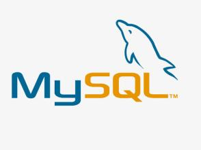
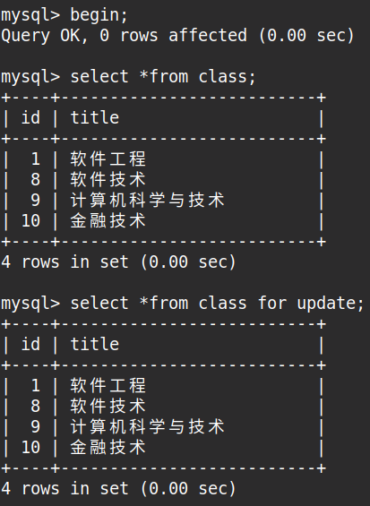
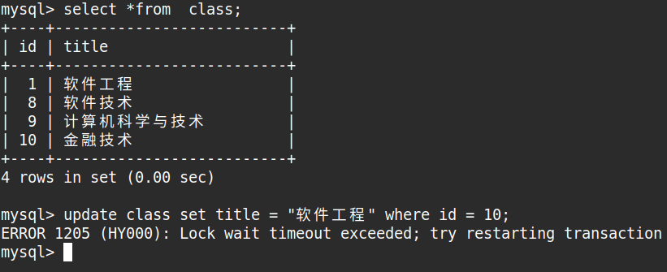
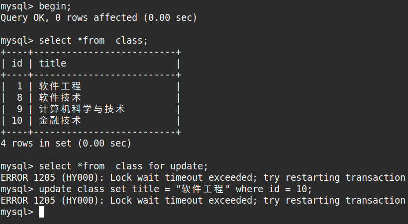
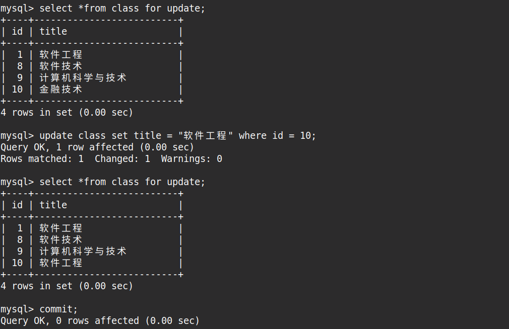
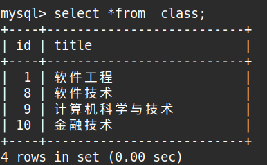
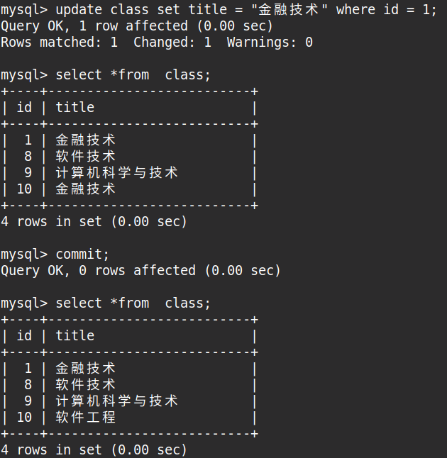

<hr>

#### 数据库索引
<hr>

##### 1. 索引的作用
加速查找、约束

<hr>

##### 2. 索引种类

主键索引：加速查找、不重复、非空

唯一索引：加速查找、不重复

普通索引：加速查找

联合索引：加速查找

联合唯一索引：加速查找、不重复

<hr>

##### 3. 覆盖索引
在索引文件中就可以得到想要的数据

<hr>

##### 4. 索引合并
使用多个单列索引去查找数据

<hr>

##### 5. 联合索引
联合索引遵循最左前缀原则，最左侧字段才能使用索引。name 不是最左侧字段，id 是最左侧字段：
```sql
SELECT *FROM test WHERE id = 1 AND name = 'erics';
```
<hr>

#### 数据库加锁
<hr>

##### 1. 行锁
当一个用户 A 对表的字段加了行锁后 ( 加锁是在事务中完成的 )，其他用户 B 不能再对该表的字段再次加行锁、修改字段数据等 ( 这样保证数了据唯一性 ) 但可以正常查询字段的值 ( 用户 A 事务执行之前的 )：

用户A：



用户B：





用户 A 执行事务在加锁之后修改数据值，然后提交这个事务。其他用户 B 如果在 A 提交事务之前已经开启了事务，查询到的结果还是修改之前的。否则，就是 A
修改过之后新数据！当然，这不影响其他用户 B 修改数据，B 完成数据的修改提交事务之后再获取的就是最新的数据 ( 用户 A 和其他用户 B 提交的数据 )。

用户A：



用户B：





pymysql 加行锁：
```python
 # 创建连接对象
conn = pymysql.connect(host='127.0.0.1', port=3306, user='root', passwd='123456', db='test')
# 创建游标
cursor = conn.cursor(cursor=pymysql.cursors.DictCursor)
# 执行查询的sql语句
cursor.execute("select id,title from class for update")
# 获取查询到的所有数据
classe_list = cursor.fetchall()
# 关闭游标
cursor.close()
# 关闭连接
conn.close()
```
ORM 操作加行锁：
```python
with trancation.automic():
    model.User.objects.all().for_update()
```
<hr>

##### 2. 表锁

<hr>

#### 数据库引擎
<hr>

##### 1. innodb
( 1 ) 支持事务

( 2 ) 锁：行锁、表锁

<hr>

##### 2. mysaim
( 1 ) 不支持事务

( 2 ) 锁：表锁

( 3 ) 查询速度快

<hr>

<div style="width: 60px;height: auto;z-index: 99;bottom: 30%;position: fixed;right: 0px" id="plug-ins">
    <div style="position: relative;float: right">
        <a target="" href="javascript:;" id="weibo"
           style="display: block;width: 40px;height: 40px;background-color: #c4351b;margin-top: 1px;">
            
        </a>
      <a target="_blank" href="http://sighttp.qq.com/authd?IDKEY=5838160dbeb2a49f264d5e2d13d6336248d74a60cf56ecad" id="qq" style="display: block;width: 40px;height: 40px;background-color:#0e91e8;margin-top: 1px">
            
        </a>
        <a href="javascript:" id="wechat"
           style="display: block;width: 40px;height: 40px;background-color:#01b901;margin-top:1px">
            
        </a>
        <a href="javascript:" id="go_top"
           style="display: none;width: 40px;height: 40px;background-color: #b5b5b5;margin-top: 1px">
            
        </a>
    </div>
</div>
<div style="width: auto;height: auto;z-index: 99;position: fixed;left: 0;bottom: 0;" id="support_us" hidden="hidden">
        <div id="alipei_and_wechat">
            <button type="button" class="close"><span aria-hidden="true">&times;</span></button>
            <br>
            
        </div>
</div>
<div style="width: auto;height: auto;z-index: 99;position: fixed;right: 0;top: 70px;" id="google_ads">
        <div>
            <div style="width: 180px;height: auto"></div>
            <script async src="https://pagead2.googlesyndication.com/pagead/js/adsbygoogle.js"></script>
            <!-- Vertical -->
            <ins class="adsbygoogle"
                 style="display:block"
                 data-ad-client="ca-pub-6937898095875663"
                 data-ad-slot="2927491642"
                 data-ad-format="auto"
                 data-full-width-responsive="true"></ins>
            <script>
                 (adsbygoogle = window.adsbygoogle || []).push({});
            </script>
        </div>
</div>