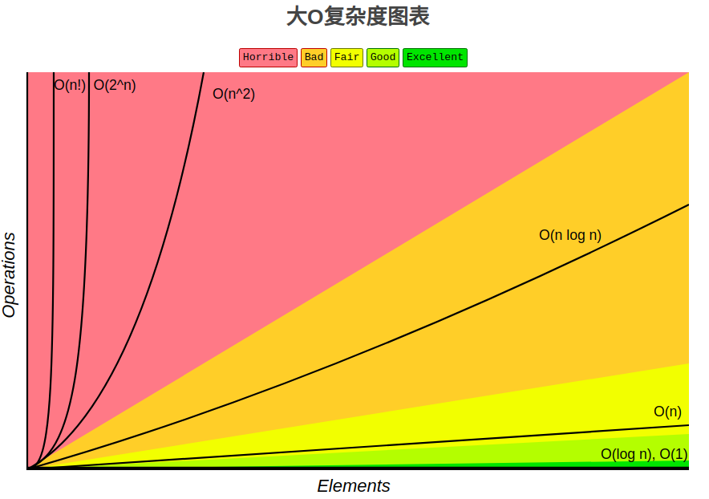
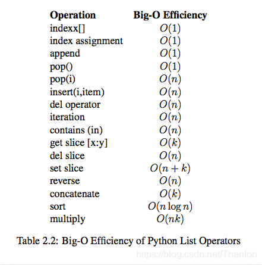
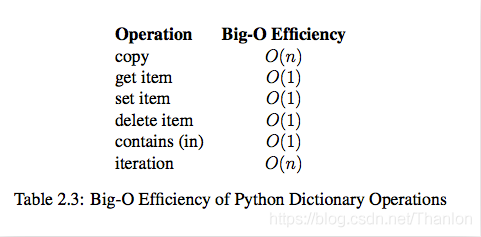

#### 算法的时间复杂度
<hr>

##### 1. 算法的五大特性
算法是独立存在的一种解决问题的方法和思想，算法具有以下五大特性：

(1) 输入: 算法具有0个或多个输入

(2) 输出: 算法至少有1个或多个输出

(3) 有穷性: 算法在有限的步骤之后会自动结束而不会无限循环，并且每一个步骤可以在可接受的时间内完成

(4) 确定性：算法中的每一步都有确定的含义，不会出现二义性

(5) 可行性：算法的每一步都是可行的，也就是说每一步都能够执行有限的次数完成
<hr>

##### 2. 最坏时间复杂度
(1) 算法完成工作最少需要多少基本操作，即最优时间复杂度

(2) 算法完成工作最多需要多少基本操作，即最坏时间复杂度

(3) 算法完成工作平均需要多少基本操作，即平均时间复杂度

<font>最优时间复杂度</font>：其价值不大，因为它没有提供什么有用信息，其反映的只是最乐观最理想的情况，没有参考价值。

<font>最坏时间复杂度</font>：提供了一种保证，表明算法在此种程度的基本操作中一定能完成工作。

<font>平均时间复杂度</font>：是对算法的一个全面评价，因此它完整全面的反映了这个算法的性质。但另一方面，这种衡量并没有保证，不是每个计算都能在这个基本操作内完成。而且，对于平均情况的计算，也会因为应用算法的实例分布可能并不均匀而难以计算。我们主要关注算法的最坏情况，亦即最坏时间复杂度。
<hr>

##### 3. 时间复杂度的基本计算规则
基本操作，即只有常数项，认为其时间复杂度为O(1)

顺序结构，时间复杂度按加法进行计算

循环结构，时间复杂度按乘法进行计算

分支结构，时间复杂度取最大值

判断一个算法的效率时，往往只需要<font>关注操作数量的最高次项，其它次要项和常数项可以忽略</font>。在没有特殊说明时，我们所分析的算法的时间复杂度都是指最坏时间复杂度。
<hr>

##### 4. 常见的时间复杂度
|  |  |  |
|--|--|--|
| 12 | O(1) | 常数阶 |
| 2n+3 |O(n)  | 线性阶 |
| 3n2+2n+1 | O(n<sup>2</sup>) | 平方阶 |
| 5log2n+20 | O(logn) | 对数阶 |
| 2n+3nlog2n+19 | O(nlogn) | nlogn阶 |
| 6n3+2n2+3n+4 | O(n<sup>3</sup>) | 立方阶 |
| 2n | O(2n) | 指数阶 |
||||

经常将以2为底的对数log2n简写成logn！
<hr>

##### 5. 常见时间复杂度之间的对比


所消耗的时间从小到大：O(1) < O(logn) < O(n) < O(nlogn) < O(n<sup>2</sup>) < O(n<sup>2</sup>log(n)) < O(n<sup>3</sup>) < O(2n) < O(n!) < O(n<sup>n</sup>)
<hr>

##### 6. 算法时间复杂度分析
如果 a+b+c=1000，且 a^2+b^2=c^2（a,b,c为500以内的自然数），如何求出所有a、b、c可能的组合?

第一种算法：
```python
import time

start_time = time.time()
for a in range(501):
    for b in range(501):
        for c in range(501):
            if a ** 2 + b ** 2 == c ** 2 and a + b + c == 1000:
                print("a, b, c: %d, %d, %d" % (a, b, c))
end_time = time.time()
ret = end_time - start_time
print(str(ret) + "s")
"""
a, b, c: 0, 500, 500
a, b, c: 200, 375, 425
a, b, c: 375, 200, 425
a, b, c: 500, 0, 500
76.27402806282043s
"""
```
时间复杂度：T(n) = O(n\*n\*n) = O(n3)

第二种算法：
```python
import time

start_time = time.time()
for a in range(501):
    for b in range(1000 - a + 1):
        c = 1000 - a - b
        if a ** 2 + b ** 2 == c ** 2:
            print("a, b, c: %d, %d, %d" % (a, b, c))
end_time = time.time()
ret = end_time - start_time
print(str(ret) + "s")
"""
a, b, c: 0, 500, 500
a, b, c: 200, 375, 425
a, b, c: 375, 200, 425
a, b, c: 500, 0, 500
0.2715432643890381s
"""
```
时间复杂度：T(n) = O(n\*n\*(1+1)) = O(n*n) = O(n<sup>2</sup>)
<hr>

##### 7. 性能分析模块
timeit 模块可以用来测试一小段Python代码的执行速度，模块中的Timer类是测量小段代码执行速度的类，

<kbd>timeit.Timer(stmt="pass", setup="pass", timer=default_timer,globals=None)</kbd>：stmt参数是要测试的代码语句；timer参数是一个定时器函数，与平台有关。<br><br>
<kbd>timeit.Timer.timeit(number=default_number)</kbd>：timeit是Timer类中测试语句执行速度的方法。number参数是测试代码时的测试次数，默认为1000000次。方法返回执行代码的平均耗时，一个float类型的秒数。
<hr>

##### 8. 列表内置操作性能分析
测试列表的生成效率，**`list(range(10000))`** 是执行效率最高的，**`两个列表向加 lst + [i]`** 执行效率最小的！所以，一定不要将两个列表相加。
```python
import timeit

def test01():
    lst = []
    for i in range(10000):
        lst.append(i)

def test02():
    lst = []
    for i in range(10000):
        lst = lst + [i]  # 这里使用+是直接对两个列表进行+操作，与+=不一样。lst+[i]得到的结果赋给新的列表(需要重新创建)，lst指向这里新的列表

def test03():
    lst = [i for i in range(10000)]

def test04():
    lst = list(range(10000))

def test05():
    lst = []
    for i in range(10000):
        lst.extend([i])  # 相当于+=

timer01 = timeit.Timer(stmt='test01()', setup='from __main__ import test01')
print(timer01.timeit(number=1000))
timer02 = timeit.Timer(stmt='test02()', setup='from __main__ import test02')
print(timer02.timeit(number=1000))
timer03 = timeit.Timer(stmt='test03()', setup='from __main__ import test03')
print(timer03.timeit(number=1000))
timer04 = timeit.Timer(stmt='test04()', setup='from __main__ import test04')
print(timer04.timeit(number=1000))
timer05 = timeit.Timer(stmt='test05()', setup='from __main__ import test05')
print(timer05.timeit(number=1000))
"""
0.45439891899877694
111.16130047300248
0.3060263489969657
0.16354428199701943
1.0356771610022406
"""
```
测试添加列表元素，一个是从列表头追加，一个是从列表尾部追加。很显然从列表尾部追加效率最高：
```python
import timeit

def test06():
    lst = []
    for i in range(10000):
        lst.append(i)

def test07():
    lst = []
    for i in range(10000):
        lst.insert(0, i) # 

timer06 = timeit.Timer(stmt='test06()', setup='from __main__ import test06')
print(timer06.timeit(number=1000))
timer07 = timeit.Timer(stmt='test07()', setup='from __main__ import test07')
print(timer07.timeit(number=1000))
"""
0.5252876660015318
18.104313356001512
"""
```
删除元素操作测试，从结果可以看出，<font>pop最后一个元素的效率远远高于pop第一个元素</font>：
```python
from timeit import Timer

x = list(range(2000000))
pop_zero = Timer("x.pop(0)", "from __main__ import x")
print("pop_zero ", pop_zero.timeit(number=1000))
x = list(range(2000000))
pop_end = Timer("x.pop()", "from __main__ import x")
print("pop_end ", pop_end.timeit(number=1000))
"""
pop_zero  1.444499523997365
pop_end  5.205700290389359e-05
"""
```
<hr>

##### 3. 列表内置操作的时间复杂度

<hr>

##### 4. 字典内置操作的时间复杂度

<hr>

#### 顺序表的实现
<hr>

##### 1. 顺序表的引出
在程序中，经常需要将一组（通常是同为某个类型的）数据元素作为整体管理和使用，需要创建这种元素组，用变量记录它们，传进传出函数等。一组数据中包含的元素个数可能发生变化（可以增加或删除元素）。

对于这种需求，最简单的解决方案便是将这样一组元素看成一个序列，用元素在序列里的位置和顺序，表示实际应用中的某种有意义的信息，或者表示数据之间的某种关系。

这样的一组序列元素的组织形式，我们可以将其抽象为<font>线性表</font>。一个线性表是某类元素的一个集合，还记录着元素之间的一种顺序关系。<font>线性表是最基本的数据结构之一，在实际程序中应用非常广泛，它还经常被用作更复杂的数据结构的实现基础</font>。根据线性表的实际存储方式，分为两种实现模型：

① 顺序表：将元素顺序地存放在一块连续的存储区里，元素间的顺序关系由它们的存储顺序自然表示。

② 链表：将元素存放在通过链接构造起来的一系列存储块中。
<hr>

##### 2. 顺序表的结构


顺序表的完整信息包括两部分，其中一部分是表中的元素集合，另一部分是为实现正确操作而需记录的信息，即有关表的整体情况的信息，这部分信息主要包括<font>元素存储区的容量</font>和<font>当前表中已有的元素个数</font>两项。
<hr>

##### 3. 顺序表的两种基本实现方式


图 a 为一体式结构，存储表信息的单元与元素存储区以连续的方式安排在一块存储区里，两部分数据的整体形成一个完整的顺序表对象。一体式结构整体性强，易于管理。但是<font>由于数据元素存储区域是表对象的一部分，顺序表创建后，元素存储区就固定了。</font>

图 b 为分离式结构，表对象里只保存与整个表有关的信息（即容量和元素个数），实际数据元素存放在另一个独立的元素存储区里，通过链接与基本表对象关联。

(1) 元素存储区替换

一体式结构由于顺序表信息区与数据区连续存储在一起，所以若想更换数据区，则只能整体搬迁，即整个顺序表对象(指存储顺序表的结构信息的区域)改变了。分离式结构若想更换数据区，只需将表信息区中的数据区链接地址更新即可，而该顺序表对象不变。

(2) 元素存储区扩充

采用<font>分离式结构的顺序表</font>，若将数据区更换为存储空间更大的区域，则可以在不改变表对象的前提下对其数据存储区进行了扩充，所有使用这个表的地方都不必修改。只要程序的运行环境（计算机系统）还有空闲存储，这种表结构就不会因为满了而导致操作无法进行。人们把采用这种技术实现的顺序表称为<font>动态顺序表</font>，因为其容量可以在使用中动态变化。

扩充的两种策略：

① 每次扩充增加固定数目的存储位置，如<font>每次扩充增加10个元素位置</font>，这种策略可称为线性增长。特点：<font>节省空间，但是扩充操作频繁，操作次数多。</font>

② 每次扩充<font>容量加倍</font>，如每次扩充增加一倍存储空间。特点：减少了扩充操作的执行次数，但可能会浪费空间资源。<font>以空间换时间，推荐的方式</font>。
<hr>

##### 4. 顺序表的操作
(1) 增加元素：


a. 尾端加入元素，时间复杂度为O(1)

b. 非保序的加入元素(不常见)，时间复杂度为O(1)

c. 保序的元素加入，时间复杂度为O(n)<br><br>

(2) 删除元素：


a. 删除表尾元素，时间复杂度为O(1)

b. 非保序的元素删除(不常见)，时间复杂度为O(1)

c. 保序的元素删除，时间复杂度为O(n)
<hr>

##### 5. Python中的顺序表
<font>Python 中的 list 和 tuple 两种类型采用了顺序表的实现技术</font>，具有前面讨论的顺序表的所有性质。tuple是不可变类型，即不变的顺序表，因此不支持改变其内部状态的任何操作，而其他方面，则与list的性质类似。

Python标准类型list就是一种元素个数可变的线性表，可以加入和删除元素，并在各种操作中维持已有元素的顺序（即保序），而且还具有以下行为特征：

(1) 基于下标(位置)的高效元素访问和更新，时间复杂度应该是O(1)；为满足该特征，应该采用顺序表技术，表中元素保存在一块连续的存储区中。

(2) 允许任意加入元素，而且在不断加入元素的过程中，表对象的标识(函数id得到的值)不变。为满足该特征，就必须能更换元素存储区，并且为保证更换存储区时list对象的标识id不变，只能<font>采用分离式实现技术。</font>

在Python的官方实现中，<font>list就是一种采用分离式技术实现的动态顺序表</font>。这就是为什么用**`list.append(x)`**(或者用**`list.insert(len(list), x)`**，即尾部插入）比在指定位置插入元素效率高的原因。在Python的官方实现中，list实现采用了如下的策略：

<font>在建立空表（或者很小的表）时，系统分配一块能容纳8个元素的存储区；在执行插入操作（insert或append）时，如果元素存储区满就换一块4倍大的存储区。但如果此时的表已经很大（目前的阀值为50000），则改变策略，采用加一倍的方法。引入这种改变策略的方式，是为了避免出现过多空闲的存储位置。</font>
<hr>

#### 链表的实现
<hr>

##### 1. 链表概述
为什么需要链表？顺序表的构建需要预先知道数据大小来申请连续的存储空间，而在进行扩充时又需要进行数据的搬迁，所以使用起来并不是很灵活。<font>链表结构可以充分利用计算机内存空间，实现灵活的内存动态管理</font>。

链表（Linked list）是一种常见的基础数据结构，是一种线性表，但是不像顺序表一样连续存储数据，而是在每一个节点(数据存储单元)里存放下一个节点的位置信息（即地址）。

<hr>

##### 2. 链表与顺序表的对比
<font>链表失去了顺序表随机读取的优点，同时链表由于增加了结点的指针域，空间开销比较大，但对存储空间的使用要相对灵活</font>。链表与顺序表的各种操作复杂度如下所示：


虽然表面看起来复杂度都是 O(n)，但是链表和顺序表在插入和删除时进行的是完全不同的操作。<font>链表的主要耗时操作是遍历查找，删除和插入操作本身的复杂度是O(1)</font>。顺序表查找很快，<font>主要耗时的操作是拷贝覆盖</font>。因为除了目标元素在尾部的特殊情况，顺序表进行插入和删除时需要对操作点之后的所有元素进行前后移位操作，只能通过拷贝和覆盖的方法进行。
<hr>

##### 3. 单向链表
单向链表也叫单链表，是链表中最简单的一种形式，<font>它的每个节点包含两个域</font>，一个信息域（元素域）和一个链接域。这个链接指向链表中的下一个节点，而最后一个节点的链接域则指向一个空值。


表元素域 elem 用来存放具体的数据，链接域next用来存放下一个节点的位置（Python中的标识），变量p指向链表的头节点（首节点）的位置，从p出发能找到表中的任意节点。

单链表中节点的实现：
```python
class SingleNode:
    def __init__(self, elem):
        # 存放数据元素
        self.item = elem
        # 下一个节点的标识
        self.next = None
```
单链表的操作有判断链表是否为空、获取链表的长度、遍历整个链表、链表头部添加元素、链表尾部添加元素、指定位置添加元素、删除节点和查找节点，下面实现这些操作：
```py
class SingleNode:
    def __init__(self, elem):
        self.elem = elem
        self.next = None


class SimpleLinkedList:
    """
    单向链表
    """

    def __init__(self, node=None):
        """
        :param node:默认是空链表
        """
        self.__head = node

    def is_empty(self):
        """
        判断是否为空
        :return:
        """
        return self.__head is None

    def length(self):
        """
        链表的长度
        :return:count
        """
        # 如果是空链表直接就返回count=0
        cur = self.__head
        count = 0
        while cur is not None:
            count += 1
            cur = cur.next
        return count

    def travel(self):
        """
        遍历链表
        :return:
        """
        cur = self.__head
        while cur is not None:
            print(cur.elem, end=' ')
            cur = cur.next

    def add(self, elem):
        """
        从链表的头部添加元素
        :param elem:
        :return:
        """
        node = SingleNode(elem)
        """
        # 下面也可以处理是空链表的情况
        if self.is_empty():
            self.__head = node
        node.next = self.__head
        """
        node.next = self.__head
        self.__head = node

    def append(self, elem):
        """
        尾部添加元素
        :param elem:
        :return:
        """
        node = SingleNode(elem)
        if self.is_empty():
            self.__head = node
        else:
            cur = self.__head
            while cur.next is not None:
                cur = cur.next
            cur.next = node

    def insert(self, pos, elem):
        node = SingleNode(elem)
        if pos <= 0:
            self.add(elem)
            return
        elif pos > self.length() - 1:
            self.append(elem)
            return
        pre = self.__head
        count = 0
        while count < pos - 1:
            pre = pre.next
            count += 1
        node.next = pre.next
        pre.next = node

    def search(self, elem):
        """
        查找元素
        :param self:
        :param elem:
        :return:
        """
        # 也可以处理空链表的情况
        cur = self.__head
        while cur is not None:
            if cur.elem == elem:
                return True
            else:
                cur = cur.next
        return False

    def remove(self, elem):
        pre = None
        cur = self.__head
        # 适用于空节点和删除头节点
        while cur is not None:
            if cur.elem == elem:
                # 判断当前节点是否是头节点
                # 也可以解决链表中只有一个头节点
                if cur == self.__head:
                    self.__head = self.__head.next
                    # self.__head = cur.next
                else:
                    # 也适用于删除尾部节点
                    pre.next = cur.next
                break
            else:
                pre = cur
                cur = cur.next


sll = SimpleLinkedList()
print('当前链表是否为空：', sll.is_empty())
print('当前链表长度：', sll.length())
print('------在链表尾部添加节点------')
sll.append(1)
print('当前链表是否为空：', sll.is_empty())
print('当前链表长度：', sll.length())
sll.append(2)
sll.append(3)
sll.append(4)
sll.append(5)
sll.append(6)
print('当前链表是否为空：', sll.is_empty())
print('当前链表长度：', sll.length())
print('遍历链表：', end='')
sll.travel()
print('\n------在链表头部添加节点-----')
sll.add(7)
print('当前链表是否为空：', sll.is_empty())
print('当前链表长度：', sll.length())
print('遍历链表：', end='')
sll.travel()
print('\n------在指定位置插入节点-----')
sll.insert(0, 8)
sll.insert(2, 9)
sll.insert(9, 10)
sll.insert(10, 10)
print('当前链表是否为空：', sll.is_empty())
print('当前链表长度：', sll.length())
print('遍历链表：', end='')
sll.travel()
print('\n------删除指定位置的元素，实现的效果类似列表的remove方法-----')
sll.remove(7)
sll.remove(1)
sll.remove(10)
print('当前链表是否为空：', sll.is_empty())
print('当前链表长度：', sll.length())
print('遍历链表：', end='')
sll.travel()
"""
当前链表是否为空： True
当前链表长度： 0
------在链表尾部添加节点------
当前链表是否为空： False
当前链表长度： 1
当前链表是否为空： False
当前链表长度： 6
遍历链表：1 2 3 4 5 6 
------在链表头部添加节点-----
当前链表是否为空： False
当前链表长度： 7
遍历链表：7 1 2 3 4 5 6 
------在指定位置插入节点-----
当前链表是否为空： False
当前链表长度： 11
遍历链表：8 7 9 1 2 3 4 5 6 10 10 
------删除指定位置的元素，实现的效果类似列表的remove方法-----
当前链表是否为空： False
当前链表长度： 8
遍历链表：8 9 2 3 4 5 6 10
"""
```
<hr>

##### 4. 双向链表
一种更复杂的链表是“双向链表”或“双面链表”。每个节点有两个链接：一个指向前一个节点，当此节点为第一个节点时，指向空值。而另一个指向下一个节点，当此节点为最后一个节点时，指向空值。双向链表引入<font>前驱节点和后继节点</font>，实现的操作与单链表相同，只是需要考虑节点。

节点的实现：
```py
class DoubleNnode:
    def __init__(self, elem):
        self.elem = elem
        self.prev = None
        self.next = None
```
双向链表的实现：
```python
class DoubleNode:
    def __init__(self, elem):
        self.elem = elem
        self.prev = None
        self.next = None


class DoubleLinkedList():
    def __init__(self):
        self.__head = None

    def is_empty(self) -> bool:
        """
        判断是否为空
        :return:
        """
        return self.__head is None

    def length(self) -> int:
        """
        链表的长度
        :return:count
        """
        # 如果是空链表直接就返回count=0
        cur = self.__head
        count = 0
        while cur is not None:
            count += 1
            cur = cur.next
        return count

    def travel(self):
        """
        遍历链表
        :return:
        """
        cur = self.__head
        while cur is not None:
            print(cur.elem, end=' ')
            cur = cur.next

    def add(self, item):
        """
        头插法
        :param item:
        :return:
        """
        node = DoubleNode(item)
        if self.is_empty():
            self.__head = node
            return
        node.next = self.__head
        self.__head = node
        node.next.prev = node

    def append(self, elem):
        """
        尾部添加元素
        :param elem:
        :return:
        """
        node = DoubleNode(elem)
        if self.is_empty():
            self.__head = node
        else:
            cur = self.__head
            while cur.next is not None:
                cur = cur.next
            cur.next = node
            node.prev = cur

    def insert(self, pos, elem):
        node = DoubleNode(elem)
        if pos <= 0:
            self.add(elem)
        elif pos > self.length() - 1:
            self.append(elem)
        else:
            cur = self.__head
            count = 0
            while count < pos:
                cur = cur.next
                count += 1
            # 第一种方式
            node.next = cur
            node.prev = cur.prev
            cur.prev.next = node
            cur.prev = node
            # 第二种方式
            """
            cur.prev = node
            node.prev.next = node
            """

    def search(self, elem) -> bool:
        cur = self.__head
        while cur is not None:
            if cur.elem == elem:
                return True
            else:
                cur = cur.next
        return False

    def remove(self, elem):
        cur = self.__head
        while cur is not None:
            if cur.elem == elem:
                if cur == self.__head:
                    self.__head = cur.next
                    # 判断链表是否只有一个节点
                    if cur.next:
                        cur.next.prev = None
                else:
                    cur.prev.next = cur.next
                    if cur.next:
                        cur.next.prev = cur.prev
                break
            else:
                cur = cur.next


dll = DoubleLinkedList()
print('-------初始的链表------')
print('当前链表是否为空：', dll.is_empty())
print('当前链表的长度：', dll.length())
print('------头插法添加链表------')
dll.add(1)
dll.add(2)
dll.add(3)
print('当前链表是否为空：', dll.is_empty())
print('当前链表的长度：', dll.length())
print('遍历链表：', end='')
dll.travel()
print('\n------尾插法添加链表------')
dll.append(1)
dll.append(2)
dll.append(3)
dll.append(4)
print('当前链表是否为空：', dll.is_empty())
print('当前链表的长度：', dll.length())
print('遍历链表：', end='')
dll.travel()
print('\n------指定位置插入------')
dll.insert(0, 6)
dll.insert(2, 7)
dll.insert(5, 8)
print('当前链表是否为空：', dll.is_empty())
print('当前链表的长度：', dll.length())
print('遍历链表：', end='')
dll.travel()
print('\n------查找元素------')
print('当前链表是否为空：', dll.is_empty())
print('当前链表的长度：', dll.length())
print('遍历链表：', end='')
dll.travel()
print('\n链表中是否存在元素是2的节点：%s' % dll.search(2))
print('------删除元素(这里以删除头节点6为例子)------')
dll.remove(6)
print('当前链表是否为空：', dll.is_empty())
print('当前链表的长度：', dll.length())
print('遍历链表：', end='')
dll.travel()
"""
-------初始的链表------
当前链表是否为空： True
当前链表的长度： 0
------头插法添加链表------
当前链表是否为空： False
当前链表的长度： 3
遍历链表：3 2 1 
------尾插法添加链表------
当前链表是否为空： False
当前链表的长度： 7
遍历链表：3 2 1 1 2 3 4 
------指定位置插入------
当前链表是否为空： False
当前链表的长度： 10
遍历链表：6 3 7 2 1 8 1 2 3 4 
------查找元素------
当前链表是否为空： False
当前链表的长度： 10
遍历链表：6 3 7 2 1 8 1 2 3 4 
链表中是否右元素是2的节点：True
------删除元素------
当前链表是否为空： False
当前链表的长度： 9
遍历链表：3 7 2 1 8 1 2 3 4 
"""
```
<hr>

##### 5. 单向循环链表
单链表的一个变形是单向循环链表，链表中最后一个节点的next域不再为None，而是指向链表的头节点。


节点的创建：
```python
class Node:
    def __init__(self, elem):
        self.elem = elem
        self.next = None
```
单向循环链表的实现：
```python
class Node:
    def __init__(self, elem):
        self.elem = elem
        self.next = None


class CircularlinkedList:
    def __init__(self, node=None):
        self.__head = node
        if node:
            node.next = node

    def is_empty(self):
        """
        判断是否为空
        :return:
        """
        return self.__head == None

    def lencllth(self):
        """
        获取链表的长度
        :return:
        """
        # 如果是空链表
        if self.is_empty():
            return 0
        # 只有一个节点，也是可以处理的
        cur = self.__head
        count = 1
        while cur.next != self.__head:
            count += 1
            cur = cur.next
        return count

    def travel(self):
        """
        遍历所有节点中的元素
        :return:
        """
        # 如果是空链表则不作任何操作
        if self.is_empty():
            return
        # 如果只有一个节点也是可以处理的
        cur = self.__head
        while cur.next != self.__head:
            print(cur.elem, end=' ')
            cur = cur.next
        print(cur.elem)

    def add(self, elem):
        """
        头部插入
        :param elem:
        :return:
        """
        node = Node(elem)
        # 如果是空链表
        if self.is_empty():
            self.__head = node
            node.next = node
            return
        # 只有一个节点，也是可以处理的
        cur = self.__head
        while cur.next != self.__head:
            cur = cur.next
        node.next = self.__head
        self.__head = node
        # cur.next = node
        cur.next = self.__head

    def append(self, elem):
        """
        尾部插入
        :param elem:
        :return:
        """
        node = Node(elem)
        # 链表为空
        if self.is_empty():
            self.__head = node
            node.next = node
            return
        # 也适用于链表只有一个节点
        cur = self.__head
        while cur.next != self.__head:
            cur = cur.next
        # node.next = cur.next
        node.next = self.__head
        cur.next = node

    def insert(self, pos, elem):
        if pos <= 0:
            self.add(elem)
        elif pos > self.lencllth() - 1:
            self.append(elem)
        else:
            # 因为不涉及头节点和尾节点的链接，中间插入和单链表插入方式一样
            count = 0
            pre = self.__head
            while count < pos - 1:
                count += 1
                pre = pre.next
            # 循环退出之后，pre指向post-1的位置
            node = Node(elem)
            node.next = pre.next
            pre.next = node

    def search(self, elem):
        if self.is_empty():
            return False
        cur = self.__head
        while cur != self.__head:
            if cur.elem == elem:
                return True
            cur = cur.next
        if cur.elem == elem:
            return True
        return False

    def remove(self, elem):
        if self.is_empty():
            return
        cur = self.__head
        prev = None
        while cur.next != self.__head:
            if cur.elem == elem:
                # 判断是否是头节点
                if cur == self.__head:
                    rear = self.__head
                    # 通过循环找到尾节点
                    while rear.next != self.__head:
                        rear = rear.next
                    self.__head = cur.next
                    rear.next = self.__head
                else:
                    # 删除中间节点
                    prev.next = cur.next
                return
            prev = cur
            cur = cur.next
        # 上述循环之后，最后一个节点的元素没有判断，所以需要判断
        if cur.elem == elem:
            # 如果链表只有一个节点
            if cur.next == self.__head:
                self.__head = None
            # prev.next = cur.next
            prev.next = self.__head


cll = CircularlinkedList()
print('------链表初始化信息-----')
print('当前链表是否为空：', cll.is_empty())
print('当前链表长度：', cll.lencllth())
print('------在链表尾部添加节点------')
cll.append(1)
cll.append(2)
cll.append(3)
cll.append(4)
cll.append(5)
cll.append(6)
print('当前链表是否为空：', cll.is_empty())
print('当前链表长度：', cll.lencllth())
print('遍历链表：', end='')
cll.travel()
print('\n------在链表头部添加节点-----')
cll.add(7)
print('当前链表是否为空：', cll.is_empty())
print('当前链表长度：', cll.lencllth())
print('遍历链表：', end='')
cll.travel()
print('\n------在指定位置插入节点-----')
cll.insert(0, 8)
cll.insert(2, 9)
cll.insert(9, 10)
cll.insert(10, 10)
print('当前链表是否为空：', cll.is_empty())
print('当前链表长度：', cll.lencllth())
print('遍历链表：', end='')
cll.travel()
print('\n------删除指定位置的元素，实现的效果类似列表的remove方法-----')
cll.remove(8)
cll.remove(1)
cll.remove(10)
print('当前链表是否为空：', cll.is_empty())
print('当前链表长度：', cll.lencllth())
print('遍历链表：', end='')
cll.travel()
"""
------链表初始化信息-----
当前链表是否为空： True
当前链表长度： 0
------在链表尾部添加节点------
当前链表是否为空： False
当前链表长度： 6
遍历链表：1 2 3 4 5 6

------在链表头部添加节点-----
当前链表是否为空： False
当前链表长度： 7
遍历链表：7 1 2 3 4 5 6

------在指定位置插入节点-----
当前链表是否为空： False
当前链表长度： 11
遍历链表：8 7 9 1 2 3 4 5 6 10 10

------删除指定位置的元素，实现的效果类似列表的remove方法-----
当前链表是否为空： False
当前链表长度： 8
遍历链表：7 9 2 3 4 5 6 10
"""
```
<hr>

#### 栈的实现
<hr>

##### 1. 栈的概念
栈，有些地方称为堆栈，是一种容器，可<font>存入数据元素、访问元素和删除元素</font>，它的特点在于<font>只能允许在容器的一端进行加入数据和输出数据的运算</font>。<font>没有了位置概念</font>，保证<font>任何时候可以访问、删除的元素都是此前最后存入的那个元素</font>，确定了一种默认的访问顺序。由于栈数据结构只允许在一端进行操作，因而按照后进先出（LIFO, Last In First Out）的原理运作。


<hr>

##### 2. 栈的实现
栈可以<font>用顺序表实现，也可以用链表实现</font>。栈的操作有创建一个新的空栈、添加一个新的元素到栈顶、弹出栈顶元素、返回栈顶元素、判断栈是否为空和返回栈的元素个数。我们选择使用顺序表来实现一个栈，Python中的列表实质按照顺序表来存储的，这里就借助列表来实现：
```python
class Stack():
    def __init__(self):
        self.__items = []  # 不希望操作栈的人直接操作内部容器：可以绕过push和pop，直接对头尾操作

    def push(self, item):
        """
        压栈:添加一个新元素item到栈顶
        :param item: 压入栈顶的元素
        :return:
        """
        # self.__items.insert(0,item)
        self.__items.append(item)

    def pop(self):
        """
        出栈：弹出栈顶元素
        :return:弹出的元素
        """
        # self.__items.pop(0)
        return self.__items.pop()

    def peek(self):
        """
        返回栈顶元素
        :return:
        """
        return self.__items[-1] if self.__items else None

    def is_empty(self):
        """
        判断栈是否为空
        :return: True or False
        """
        # return self.__items == []
        return not self.__items

    def size(self):
        """
        返回栈的大小
        :return:
        """
        return len(self.__items)


if __name__ == '__main__':
    s = Stack()
    print('压栈...')
    s.push(1)
    s.push(2)
    s.push(3)
    s.push(4)
    print('当前栈的元素数：', s.size())
    print('出栈...')
    print(s.pop())
    print(s.pop())
    print(s.pop())
    print(s.pop())
    print("当前栈为%s栈！" % '空' if s.is_empty() else '非空')
    print('当前栈的元素数：{0}个'.format(s.size()))
"""
压栈...
当前栈的元素数： 4
出栈...
4
3
2
1
当前栈为空栈！
当前栈的元素数：0个
"""
```
使用顺序表实现栈的压栈操作最好从尾部开始，使用链表实现栈的压栈操作最好从头部开始，这是由于<font>时间复杂度</font>的原因。
<hr>

#### 队列与双端队列
<hr>

##### 1. 队列的概念
队列（queue）是<font>只允许在一端进行插入操作，而在另一端进行删除操作的线性表。</font>队列是一种<font>先进先出</font>的（First In First Out）的线性表，简称FIFO。允许插入的一端为队尾，允许删除的一端为队头。<font>队列不允许在中间部位进行操作</font>！假设队列是 q = (a1，a2，……，an)，那么a1就是队头元素，而an是队尾元素。这样我们就可以删除时，总是从a1开始，而插入时，总是在队列最后。这也比较符合我们通常生活中的习惯，排在第一个的优先出列，最后来的当然排在队伍最后。


<hr>

##### 2. 队列的实现
<font>同栈一样，队列也可以用顺序表或者链表实现：</font>具体的操作有：创建一个空的队列，往队列中添加一个item元素，从队列头部删除一个元素，判断一个队列是否为空，返回队列的大小。
```python
class Queue():
    def __init__(self):
        self.__list = []

    def enqueue(self, item):
        # 如果出队比入队操作频率高
        # self.__list.insert(0, item)
        # 如果入队比出队操作频率高
        self.__list.append(item)

    def dequeue(self):
        # 如果出队比入队操作频率高
        # self.__list.pop()
        # 如果入队比出队操作频率高
        return self.__list.pop(0)

    def is_empty(self):
        return self.__list == []

    def size(self):
        return len(self.__list)
        
        
# 创建一个空的双端队列
q = Queue()
q.enqueue(1)
q.enqueue(1.2)
q.enqueue('thanlon')
q.enqueue([1, 2, 3])
print('入队状态：已完成')
print('当前队列是否为空：', q.is_empty())
print('当前队列的大小：', q.size())
print(q.dequeue())
print(q.dequeue())
print(q.dequeue())
print(q.dequeue())
"""
入队状态：已完成
当前队列是否为空： False
当前队列的大小： 4
1
1.2
thanlon
[1, 2, 3]
"""
```
<hr>

##### 3. 双端队列的概念
双端队列（deque，全名double-ended queue），是一种具有<font>队列和栈的性质的数据结构</font>。双端队列中的元素可以从两端弹出，其限定插入和删除操作在表的两端进行。双端队列可以在队列任意一端入队和出队。


<hr>

##### 4. 双端队列的实现
<font>双端队列两端都可以入队和出队</font>，相对于一般队列操作要多几步，具体的操作有： 创建一个空的双端队列，从队头加入一个item元素，从队尾加入一个item元素，从队头删除一个item元素，从队尾删除一个item元素，判断双端队列是否为空，返回队列的大小。
```python
class Dqueue():
    def __init__(self):
        self.__list = []

    def add_tail(self, item):
        """
        从队列尾部添加元素
        :param item:
        :return:
        """
        self.__list.append(item)

    def remove_front(self):
        """
        从队列头部删除元素
        :return:
        """
        return self.__list.pop(0)

    def add_front(self, item):
        """
        从队列头部添加元素
        :param item:
        :return:
        """
        self.__list.insert(0, item)

    def remove_tail(self):
        """
        从队列尾部删除元素
        :param item:
        :return:
        """
        return self.__list.pop()

    def is_empty(self):
        return self.__list == []

    def size(self):
        return len(self.__list)


# 创建一个空的双端队列
dq = Dqueue()
# 尾部添加元素，头部删除元素
dq.add_tail(1)
dq.add_tail(1.2)
dq.add_tail('thanlon')
dq.add_tail([1, 2, 3])
print('尾部已经完成元素的添加!')
print('当前队列是否为空：', dq.is_empty())
print('当前队列的大小：', dq.size())
print(dq.remove_front())
print(dq.remove_front())
print(dq.remove_front())
print(dq.remove_front())
# 尾部添加元素，头部删除元素
dq.add_front(1)
dq.add_front(1.2)
dq.add_front('thanlon')
dq.add_front([1, 2, 3])
print('头部已经完成元素的添加!')
print('当前队列是否为空：', dq.is_empty())
print('当前队列的大小：', dq.size())
print(dq.remove_tail())
print(dq.remove_tail())
print(dq.remove_tail())
print(dq.remove_tail())
"""
尾部已经完成元素的添加!
当前队列是否为空： False
当前队列的大小： 4
1
1.2
thanlon
[1, 2, 3]
头部已经完成元素的添加!
当前队列是否为空： False
当前队列的大小： 4
1
1.2
thanlon
[1, 2, 3]
"""
```
<hr>

#### 排序算法
<hr>

##### 1. 排序算法的稳定性
排序算法（Sorting algorithm）是一种能将<font>一串数据依照特定顺序进行排列</font>的一种算法。<font>稳定性</font>：稳定排序算法会让原本有相等键值的纪录维持相对次序。也就是如果一个排序算法是稳定的，当有两个相等键值的纪录R和S，且<font>在原本的列表中R出现在S之前，在排序过的列表中R也将会是在S之前。</font>当相等的元素是无法分辨的，比如像是整数，稳定性并不是一个问题。然而，假设以下的数对将要以他们的第一个数字来排序：
```python
(4,1) (3,1) (3,7) (5,6)
```
在这个状况下，有可能产生两种不同的结果，一个是<font>让相等键值的纪录维持相对的次序</font>，而另外一个则没有：
```python
# 结果1：维持次序
(3,1) (3,7) (4,1) (5,6)
# 结果2：次序被改变
(3,7) (3,1) (4,1) (5,6)
```
<font>不稳定排序算法可能会在相等的键值中改变纪录的相对次序，但是稳定排序算法从来不会如此</font>。不稳定排序算法可以被<font>特别地实现为稳定</font>。作这件事情的一个方式是人工扩充键值的比较，如此在其他方面相同键值的两个对象间之比较（比如上面的比较中加入第二个标准：第二个键值的大小）就会被决定使用在原先数据次序中的条目，当作一个同分决赛。然而，要记住这种次序通常牵涉到额外的空间负担。
<hr>

##### 2. 常见排序算法效率比较


<hr>

##### 3. 冒泡排序
冒泡排序（Bubble Sort）是一种简单的排序算法。它重复地遍历要排序的数列，<font>一次比较两个元素，如果他们的顺序错误就把他们交换过来</font>。遍历数列的工作是重复地进行直到没有再需要交换，也就是说该数列已经排序完成。这个算法的名字由来是因为越小的元素会经由交换慢慢“浮”到数列的顶端。<font>冒泡排序最优时间复杂度：O(n)</font>，表示遍历一次发现没有任何可以交换的元素，排序结束。最坏时间复杂度：O(n<sup>2</sup>)。是一种比较<font>稳定</font>的排序算法。

第一种实现:
```python
def bubble_sort(alist):
    n = len(alist)
    for i in range(n - 1):
        for j in range(n - 1 - i):
            if alist[j] > alist[j + 1]:
                alist[j], alist[j + 1] = alist[j + 1], alist[j]
    return alist


test_list = [9, 2, 3, 3, 1, 0]
bubble_sort(test_list)
print(test_list)
"""
[0, 1, 2, 3, 3, 9]
"""
```
第二种实现:
```python
def bubble_sort(alist):
    n = len(alist)
    for i in range(n - 1,0,-1):
        for j in range(i):
            if alist[j] > alist[j + 1]:
                alist[j], alist[j + 1] = alist[j + 1], alist[j]
    return alist


test_list = [9, 2, 3, 3, 1, 0]
bubble_sort(test_list)
print(test_list)
"""
[0, 1, 2, 3, 3, 9]
"""
```
冒泡排序优化：
```python
def bubble_sort(alist):
    n = len(alist)
    for i in range(n - 1, 0, -1):
        count = 0
        for j in range(i):
            if alist[j] > alist[j + 1]:
                alist[j], alist[j + 1] = alist[j + 1], alist[j]
                count += 1
        if count == 0:
            return
    return alist

test_list = [9, 2, 3, 3, 1, 0]
bubble_sort(test_list)
print(test_list)
"""
[0, 1, 2, 3, 3, 9]
"""
```
<hr>

##### 4. 选择排序
选择排序（Selection sort）是一种简单直观的排序算法。它的工作原理：首先在未排序序列中找到最小（大）元素，存放到排序序列的起始位置，然后再从剩余未排序元素中继续寻找最小（大）元素，然后放到已排序序列的末尾。以此类推，直到所有元素均排序完毕。

选择排序的主要优点与数据移动有关。如果某个元素位于正确的最终位置上，则它不会被移动。选择排序每次交换一对元素，<font>它们当中至少有一个将被移到其最终位置上</font>，因此对n个元素的表进行排序总共进行至多n-1次交换。在所有的完全依靠交换去移动元素的排序方法中，<font>选择排序属于非常好的一种</font>。

如果是排好序的，也需要n<sup>2</sup>次遍历才能确定，所以最优时间复杂度是O(n<sup>2</sup>)，最坏时间复杂度也是O(n<sup>2</sup>)。<font>选择排序是不稳定</font>，<font>相同大小的元素，排序后前面的元素总会先被放到最后，后面的元素总会后被放到最后</font>。
```python
def selection_sort(alist):
    n = len(alist)
    for i in range(n - 1):
        min_index = i
        for j in range(i + 1, n):
            if alist[j] < alist[min_index]:
                min_index = j
        # 判断当前最小值的索引是否还是i，如果是则i不用交换位置，否则需要交换位置
        if min_index != i:
            alist[i], alist[min_index] = alist[min_index], alist[i]


alist = [54, 226, 93, 17, 77, 31, 44, 55, 20]
selection_sort(alist)
print(alist)
"""
[17, 20, 31, 44, 54, 55, 77, 93, 226]
"""
```
##### 5. 插入排序
插入排序（Insertion Sort）是一种简单直观的排序算法。它的工作原理是通过构建有序序列，对于未排序数据，在已排序序列中<font>从后向前扫描，找到相应位置并插入</font>。插入排序在实现上，从后向前扫描过程中，需要<font>反复把已排序元素逐步向后挪位</font>，为最新元素提供插入空间。

最优时间复杂度O(n)，也就是已经排好序的情况下。最坏时间复杂度：O(n2)，插入排序也是一种稳定的排序算法。


```python
def insert_sort(alist):
    for i in range(1, len(alist)):
        for j in range(i, 0, -1):
            if alist[j] < alist[j - 1]:
                alist[j], alist[j - 1] = alist[j - 1], alist[j]
            """
            # 最优时间复杂度的情况
            else:
                break
            """

alist = [6, 5, 3, 1, 8, 7, 2, 4, ]
insert_sort(alist)
print(alist)
"""
[1, 2, 3, 4, 5, 6, 7, 8]
"""
```
使用while循环来实现，也是同样的道理：
```python
def insert_sort(alist):
    for i in range(1, len(alist)):
        while i > 0:
            if alist[i] < alist[i - 1]:
                alist[i], alist[i - 1] = alist[i - 1], alist[i]
            # 最优时间复杂度的情况
            # else:
            #     break
            i -= 1

alist = [6, 5, 3, 1, 8, 7, 2, 4, ]
insert_sort(alist)
print(alist)
"""
[1, 2, 3, 4, 5, 6, 7, 8]
"""
```
<hr>

##### 6. 希尔排序
希尔排序(Shell Sort)是插入排序的一种。也称缩小增量排序，是直接插入排序算法的一种更高效的改进版本。希尔排序是非稳定排序算法。希尔排序是把记录按下标的一定增量分组，对每组使用直接插入排序算法排序；随着增量逐渐减少，每组包含的关键词越来越多，<font>当增量减至1时，整个文件恰被分成一组，算法便终止</font>。

希尔排序的基本思想是：将数组列在一个表中并对列分别进行插入排序，重复这过程，不过每次用更长的列（步长更长了，列数更少了）来进行，最后整个表就只有一列了。


```python
def shell_sort(alist):
    n = len(alist)
    # 如果是9个元素，则gap从4开始(不能确定取半才能是最优的)
    gap = n // 2
    # gap最小缩小为1，也就是不能大于0
    while gap > 0:
        for i in range(gap, n):
            for i in range(i, 0, -gap):
                if alist[i] < alist[i - gap]:
                    alist[i], alist[i - gap] = alist[i - gap], alist[i]
            """
            # 与内层的for循环是等价的
            while i > 0:
                if alist[i] < alist[i - gap]:
                    alist[i], alist[i - gap] = alist[i - gap], alist[i]
                i -= gap
            """

        # 缩短gap
        gap //= 2

alist = [54, 26, 93, 17, 77, 31, 44, 55, 20]
shell_sort(alist)
print(alist)
"""
[17, 20, 26, 31, 44, 54, 55, 77, 93]
"""
```
希尔排序的最优时间复杂度是<font>根据步长序列的不同而不同</font>。最坏时间复杂度：O(n2)，也就是<font>当gap取1的时候就是普通的插入排序。</font>相同的值在不同的分组中排序，最后合并分组，不能保证这两个相同值顺序还是和之前一致，所以这是不稳定的排序算法！
<hr>

##### 7. 快速排序
快速排序（Quicksort），又称<font>划分交换排序</font>（partition-exchange sort）。通过一趟排序将要排序的数据分割成独立的两部分，其中一部分的所有数据都比另外一部分的所有数据都要小，然后再按此方法对这两部分数据分别进行快速排序，整个排序过程可以递归进行，以此达到整个数据变成有序序列。步骤:

(1) 从数列中挑出一个元素，称为"基准"（pivot）

(2) 重新排序数列，<font>所有元素比基准值小的摆放在基准前面，所有元素比基准值大的摆在基准的后面</font>（相同的数可以到任一边）。<font>在这个分区结束之后，该基准就处于数列的中间位置</font>。这个称为分区（partition）操作。

(3) 递归地（recursive）把小于基准值元素的子数列和大于基准值元素的子数列排序。


递归的最底部情形是数列的大小是0或1，也就是<font>永远都已经被排序好了</font>。虽然一直递归下去，但是这个算法总会结束，因为在每次的迭代中，它至少会把一个元素摆到它最后的位置去。
```python
def quick_sort(alist, first, last):
    # 递归结束条件
    if first >= last:
        return
    # 基准值
    pivot_value = alist[first]
    # 每次传入的索引位置：first和last都是不同的
    low_pointer = first
    high_pointer = last
    while low_pointer < high_pointer:
    	# 当列表中高索引位置的元素大于或者等于基准值时，只需要索引-1，也就是索引移动到上一个元素
        while low_pointer < high_pointer and alist[high_pointer] >= pivot_value:
            high_pointer -= 1
        # 当存在小于基准值的元素，while循环停止，索引移动停止，把这个索引放到低索引位置
        alist[low_pointer] = alist[high_pointer]
        # 当列表中低索引位置的元素小于基准值时，只需要低索引+1，也就是移动到下一个元素
        while low_pointer < high_pointer and alist[low_pointer] <= pivot_value:
            low_pointer += 1
        # 当存在大于基准值的元素，while循环停止，索引移动停止，把这个索引放到高索引位置
        alist[high_pointer] = alist[low_pointer]
    # low_pointer也可以换成high_pointer，因为这个时候low_pointer与high_pointer是等价的
    alist[low_pointer] = pivot_value
    # low_pointer左边的列表进行快速排序
    quick_sort(alist, first, low_pointer - 1)
    # low_pointer右边的列表进行快速排序
    quick_sort(alist, low_pointer + 1, last)

alist = [54, 26, 93, 17, 77, 31, 44, 55, 20]
quick_sort(alist, 0, len(alist) - 1)
print(alist)
"""
[17, 20, 17, 17, 31, 54, 17, 17, 93]
"""
```
<font>最优时间复杂度：O(nlogn)，最坏时间复杂度：O(n2)，每次分区会有一个单独的元素。快速排序是不稳定性的排序算法。</font>从一开始快速排序平均需要花费O(n log n)时间的描述并不明显。但是不难观察到的是分区运算，数组的元素都会在每次循环中走访过一次，使用O(n)的时间。在使用结合（concatenation）的版本中，这项运算也是O(n)。

在最好的情况，每次我们运行一次分区，我们会把一个数列分为两个几近相等的片段。这个意思就是每次递归调用处理一半大小的数列。因此，在到达大小为一的数列前，我们只要作log n次嵌套的调用。这个意思就是调用树的深度是O(log n)。但是在同一层次结构的两个程序调用中，不会处理到原来数列的相同部分。因此，程序调用的每一层次结构总共全部仅需要O(n)的时间（每个调用有某些共同的额外耗费，但是因为在每一层次结构仅仅只有O(n)个调用，这些被归纳在O(n)系数中）。结果是这个算法仅需使用O(n log n)时间。
<hr>

##### 8. 归并排序
归并排序是采用<font>分治法</font>的一个非常典型的应用。归并排序的思想就是<font>先递归分解数组，再合并数组</font>。将数组分解最小之后，然后合并两个有序数组，基本思路是比较两个数组的最前面的数，谁小就先取谁，取了后相应的指针就往后移一位。然后再比较，直至一个数组为空，最后把另一个数组的剩余部分复制过来即可。


```python
def merger_sort(alist):
    # 每次都要获取分组后列表的长度
    n = len(alist)
    # 根据列表的长度分组
    mid_elem = n // 2
    # 当列表只有一个元素时无法分组就直接返回这个列表
    if n <= 1:
        return alist
    # 分组后左边的元素形成的新列表
    left_elems = merger_sort(alist[:mid_elem])
    # 分组之后右边的元素形成的新列表
    right_elems = merger_sort(alist[mid_elem:])
    # 左右列表分别设置一个指针
    left_pointer, right_pointer = 0, 0
    # 新的列表用于存放需要合并的且排序好的左右子列表
    ret = []
    # 只要指针的值小于左右子列表的长度，需要继续排序
    while left_pointer < len(left_elems) and right_pointer < len(right_elems):
        # 如果左子列表的元素小于或者等于右子列表则将左子列表的该元素添加到新列表中，指针向后移动1次
        if left_elems[left_pointer] <= right_elems[right_pointer]:
            ret.append(left_elems[left_pointer])
            left_pointer += 1
        # 如果右子列表的元素小于或者等于左子列表则将右子列表的该元素添加到新列表中，指针向后移动一次
        else:
            ret.append(right_elems[right_pointer])
            right_pointer += 1
    # 剩下的元素直接追加到列表后面，比如1，2，3，4排好1，2剩下的3，4直接追加到列表中
    # 这里由于执行效率的原因不建议使用列表相加
    ret.extend(left_elems[left_pointer:])
    ret.extend(right_elems[right_pointer:])
    return ret


alist = [54, 26, 93, 17, 77, 31, 44, 55, 20]
sorted_alist = merger_sort(alist)
print(sorted_alist)
"""
[17, 20, 26, 31, 44, 54, 55, 77, 93]
"""
```
最优时间复杂度：O(nlogn)，最坏时间复杂度：O(nlogn)，归并排序是一种稳定的排序算法。归并排序虽然在时间复杂度上要比其它排序算法减小了，但是<font>空间复杂度却增加了</font>，因为新增了新的列表，占用了更多的内存空间。
<hr>

#### 搜索算法
搜索是在一个项目集合中找到一个特定项目的算法过程，搜索通常的答案是真的或假的。 搜索的几种常见方法：顺序查找、二分法查找、二叉树查找、哈希查找。
<hr>

##### 1. 二分法查找
二分查找又称折半查找，优点：<font>比较次数少，查找速度快，平均性能好</font>；其缺点：<font>要求待查表为有序表，且插入删除困难。</font>因此，<font>折半查找方法适用于不经常变动而查找频繁的有序列表。</font>首先，假设表中元素是按升序排列，将表中间位置记录的关键字与查找关键字比较，如果两者相等，则查找成功；否则利用中间位置记录将表分成前、后两个子表，如果中间位置记录的关键字大于查找关键字，则进一步查找前一子表，否则进一步查找后一子表。重复以上过程，直到找到满足条件的记录，使查找成功，或直到子表不存在为止，此时查找不成功。<font>二分查找只能作用于有序的顺序表。</font>


<hr>

##### 2. 二分法查找的两种实现
不使用递归实现：
```python
def binary_search(alist, item):
    first_index = 0
    end_index = len(alist) - 1
    while end_index >= first_index:
        middle_index = (end_index + first_index) // 2
        if item == alist[middle_index]:
            return True
        elif item < alist[middle_index]:
            end_index = middle_index - 1
        else:
            first_index = middle_index + 1
    return False


test_list = [0, 1, 2, 8, 13, 17, 19, 32, 42, ]
print(binary_search(test_list, 3))
print(binary_search(test_list, 17))
"""
False
True
"""
```
使用递归实现：
```python
def binary_search(alist, item):
    len_alist = len(alist)
    if len_alist == 0:
        return False
    else:
        middle_index = len_alist // 2
        if item == alist[middle_index]:
            return True
        elif item < alist[middle_index]:
            return binary_search(alist[:middle_index], item)
        else:
            return binary_search(alist[middle_index + 1:], item)


test_list = [0, 1, 2, 8, 13, 17, 19, 32, 42, ]
print(binary_search(test_list, 3))
print(binary_search(test_list, 17))
"""
False
True
"""
```
最优时间复杂度：O(1)，最坏时间复杂度：O(logn)
<hr>

#### 树与树的算法
<hr>

##### 1. 树的概念
树是一种抽象数据类型（ADT）或是作这种抽象数据类型的数据结构，用来模拟具有树状结构性质的数据集合。<font>它是由 n(n>=1) 个有限节点组成一个具有层次关系的集合</font>。把它叫做“树”是因为它看起来像一棵倒挂的树，也就是说它是根朝上，而叶朝下的。它具有以下的特点：

（1）每个节点有零个或多个子节点

（2）没有父节点的节点称为根节点

（3）每一个非根节点有且只有一个父节点

（4）除了根节点外，每个子节点可以分为多个不相交的子树
<hr>

##### 2. 树的术语
（1）节点的度：一个节点含有子树的个数称为该节点的度

（2）树的度：一棵树中，最大的节点的度称为树的度

（3）叶子节点或终端节点：度为零的节点

（4）父亲节点或父节点：若一个节点含有子节点，则这个节点称为其子节点的父节点

（5）孩子节点或子节点：一个节点含有的子树的根节点称为该节点的子节点

（6）兄弟节点：具有相同父节点的节点互称为兄弟节点

（7）节点的层次：从根开始定义起，根为第1层，根的子节点为第2层，以此类推

（8）树的高度或深度：树中节点的最大层次

（9）堂兄弟节点：父节点在同一层的节点互为堂兄弟

（10）节点的祖先：从根到该节点所经分支上的所有节点

（11）子孙：以某节点为根的子树中任一节点都称为该节点的子孙

（12）森林：由m（m>=0）棵互不相交的树的集合称为森林
<hr>

##### 3. 树的种类
树分为无序树和有序树，<font>树中任意节点的子节点之间没有顺序关系，这种树称为无序树</font>，也称为自由树。<font>树中任意节点的子节点之间有顺序关系，这种树称为有序树</font>。有序树还可以进一步划分：

① 二叉树：每个节点最多含有<font>两个</font>子树的树称为二叉树

② 完全二叉树：对于一颗二叉树，假设其深度为d(d>1)。<font>除了第d层外，其它各层的节点数目均已达最大值</font>，且第d层所有节点从左向右连续地紧密排列，这样的二叉树被称为完全二叉树。<font>其中满二叉树的定义是所有叶子节点都在最底层的完全二叉树</font>

③ 平衡二叉树：当且仅当任何节点的两棵子树的<font>高度差不大于1的二叉树</font>

④ 排序二叉树：也称二叉搜索树、有序二叉树

⑤ 霍夫曼树：<font>带权路径最短</font>的二叉树称为哈夫曼树或最优二叉树，用于信息编码

⑥ B树：一种对<font>读写操作进行优化的自平衡的二叉查找树</font>，能够保持数据有序，拥有多于两个子树
<hr>

##### 4. 树的存储与表示
顺序存储：


将数据结构存储在固定的数组中，在<font>遍历速度</font>上有一定的优势，但因<font>所占空间比较大</font>，是非主流二叉树。<font>二叉树通常以链式存储。</font>

链式存储：


由于对节点的个数无法掌握，<font>常见树的存储表示都转换成二叉树进行处理</font>，子节点个数最多为2。
<hr>

##### 5. 树的应用场景
① xml、html等，那么编写这些格式文件的解析器不可避免用到树

② 路由协议

③ mysql数据库索引

④ 文件系统的目录结构

⑤ 很多经典的<font>AI算法其实都是树搜索</font>，此外机器学习中的决策树也是树结构
<hr>

##### 6. 二叉树的基本概念
二叉树是每个节点最多有两个子树的树结构。通常子树被称作左子树（left subtree）和右子树（right subtree）。
<hr>

##### 7. 二叉树的性质
性质1: 在二叉树的第i层上至多有<font>2<sup>(i-1)</sup></font> 个结点（i>0）

性质2: 深度为k的二叉树至多有<font>2<sup>k - 1</sup></font>个结点（k>0）

性质3: 对于任意一棵二叉树，如果其叶结点数为N0，而度数为2的结点总数为N2，则N0=N2+1

性质4：具有n个结点的完全二叉树的深度必为<font>log2(n+1)</font>

性质5：对完全二叉树，若从上至下、从左至右编号，则编号为i的结点，其左孩子编号必为2i，其右孩子编号必为2i+1；其双亲的编号必为 i/2（i＝1时为根除外）<br><br>
完全二叉树：如果设二叉树的深度是h，除了h层以外，其它各层的节点数都达到了最大数。第h层有叶子节点，并且叶子节点都是从左到右依次排布


满二叉树：除了叶子结点外每一个结点都有左右子叶且叶子结点都处在最底层的二叉树


<hr>

##### 8. 二叉树节点表示以及树的创建
Node类中定义三个属性，分别是节点本身的值，还有左孩子和右孩子：
```python
class Node:
    def __init__(self, elem, l_child=None, r_child=None):
        self.elem = elem  # 节点本身的值
        self.l_child = l_child  # 左孩子
        self.r_child = r_child  # 右孩子
```
树的创建，创建一个树的类，并给一个根节点，一开始为空，随后添加节点：
```python
class Node:
    def __init__(self, elem, l_child=None, r_child=None):
        self.elem = elem  # 节点本身的值
        self.l_child = l_child  # 左孩子
        self.r_child = r_child  # 右孩子

class Tree:
    def __init__(self, root=None):
        self.root = root

    def add_node(self, elem):
        # 创建一个节点
        node = Node(elem)
        # 如果根节点为空，则为根节点赋值
        if self.root == None:
            self.root = node
        # 否则继续判断
        else:
            # 创建一个队列并加入根节点
            queue = [self.root]
            while queue:
                # 弹出第一个节点
                curr_node = queue.pop(0)
                # 如果该节点的左孩子为空，则需要创建的节点赋给当前节点的左孩子节点
                if curr_node.l_child is None:
                    curr_node.l_child = node
                    return
                # 如果该节点的右孩子为空，则需要创建的节点赋给当前节点的右孩子节点
                elif curr_node.r_child is None:
                    curr_node.r_child = node
                    return
                # 如果该节点的左孩子和右孩子都有值，则需要将左右孩子加入队列继续判断它们有没有孩子节点
                else:
                    queue.append(curr_node.l_child)
                    queue.append(curr_node.r_child)
                    
tree = Tree()
# 第一个赋值给根节点
tree.add_node('A')
# 为根节点的左孩子赋值
tree.add_node('B')
# 为根节点的右孩子赋值
tree.add_node('C')
# 为根节点的左孩子的左孩子赋值
tree.add_node('D')
# 为根节点的左孩子的右孩子赋值
tree.add_node('E')
# 为根节点的右孩子的左孩子赋值
tree.add_node('F')
# 为根节点的右孩子的右孩子赋值
tree.add_node('G')
```
<hr>

##### 9. 二叉树的遍历
树的遍历是树的一种重要的运算。所谓遍历是指对树中所有结点的信息的访问，即依次对树中每个结点访问一次且仅访问一次，我们把这种对所有节点的访问称为遍历（traversal）。那么树的两种重要的遍历模式是深度优先遍历和广度优先遍历,深度优先一般用递归，广度优先一般用队列。一般情况下能用递归实现的算法大部分也能用堆栈来实现。
<hr>

##### 10. 二叉树广度优先遍历
广度优先遍历也就是层次遍历，从树的根节点开始，从上到下从从左到右遍历整个树的节点：
```python
class Node:
    def __init__(self, elem, l_child=None, r_child=None):
        self.elem = elem  # 节点本身的值
        self.l_child = l_child  # 左孩子
        self.r_child = r_child  # 右孩子

class Tree:
    def __init__(self, root=None):
        self.root = root

    def add_node(self, elem):
        # 创建一个节点
        node = Node(elem)
        # 如果根节点为空，则为根节点赋值
        if self.root == None:
            self.root = node
        # 否则继续判断
        else:
            # 创建一个队列并加入根节点
            queue = [self.root]
            while queue:
                # 弹出第一个节点
                curr_node = queue.pop(0)
                # 如果该节点的左孩子为空，则需要创建的节点赋给当前节点的左孩子节点
                if curr_node.l_child is None:
                    curr_node.l_child = node
                    return
                # 如果该节点的右孩子为空，则需要创建的节点赋给当前节点的右孩子节点
                elif curr_node.r_child is None:
                    curr_node.r_child = node
                    return
                # 如果该节点的左孩子和右孩子都有值，则需要将左右孩子加入队列继续判断它们有没有孩子节点
                else:
                    queue.append(curr_node.l_child)
                    queue.append(curr_node.r_child)

    def breadth_traversal(self):
        if self.root is None:
            return
        queue = [self.root]
        while queue:
            curr_node = queue.pop(0)
            print(curr_node.elem)
            if curr_node.l_child is not None:
                queue.append(curr_node.l_child)
            if curr_node.r_child is not None:
                queue.append(curr_node.r_child)

tree = Tree()
# 第一个赋值给根节点
tree.add_node('A')
# 为根节点的左孩子赋值
tree.add_node('B')
# 为根节点的右孩子赋值
tree.add_node('C')
# 为根节点的左孩子的左孩子赋值
tree.add_node('D')
# 为根节点的左孩子的右孩子赋值
tree.add_node('E')
# 为根节点的右孩子的左孩子赋值
tree.add_node('F')
# 为根节点的右孩子的右孩子赋值
tree.add_node('G')
tree.breadth_traversal()
"""
A
B
C
D
E
F
G
"""
```
<hr>

##### 11. 二叉树深度优先遍历
对于一颗二叉树，深度优先搜索(Depth First Search)是沿着树的深度遍历树的节点，尽可能深的搜索树的分支。那么深度遍历有重要的三种方法。这三种方式常被用于访问树的节点，它们之间的不同在于访问每个节点的次序不同。这三种遍历分别叫做先序遍历（preorder），中序遍历（inorder）和后序遍历（postorder）。
 
① 先序遍历。在先序遍历中，我们先访问根节点，然后递归使用先序遍历访问左子树，再递归使用先序遍历访问右子树。遍历的顺序是：<font>根节点->左子树->右子树</font>
```python
def preorder_traversal(self, root):
    """递归实现先序遍历"""
    if root is None:
        return
    print(root.elem, end=' ')
    self.preorder_traversal(root.l_child)
    self.preorder_traversal(root.r_child)
```
② 中序遍历。在中序遍历中，我们递归使用中序遍历访问左子树，然后访问根节点，最后再递归使用中序遍历访问右子树。遍历的顺序是：<font>左子树->根节点->右子树</font>
```python
def inorder_traversal(self, root):
    """递归实现中序遍历"""
    if root is None:
        return
    self.inorder_traversal(root.l_child)
    print(root.elem, end=' ')
    self.inorder_traversal(root.r_child)
```
③ 后序遍历。在后序遍历中，我们先递归使用后序遍历访问左子树和右子树，最后访问根节点。遍历的顺序是：<font>左子树->右子树->根节点</font>
```python
def postorder_traversal(self, root):
    """递归实现后续遍历"""
    if root is None:
        return
    self.postorder_traversal(root.l_child)
    self.postorder_traversal(root.r_child)
    print(root.elem, end=' ')
```
完整的遍历测试：
```python
class Node:
    def __init__(self, elem, l_child=None, r_child=None):
        self.elem = elem  # 节点本身的值
        self.l_child = l_child  # 左孩子
        self.r_child = r_child  # 右孩子

class Tree:
    def __init__(self, root=None):
        self.root = root

    def add_node(self, elem):
        # 创建一个节点
        node = Node(elem)
        # 如果根节点为空，则为根节点赋值
        if self.root == None:
            self.root = node
        # 否则继续判断
        else:
            # 创建一个队列并加入根节点
            queue = [self.root]
            while queue:
                # 弹出第一个节点
                curr_node = queue.pop(0)
                # 如果该节点的左孩子为空，则需要创建的节点赋给当前节点的左孩子节点
                if curr_node.l_child is None:
                    curr_node.l_child = node
                    return
                # 如果该节点的右孩子为空，则需要创建的节点赋给当前节点的右孩子节点
                elif curr_node.r_child is None:
                    curr_node.r_child = node
                    return
                # 如果该节点的左孩子和右孩子都有值，则需要将左右孩子加入队列继续判断它们有没有孩子节点
                else:
                    queue.append(curr_node.l_child)
                    queue.append(curr_node.r_child)

    def breadth_traversal(self):
        """广度优先遍历/层次遍历"""
        if self.root is None:
            return
        queue = [self.root]
        while queue:
            curr_node = queue.pop(0)
            print(curr_node.elem, end=' ')
            if curr_node.l_child is not None:
                queue.append(curr_node.l_child)
            if curr_node.r_child is not None:
                queue.append(curr_node.r_child)

    def preorder_traversal(self, root):
        """递归实现先序遍历"""
        if root is None:
            return
        print(root.elem, end=' ')
        self.preorder_traversal(root.l_child)
        self.preorder_traversal(root.r_child)

    def inorder_traversal(self, root):
        """递归实现中序遍历"""
        if root is None:
            return
        self.inorder_traversal(root.l_child)
        print(root.elem, end=' ')
        self.inorder_traversal(root.r_child)

    def postorder_traversal(self, root):
        """递归实现后续遍历"""
        if root is None:
            return
        self.postorder_traversal(root.l_child)
        self.postorder_traversal(root.r_child)
        print(root.elem, end=' ')

tree = Tree()
# 第一个赋值给根节点
tree.add_node(0)
# 为根节点的左孩子赋值
tree.add_node(1)
# 为根节点的右孩子赋值
tree.add_node(2)
# 为根节点的左孩子的左孩子赋值
tree.add_node(3)
# 为根节点的左孩子的右孩子赋值
tree.add_node(4)
# 为根节点的右孩子的左孩子赋值
tree.add_node(5)
# 为根节点的右孩子的右孩子赋值
tree.add_node(6)
tree.add_node(7)
tree.add_node(8)
tree.add_node(9)
print('广度优先遍历(层次遍历)：', end='')
tree.breadth_traversal()
print('\n前序遍历：', end='')
tree.preorder_traversal(tree.root)
print('\n中序遍历：', end='')
tree.inorder_traversal(tree.root)
print('\n后序遍历：', end='')
tree.postorder_traversal(tree.root)
"""
广度优先遍历(层次遍历)：0 1 2 3 4 5 6 7 8 9 
前序遍历：0 1 3 7 8 4 9 2 5 6 
中序遍历：7 3 8 1 9 4 0 5 2 6 
后序遍历：7 8 3 9 4 1 5 6 2 0 
"""
```
<div style="width: 60px;height: auto;z-index: 99;bottom: 30%;position: fixed;right: 0px" id="plug-ins">
    <div style="position: relative;float: right">
        <a target="_blank" href="https://blog.csdn.net/thanlon" id="weibo"
           style="display: block;width: 40px;height: 40px;background-color: #c4351b;margin-top: 1px;">
            
        </a>
      <a target="_blank" href="http://sighttp.qq.com/authd?IDKEY=5838160dbeb2a49f264d5e2d13d6336248d74a60cf56ecad" id="qq" style="display: block;width: 40px;height: 40px;background-color:#0e91e8;margin-top: 1px">
            
        </a>
        <a href="javascript:" id="wechat"
           style="display: block;width: 40px;height: 40px;background-color:#01b901;margin-top:1px">
            
        </a>
        <a href="javascript:" id="go_top"
           style="display: none;width: 40px;height: 40px;background-color: #b5b5b5;margin-top: 1px">
            
        </a>
    </div>
</div>
<!--双11 start-->
<div style="z-index: 100;position: fixed;left: 0;bottom: 0;" id="ads" hidden="hidden">
        <div>
            <button type="button" class="close" style="position: absolute;right: 5px;top: 0;font-size: 28px;opacity: 1;color: white"><span aria-hidden="true">&times;</span></button>
             <a target="_blank" href="https://s.click.taobao.com/1pElJvu">
                
            </a><br>
            <a target="_blank" href="https://s.click.taobao.com/5EtkJvu">
                
            </a>
        </div>
</div>
<!--双11 stop-->
<div style="width: auto;height: auto;z-index: 99;position: fixed;right: 0;top: 70px;" id="google_ads">
        <div>
            <div style="width: 180px;height: auto"></div>
            <script async src="https://pagead2.googlesyndication.com/pagead/js/adsbygoogle.js"></script>
            <!-- Vertical -->
            <ins class="adsbygoogle"
                 style="display:block"
                 data-ad-client="ca-pub-6937898095875663"
                 data-ad-slot="2927491642"
                 data-ad-format="auto"
                 data-full-width-responsive="true"></ins>
            <script>
                 (adsbygoogle = window.adsbygoogle || []).push({});
            </script>
        </div>
</div>
<div style="width: auto;height: auto;z-index: 99;position: fixed;left: 0;top: 70px;" id="google_ads">
        <div>
            <div style="width: 180px;height: auto"></div>
            <script async src="https://pagead2.googlesyndication.com/pagead/js/adsbygoogle.js"></script>
            <!-- Vertical -->
            <ins class="adsbygoogle"
                 style="display:block"
                 data-ad-client="ca-pub-6937898095875663"
                 data-ad-slot="2927491642"
                 data-ad-format="auto"
                 data-full-width-responsive="true"></ins>
            <script>
                 (adsbygoogle = window.adsbygoogle || []).push({});
            </script>
        </div>
</div>