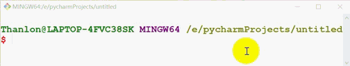
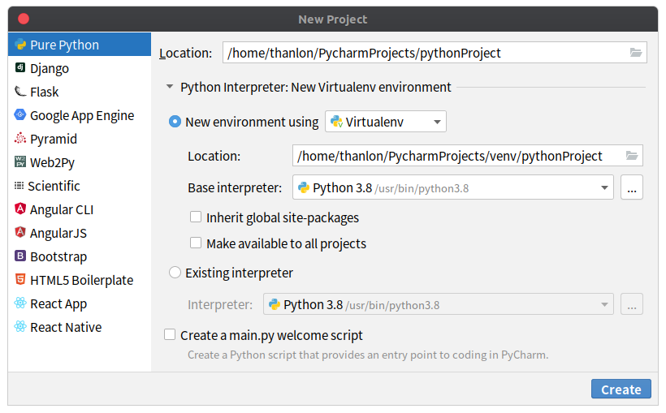

#### 内置模块
Python 内置库(模块)是 Python 内部提供的库，可以帮助我们实现一些基本的功能。我们安装 Python 后可以直接使用，不需要再次安装。可以通过 <kbd>sys.argv</kbd>
来查看 Python 所有内置库。库可以是一个文件，也可以是一个文件夹。
<hr>

##### 1. sys
sys模块中包含Python解释器相关的数据。如引用次数：

<kbd>sys.getrefcount()</kbd>：获取一个值的应用计数
```python
''''
sys模块中，pthon解释器相关的数据
获取一个值的应用计数
'''
import sys
a = [1,2,3]
b=a
print(sys.getrefcount(a))
'''
3
'''
```
<kbd>sys.getrecursionlimit()</kbd>：获取python默认支持的递归数量
```python
''''
sys模块中，pthon解释器相关的数据
python默认支持的递归数量
'''
import sys
print(sys.getrecursionlimit())
'''
1000
'''
```
<kbd>sys.stdout.write()</kbd>：输出，print函数内部会调用它
```python
''''
输入输出：print函数内部会调用
'''
import sys

# 不能是数字，只能是字符串。默认不换行，print函数内部会调用它。
sys.stdout.write('520')
sys.stdout.write('kiku')
'''
520kiku
'''
```
例1：进度条的实现：
```python
# \n：换行
# \t：制表符
# \r：回到当前行的起始位置
print('thanlon', end='')
print('kiku')

print('thanlon\r', end='')
print('kiku')
'''
thanlonkiku
kiku
'''
```
```python
# coding:utf-8
'''
使用\r做进度条
'''
import time

for i in range(1, 101):
    msg = '%s%%\r' % i
    print(msg, end='')
    time.sleep(0.05)
'''
100%
'''
```
例2：读文件的进度条：
```python
# coding:utf-8
'''
进度条
'''
import os

# 读取文件的大小(字节大小)
file_size = os.stat('video.mp4').st_size
# 一点一点读文件
read_size = 0
with open('video.mp4', mode='rb') as f1, open('tmp.mp4', mode='wb')as f2:
    while read_size < file_size:
        chunk = f1.read(1024)  # 每次最多读取1024字节
        f2.write(chunk)
        read_size += len(chunk)
        v = int(read_size / file_size * 100)
        print('%s%%\r' % v, end='')
```


<kbd>sys.argv</kbd>：获取用户的执行脚本的路径
```python
# coding:utf-8
import sys

print(sys.argv)
'''
['E:/pycharmProjects/untitled/test.py']
'''
```
```python
# coding:utf-8
'''
让用户执行脚本传入要删除的文件路径，在内部帮助用户将目录删除
'''
import sys

'''
获取用户执行的脚本时，传入参数
如：D:\Python37\python.exe E:/pycharmProjects/untitled/test.py D:/test（参数是“D:/test”）
sys.argv = ['E:/pycharmProjects/untitled/test.py', 'D:/test']
'''
# 获取参数
path = sys.argv[1]  # path =D:/test
# 删除文件目录
import shutil

shutil.rmtree(path)
```
<kbd>sys.path</kbd>：Python导入模块，会按照 <font>sys.path</font> 中的路径依次查找模块
```python
import sys

for i in sys.path:
    print(i)
'''
E:\pycharmProjects\practice # 执行py文件会向sys.path中添加一个路径，可忽略。D:\Python37\python.exe E:/pycharmProjects/practice/test.py
E:\pycharmProjects\practice # 把当前pycharm中project路径也添加到sys.path中，可忽略。
C:\Program Files\JetBrains\PyCharm 2019.1.3\helpers\pycharm_display
D:\Python37\python37.zip
D:\Python37\DLLs
D:\Python37\lib
D:\Python37
D:\Python37\lib\site-packages
D:\Python37\lib\site-packages\turtle-0.0.2-py3.7.egg
D:\Python37\lib\site-packages\pyyaml-5.1.1-py3.7-win-amd64.egg
C:\Program Files\JetBrains\PyCharm 2019.1.3\helpers\pycharm_matplotlib_backend # pycharm中添加的，忽略
'''
```
内置模块会通过一下路径引入：
```python
'''
D:\Python37\python37.zip
D:\Python37\DLLs
D:\Python37\lib
D:\Python37
D:\Python37\lib\site-packages
D:\Python37\lib\site-packages\turtle-0.0.2-py3.7.egg
D:\Python37\lib\site-packages\pyyaml-5.1.1-py3.7-win-amd64.egg
'''
```
我们不要把自定义的模块放到这些路径下，否则 Python 一旦卸载，这些模块也会被清除。当然我们可以临时把自定义模块的所在路径放到sys.path中：
```python
import sys

# 如果我们自定义的模块在D:/下，可以把这个路径加入path的列表中
sys.path.append(r'D:/')
print(sys.path)
```
<hr>

##### 2. os
os模块可以获取与操作系统相关的数据，如：

<kbd>os.path.exists()</kbd>：文件是否存在
```python
# coding:utf-8
import os

if os.path.exists('E:\pycharmProjects\practice\log.txt'):
    print('yes!')
'''
yes!
'''
```
<kbd>os.stat('xxx.txt').st_size</kbd>：获取文件的大小
```python
# coding:utf-8
import os

v = os.stat('E:\pycharmProjects\practice\log.txt').st_size  # 字节
print(v)  # 9
```
<kbd>os.path.abspath(path)</kbd>：获取文件的绝对路径
os.path.abspath(path)
```python
# coding:utf-8
import os

path = 'log.txt'
v = os.path.abspath(path)
print(v)
'''
E:\pycharmProjects\practice\log.txt
'''
```
<kbd>os.path.dirname(path)</kbd>：获取文件或目录的上一级目录
```python
# coding:utf-8
import os

path = 'E:\pycharmProjects\practice\log.txt'
path2 = 'E:\pycharmProjects\practice\test'
v = os.path.dirname(path)  # E:\pycharmProjects\practice
v2 = os.path.dirname(path2)  # E:\pycharmProjects\practice
print(v)
print(v2)
'''
E:\pycharmProjects\practice
E:\pycharmProjects
'''
```
<kbd>os.listdir(r'E:\pycharmProjects\practice\test')</kbd>：拼接路径
```python
# coding:utf-8
import os

path = 'E:\pycharmProjects\practice'
file_name = 'log.txt'
res1 = os.path.join(file_name, path)  # 注意顺序
res2 = os.path.join(path, file_name)
res3 = os.path.join(path, 'test', file_name)
print(res1)
print(res2)
print(res3)
'''
E:\pycharmProjects\practice
E:\pycharmProjects\practice\log.txt
E:\pycharmProjects\practice\test\log.txt
'''
```
例1：获取一个目录下所有的文件(第一层)：
```python
# coding:utf-8
import os

res = os.listdir(r'E:\pycharmProjects\practice\test')
print(res)  # ['index.html', 'log.txt']
for item in res:
    print(item)
'''
index.html
log.txt
'''
```
例2：获取一个目录下所有的文件(所有层):
```python
# coding:utf-8
import os

res = os.walk(r'E:\pycharmProjects\practice')
print(res)  # <generator object walk at 0x00000237D9C85570>生成器
```
```python
# coding:utf-8
import os

res = os.walk(r'E:\pycharmProjects\practice')

for item in res:
    print(item)
'''
('E:\\pycharmProjects\\practice', ['.idea', 'test'], ['test.py'])
('E:\\pycharmProjects\\practice\\.idea', [], ['misc.xml', 'modules.xml', 'practice.iml', 'workspace.xml'])
('E:\\pycharmProjects\\practice\\test', [], ['index.html', 'log.txt'])
'''
```
```python
# coding:utf-8
import os

res = os.walk(r'E:\pycharmProjects\practice')

for a, b, c in res:
    '''
    a:正在查看的目录
    b:此目录下的文件夹
    c:此目录下的文件
    '''
    print(a)
    print(b)
    print(c)
    '''
    E:\pycharmProjects\practice
    ['.idea', 'test']
    ['test.py']
    E:\pycharmProjects\practice\.idea
    []
    ['misc.xml', 'modules.xml', 'practice.iml', 'workspace.xml']
    E:\pycharmProjects\practice\test
    []
    ['index.html', 'log.txt']
    '''
```
例2：找到目录中的所有文件（重点）：
```python
# coding:utf-8
import os

res = os.walk(r'E:\pycharmProjects\practice')

for a, b, c in res:
    '''
    a:正在查看的目录
    b:此目录下的文件夹
    c:此目录下的文件
    '''
    # print(a)
    # print(b)
    # print(c)
    '''
    E:\pycharmProjects\practice
    ['.idea', 'test']
    ['test.py']
    E:\pycharmProjects\practice\.idea
    []
    ['misc.xml', 'modules.xml', 'practice.iml', 'workspace.xml']
    E:\pycharmProjects\practice\test
    []
    ['index.html', 'log.txt']
    '''
    for item in c:
        path = os.path.join(a, item)
        print(path)
    '''
    E:\pycharmProjects\practice\test.py
    E:\pycharmProjects\practice\.idea\misc.xml
    E:\pycharmProjects\practice\.idea\modules.xml
    E:\pycharmProjects\practice\.idea\practice.iml
    E:\pycharmProjects\practice\.idea\workspace.xml
    E:\pycharmProjects\practice\test\index.html
    E:\pycharmProjects\practice\test\log.txt
    '''
```
<hr>

##### 3. json
我们都知道json格式是一个特殊的字符串，而Python内置的json模块可以对json格式的字符串进行序列化与反序列化，

<kbd>json.dumps()</kbd>：序列化，将Python的数据类型转换为json字符串的格式：
```python
import json

v = [1, 2, 3, 'thanlon', True, {'name': 'thanlon', 'age': 23}]
# 序列化，将python的值转换为json格式的字符串
v2 = json.dumps(v)
print(v2)
'''
[1, 2, 3, "thanlon", true, {"name": "thanlon", "age": 23}]
'''
```
序列化元组，会把元组变为列表:
```python
import json

v = ('thanlon', 23)
v2 = json.dumps(v)
print(type(v2), v2)
'''
<class 'str'> ["thanlon", 23]
'''
```
序列化集合，会报错：
```python
import json

v = {'thanlon', 23}
# 反序列化，将json格式的字符串转换成python的数据类型
v2 = json.dumps(v)
'''
TypeError: Object of type set is not JSON serializable
'''
```
支持序列化成json字符串的数据类型有：
```python
# 来自encoder.py文件
"""
+-------------------+---------------+
| Python            | JSON          |
+===================+===============+
| dict              | object        |
+-------------------+---------------+
| list, tuple       | array         |
+-------------------+---------------+
| str               | string        |
+-------------------+---------------+
| int, float        | number        |
+-------------------+---------------+
| True              | true          |
+-------------------+---------------+
| False             | false         |
+-------------------+---------------+
| None              | null          |
+-------------------+---------------+
"""
```
序列化字典和列表的时候，如果字典和列表中有中文，在序列化为json格式字符串时需要保留中文，需要设置 **`ensure_ascii = False`**:
```python
# coding:utf-8
import json

v = {'k1': '奈何', '哈哈': 'v2'}
val = json.dumps(v)  # 默认中文是unicode编码的
print(val)
'''
{"k1": "\u5948\u4f55", "\u54c8\u54c8": "v2"}
'''
val2 = json.dumps(v, ensure_ascii=False)
print(val2)
'''
{"k1": "奈何", "哈哈": "v2"}
'''
```
<kbd>json.loads()</kbd>：反序列化，将json字符串的格式转换成python的数据类型：
```python
import json

v = '["thanlon",23]'
# 反序列化，将json格式的字符串转换成python的数据类型
v2 = json.loads(v)
print(v2)
'''
['thanlon', 23]
'''
```
json字符串中需要构造成列表或字典(包裹其它内容)才可以被反序列化，传一个值也要构造成列表或字典：
```python
import json
'''
list或dict包裹的内容才可以反序列化，只有字符串是不可以反序列化的
'''
v = 'thanlon'
v2 = json.loads(v)
print(v2)
'''
json.decoder.JSONDecodeError: Expecting value: line 1 column 1 (char 0)
'''
```
<kbd>json.dump()</kbd>：序列化后写入文件
```python
import json

v = [1, 2, 3]
f = open('test.txt', mode='w', encoding='utf-8')
val = json.dump(v, f)
print(val)
```
<kbd>json.load()</kbd>：读取文件数据并反序列化
```python
import json

f = open('test.txt', mode='r', encoding='utf-8')
val = json.load(f)
print(val)
'''[1, 2, 3]'''
```
<hr>

##### 4. pickle
json所有编程语言通用，但是只能序列化基本数据类型list/dict/int；而pickle，除了socket对象，Python中所有东西都可以被序列化。但缺点是序列化的内容只能Python语言识别。<br><br>
<kbd>pickle.dumps()</kbd>：用于将数据进行序列化，完成序列化后，会把数据转换成字节，是不可识别的

<kbd>pickle.loads()</kbd>：用于反序列化<br><br>
例1：集合的序列化与反序列化
```python
import pickle

v = {1, 2, 3, 4}
val = pickle.dumps(v)
print(val)
'''
b'\x80\x03cbuiltins\nset\nq\x00]q\x01(K\x01K\x02K\x03K\x04e\x85q\x02Rq\x03.'
'''
data = pickle.loads(val)
print(data)
'''
{1, 2, 3, 4}
'''
```
例2：函数的序列化与反序列化
```python
# coding:utf-8
'''
函数的序列化与反序列化
'''
import pickle

def foo():
    print('foo')

v1 = pickle.dumps(foo)
print(v1)
data = pickle.loads(v1)
data()
'''
b'\x80\x03c__main__\nfoo\nq\x00.'
foo
'''
```
<kbd>dump函数</kbd>：对数据进行序列化，同时可以保存序列化的内容（序列化后写入文件）

<kbd>load函数</kbd>：读取文件数据并反序列化<br><br>
```python
import pickle

v = {1, 2, 3, 4}
f1 = open('test.txt', mode='wb')
val = pickle.dump(v, f1)  # 写入文件的时候写入的是字节类型的数据
f1.close()
f2 = open('test.txt', mode='rb')
data = pickle.load(f2)
f2.close()
print(data)
'''
{1, 2, 3, 4}
'''
```

<hr>

##### 5. shutil
os模块的删除可能会出问题。可能是权限的原因，文件夹中不能有文件，有文件就删除不了。而shutil模块，文件和目录一块被强制删除。<br><br>
<kbd>shutil.rmtree()</kbd>：删除目录
```python
import shutil
# 删除目录
shutil.rmtree('test')  # 不能删除文件
```
<kbd>shutil.move()</kbd>：重命名目录和文件
```python
import shutil

# 重命名目录和文件
shutil.move('test', 'tmp')
shutil.move('test.txt', 'tmp.txt')
```
<kbd>shutil.make_archive()</kbd>：压缩
```python
import shutil

# 压缩
shutil.make_archive('test', 'zip', 'test')  # "zip", "tar", "gztar","bztar", or "xztar"
# shutil.make_archive('test', 'zip', 'E:\pycharmProjects\\untitled\\test')
```
<kbd>shutil.unpack_archive()</kbd>：解压缩
```python
import shutil

# 解压到当前目录
shutil.unpack_archive('test.zip', format='zip')  # 解压到当前目录
# 解压到指定目录，指定目录如果没有，可以创建
shutil.unpack_archive('test.zip', extract_dir='D:\\newdir', format='zip')
```
<kbd>shutil.copyfileobj()</kbd>：将一个文件内容拷贝到另一个文件中
```python
import shutil

# 将一个文件内容拷贝到另一个文件中
shutil.copyfileobj(open('test.txt', 'r'), open('log.txt', 'w'))
```
<kbd>shutil.copyfile()</kbd>：拷贝文件
```python
import shutil

# 拷贝文件
shutil.copyfile('test.txt','log.txt')
```
<hr>

##### 6. datetime
<kbd>datetime.datetime.now()</kbd>：获取本地时间
```python
import datetime

print(datetime.datetime.now())
"""
2020-09-08 04:53:24.150263
"""
```
<kbd>datetime.datetime.utcnow()</kbd>：获取UTC时间
```python
import datetime

print(datetime.datetime.utcnow())
"""
2020-09-07 20:52:48.993547
"""
```
例1：datetime类型转换成字符串：
```python
from datetime import datetime

ret = datetime.now().strftime('%Y-%m-%d %H:%M%S')  # 字符串中不能使用中文字符
print(ret)
```
例2：字符串转datetime类型：
```python
from datetime import datetime

ret = datetime.strptime('2019-8-1', '%Y-%m-%d')
print(ret, type(ret))
'''
2019-08-01 00:00:00 <class 'datetime.datetime'>
'''
```
例3：datetime类型转换为时间戳类型
```python
from datetime import datetime

ret = datetime.now().timestamp()
print(ret, type(ret))
'''
1599514412.457368 <class 'float'>
'''
```
例4：时间戳转换为datatime类型的时间
```python
from datetime import datetime
import time

ctime = time.time()
ret = datetime.fromtimestamp(ctime)
print(ret, type(ret))
'''
2020-09-08 05:36:03.675019 <class 'datetime.datetime'>
'''
```
<kbd>datetime.timezone()</kbd>：获取时区

<kbd>datetime.datetime.utcnow()</kbd>：时间的加减乘除
获取时区：
```python
from datetime import timezone, timedelta

tz = timezone(timedelta(hours=1))  # 获取时区，hours表示一小时间隔，表示东一区。西一区可以使用-1
print(tz)
'''
UTC+01:00
'''
```
获取指定时区的时间：
```python
from datetime import timezone, timedelta, datetime

tz = timezone(timedelta(hours=1))  # 获取时区
ret = datetime.now(tz)  # 获取指定时区的时间
print(ret)
"""
2020-09-07 22:48:09.492275+01:00
"""
```
<hr>

##### 7. time
<kbd>time.time()</kbd>：获取时间戳
```python
import time

print(time.time())
"""
1599507081.1925657
"""
```
><font>time.time( ) 是1970年到现在的秒数。</font>

<kbd>time.sleep()</kbd>：同步等待多少时间(单位秒)
```python
import time

print(time.time())
time.sleep(5)
print(time.time())  # 5s后才执行这一条语句
"""
1599507258.6660213
1599507263.6695352
"""
```
<kbd>time.timezone()</kbd>：当前时区和格林尼治时间相差的秒数
```python
import time

print(time.timezone)
"""
-28800
"""
```
<hr>

##### 8. logging
logging模块可以用来记录程序错误日志信息，<br><br>
<kbd>logging.basicConfig()</kbd>：为日志系统做基础的配置

<kbd>logging.__dir__()</kbd>：获取logining模块的所有方法、属性

<kbd>logging.error()</kbd>：可以把错误信息写入到日志文件中

记录到错误日志是需要设置级别的，只有级别大于函数中设置的级别才可以被写入日志文件！

例子：
```python
import logging
import traceback

"""
asctime：时间，name：用户，levelname：级别，module：运行的模块，message：相关信息
level>=30才会被写入日志文件，默认级别也就是30
"""
logger = logging.basicConfig(
    filename='log.txt',
    format='%(asctime)s - %(name)s - %(levelname)s - %(module)s：%(message)s',
    datefmt='%Y-%m-%d %H:%M:%S',
    level=30
)

def func():
    a = 10
    try:
        b = a / 0
    except Exception as e:
        print(e)  # division by zero
        logging.error(str(e))
        """
        # 只是将e的信息写入日志，这是不够的
        2020-09-08 13:57:50 - root - ERROR - test：division by zero
        """
        msg = traceback.format_exc()
        logging.error(msg)
        """
        # 需要更加具体到错误的代码行数
        2020-09-08 13:59:04 - root - ERROR - test：Traceback (most recent call last):
            File "/home/thanlon/test.py", line 20, in func
                b = a / 0
        ZeroDivisionError: division by zero
        """

if __name__ == '__main__':
    func()
```
<hr>

##### 9. md5
简单的加密：如果撞库(将能想到的常用的密码加密，根据密文找明文)，会导致密码被泄露。
```python
import hashlib

# 实例化对象
obj = hashlib.md5()
# 写入要加密的字节，python3中加密的必须是字节
obj.update('123456'.encode('utf-8'))
# 获取密文
ciphers = obj.hexdigest()
print(ciphers)
'''
e10adc3949ba59abbe56e057f20f883e
'''
```
加盐的加密：使用加盐可以解决撞库问题，增强密码的安全性。
```python
import hashlib

# 实例化对象的时候顺便加盐
obj = hashlib.md5(b'thanlon')  # 加盐
# 写入要加密的字节，python3中加密的必须是字节
obj.update('123456'.encode('utf-8'))
# 获取密文
ciphers = obj.hexdigest()
print(ciphers)
'''
1a8c227a607ed3c09a39f4b6a6df8869
'''
```
封装加密函数：
```python
import hashlib

SALT = b'thanlon'

def md5(pwd):
    """
    # 自定义MD5函数
    :param pwd:
    :return:
    """
    obj = hashlib.md5(SALT)
    # pwd是字符串，需要将其转换成字节
    obj.update(pwd.encode('utf-8'))
    # 返回密文
    return obj.hexdigest()

print(md5('123456'))
"""
1a8c227a607ed3c09a39f4b6a6df8869
"""
```
<hr>

##### 10. getpass
可以让用户在终端输入密码不显示，注意只有在终端运行密码才会不显示：
```python
import getpass

pwd = getpass.getpass('请输入密码：')
if pwd == '123456':
    print('密码正确！')
```
<hr>

##### 11. csv
csv即逗号分隔值(comma-separated values)，有时也称为字符分割值，是以纯文本形式存储表格数据。

<kbd>csv.reader()</kbd>：csv文件的读取
```py
import csv

with open('stuInfo.csv', 'r') as f:
    data = csv.reader(f)
    # print(data)  # data is a object<_csv.reader object at 0x00000197FC4A4160>
    for data_item in data:
        print(data_item)
'''
['1', 'thanlon', '10000']
['2', 'Maria', '20000']
'''
   for data_item in data:
       print(data_item[0], data_item[1], data_item[2])
'''
1 thanlon 10000
2 Maria 20000
'''
```
<kbd>csv.writer()</kbd>：csv文件的写入
```py
import csv

stu = ['3', 'Maria', 10000]
with open('stuInfo.csv', 'a', newline='') as f:  # 如果没有加newline=''写入一行后空行
    csv_writer = csv.writer(f, dialect='excel')
    csv_writer.writerow(stu)
```
<hr>

##### 12. timeit
timeit模块可以用来计算代码执行的时间，

<kbd>timeit.timeit()</kbd>：返回的是timerit模块中Timer类的timeit方法的执行结果，timeit函数的源码
```python
def timeit(stmt="pass", setup="pass", timer=default_timer,
           number=default_number, globals=None):
    """Convenience function to create Timer object and call timeit method."""
    return Timer(stmt, setup, timer, globals).timeit(number)
```
timeit函数参数：

|   |   |
|--|--|
| stmt | 用来放需要进行计算时间的代码，可以接收字符串的表达式、单个变量、函数 |
| setup | 可以用来传stmt的环境，例如import和一些参数之类的 |
| number | 执行是的次数，默认是1000000 |
| 其它 | 一般用不到，具体可查看文档 |
|||

<kbd>timeit.repeat()</kbd>：返回的是timeit模块中Timer类repeat方法的执行结果，repeat函数的源码
```py
def repeat(stmt="pass", setup="pass", timer=default_timer,
           repeat=default_repeat, number=default_number, globals=None):
    """Convenience function to create Timer object and call repeat method."""
    return Timer(stmt, setup, timer, globals).repeat(repeat, number)
```
repeat函数比timeit函数多一个repeat参数：

|   |   |
|-|-|
| stmt | 用来放需要进行计算时间的代码，可以接收字符串的表达式、单个变量、函数 |
| setup | 可以用来传stmt的环境，例如import和一些参数之类的 |
| number | 执行是的次数，默认是1000000 |
| repeat | 重复整个测试的个数，默认是3 |
| 其它 | 一般用不到，具体可查看文档 |
|||

例1：测试列表推导式与for循环的执行时间(分别使用timeit函数和repeat函数)：
```py
import timeit

stmt_list = '''
lst=[]
for i in range(10000):
    lst.append(i)
'''
if __name__ == '__main__':
    print(timeit.timeit('[i for i in range(10000)]', number=10000))
    print(timeit.timeit(stmt_list, number=10000))
'''
3.346147895
5.789892938
'''
```
```py
import timeit

stmt_list = '''
lst=[]
for i in range(10000):
    lst.append(i)
'''
if __name__ == '__main__':
    print(timeit.repeat('[i for i in range(10000)]', repeat=2, number=10000))
    print(timeit.repeat(stmt_list, repeat=2, number=10000))
'''
[3.374952514, 3.4277178010000005]
[5.748379824000001, 5.8717959529999995] 
'''
```
<hr>

##### 13. random

<hr>

#### 第三方模块
一般我们使用 <kbd>$ pip install module_name</kbd> 命令来安装第三方库。
<hr>

##### 1. jieba
jieba是Python中一个重要的第三方 <font>分词</font> 函数库，能够将中文文本分割成中文词语的序列。jieba原理是将中文文本与分词词库对比，通过图结构和动态规划算法找出最大概率的词组。

<kbd>jieba.lcut(str)</kbd>：精确模式，将句子精确地分开，适合文本分析
```python
import jieba
str = '宁浩出任第22届上海国际电影节亚洲新人奖评委会主席'
ls =jieba.lcut(str)
print(ls)
"""
['宁浩', '出任', '第', '22', '届', '上海', '国际', '电影节', '亚洲', '新人奖', '评委会', '主席']
"""
```
<kbd>jieba.lcut_for_search(str)</kbd>：搜索引擎模式，在精确查找的基础上对长词再次切分，提高召回率，适合搜索引擎分词
```python
import jieba
str = '宁浩出任第22届上海国际电影节亚洲新人奖评委会主席'
ls =jieba.lcut_for_search(str)
print(ls)
"""
['宁浩', '出任', '第', '22', '届', '上海', '国际', '电影', '电影节', '亚洲', '新人', '新人奖', '评委', '委会', '评委会', '主席']
"""
```
<kbd>jieba.lcut(str,cut_all=True)</kbd>：全模式，把句子可以成词的语句都扫描出来，速度快但不能解决歧义
```python
import jieba
str = '宁浩出任第22届上海国际电影节亚洲新人奖评委会主席'
ls =jieba.lcut(str,cut_all=True)
print(ls)
"""
['宁', '浩', '出任', '第', '22', '届', '上海', '海国', '国际', '电影', '电影节', '亚洲', '新人', '新人奖', '奖评', '评委', '评委会', '委会', '会主', '主席']
"""
```
<hr>

##### 2. pyInstaller
pyInstaller可以在Windows、Linux、Mac 0S等操作系统下将.py的Python源文件打包成直接可运行的可执行文件。执行<kbd>pyinstaller -F test.py</kbd> 命令打包，执行完成后，源文件目录生成 dist 和 build
目录，build目录是PyInstaller存储临时文件的目录，可以完全删除。最终打包程序在dist内部与源文件同名的目录中。pyinstaller命令相关参数：

|   |   |
| - | - |
| -F或--onefile | 在dist文件夹中只生成独立的打包文件  |
| -h或--help | 帮助信息  |
| --clean |  清理打包过程中的临时文件 |
| -i <图标文件路径名.io>  | 指定打包程序使用的图标  |
| -D或--onedir  | 默认值，生成dist目录  |
|   |   |

通过对Python源文件打包，使Python程序在可以没有安装Python环境中运行，可作为独立文件方便传递和管理。此外，公司通常是不开放自己源代码的，将源文件打包成看不到源代码的可执行文件，安全性得到增强。
<hr>

##### 3. virtualenv
virtualenv可用来帮助我们创建Python虚拟环境，能够保证Python环境的干净，

<kbd>$ pip install virtualenv</kbd>：安装virtualenv<br><br>

<kbd>$ virtualenv env --no-site-packages</kbd>：创建一个名字为env名字的虚拟环境（不包括安装的其它第三方模块）<br><br>

<kbd>$ source env/bin/activate</kbd>：激活虚拟环境<br><br>

<kbd>$ deactivate</kbd>：退出虚拟环境<br><br>

<kbd>$ rm -r env</kbd>：删除虚拟环境（删除这个env这个文件夹就可以）
<br><br>
PyCharm中创建virtualenv环境：

<hr>

##### 4. wordcloud
wordcloud库是专门用来生成词云的Python第三方模块。词云：以词语为单位，根据文本出现的概率设计不同的size，形成关键词词文或关键词渲染。

<kbd>generate()</kbd>：由字符串的内容生成词云

<kbd>to_file()</kbd>：将词云图保存为图片

例1：
```py
from wordcloud import WordCloud
text = 'I like python, I am learning python.' # 标点符号不参与
wd = WordCloud().generate(text)
wd.to_file('test.png') # 其它图片格式也是可以的 
```
例2：
```py
import jieba
from wordcloud import WordCloud
text = '程序设计语言是计算机'
words = jieba.lcut(text)
print(words) # ['程序设计', '语言', '是', '计算机']
new_text = ' '.join(words)
print(new_text)
wc = WordCloud(font_path = None).generate(new_text)
wc.to_file('test.png')
```
<kbd>WordCloud()类更多的属性和解释</kbd>：

|   |    |
| - | - |
| font_path | 默认为None，指定字体文件的完整路径  |
| width  |  生成图片的宽度，默认是400px |
| height  | 生成图片的高度，默认是200px  |
| mask  | 词文形状，默认是None，默认是方型图  |
| min_font_size | 词云最小的字体字号，默认是4号  |
| max_font_size  | 词云最小的字体字号，默认是None，根据高度自动调节  |
| font_step | 字体间隔，模式是1  |
| max_words |  词云中最大词数，默认是200 |
| stop_words |  被排除词列表，排除词不在词云中显示 |
| background_color | 图片背景颜色，默认是黑色  |
|   |    |

<hr>

##### 5. multiprocessing
multiprocessing是一个跨平台的多进程模块，提供一个Process类来代表一个进程对象，下面是一个多进程示例：
```python
from multiprocessing import Process
import time

def f(n):
    time.sleep(1)
    print(n * n)

def main():
    for i in range(10):
        p = Process(target=f, args=[i, ])
        p.start()

# p.join()使用p.join()可阻塞进程，前面一个进程执行完，后面的进程才可以执行
if __name__ == '__main__':
    main()
```
程序使用单进程写则需要执行10s以上的时间，而使用多进程启用10个进程并行执行，只需要用1秒多的时间。Queue是多进程安全队列，可以使用Queue实现多进程之间的数据传递，下面是一个Queue相关的例子：
```python
from multiprocessing import Queue, Process
import time

def write(q):
    lst = ['A', 'B', 'C', 'D']
    for i in lst:
        q.put(i)
        print('Put %s to queue' % i)
        time.sleep(0.5)
def read(q):
    while True:
        v = q.get(True)
        print('get %s from queue' % v)
def main():
    q = Queue()
    pw = Process(target=write, args=(q,))
    pr = Process(target=read, args=(q,))
    pw.start()
    pr.start()
    pr.join()
    pr.terminate()
if __name__ == '__main__':
    main()
"""
Put A to queue
get A from queue
Put B to queue
get B from queue
Put C to queue
get C from queue
Put D to queue
get D from queue
"""
```
<hr>

<div style="width: 60px;height: auto;z-index: 99;bottom: 30%;position: fixed;right: 0px" id="plug-ins">
    <div style="position: relative;float: right">
        <a target="_blank" href="https://blog.csdn.net/thanlon" id="weibo"
           style="display: block;width: 40px;height: 40px;background-color: #c4351b;margin-top: 1px;">
            
        </a>
       <a target="_blank" href="http://sighttp.qq.com/authd?IDKEY=5838160dbeb2a49f264d5e2d13d6336248d74a60cf56ecad" id="qq" style="display: block;width: 40px;height: 40px;background-color:#0e91e8;margin-top: 1px">
            
        </a>
        <a href="javascript:" id="wechat"
           style="display: block;width: 40px;height: 40px;background-color:#01b901;margin-top:1px">
            
        </a>
        <a href="javascript:" id="go_top"
           style="display: none;width: 40px;height: 40px;background-color: #b5b5b5;margin-top: 1px">
            
        </a>
    </div>
</div>
<!--双11 start-->
<div style="z-index: 100;position: fixed;left: 0;bottom: 0;" id="ads" hidden="hidden">
        <div>
            <button type="button" class="close" style="position: absolute;right: 5px;top: 0;font-size: 28px;opacity: 1;color: white"><span aria-hidden="true">&times;</span></button>
             <a target="_blank" href="https://s.click.taobao.com/1pElJvu">
                
            </a><br>
            <a target="_blank" href="https://s.click.taobao.com/5EtkJvu">
                
            </a>
        </div>
</div>
<!--双11 stop-->
<div style="width: auto;height: auto;z-index: 99;position: fixed;right: 0;top: 70px;" id="google_ads">
        <div>
            <div style="width: 180px;height: auto"></div>
            <script async src="https://pagead2.googlesyndication.com/pagead/js/adsbygoogle.js"></script>
            <!-- Vertical -->
            <ins class="adsbygoogle"
                 style="display:block"
                 data-ad-client="ca-pub-6937898095875663"
                 data-ad-slot="2927491642"
                 data-ad-format="auto"
                 data-full-width-responsive="true"></ins>
            <script>
                 (adsbygoogle = window.adsbygoogle || []).push({});
            </script>
        </div>
</div>
<div style="width: auto;height: auto;z-index: 99;position: fixed;left: 0;top: 70px;" id="google_ads">
        <div>
            <div style="width: 180px;height: auto"></div>
            <script async src="https://pagead2.googlesyndication.com/pagead/js/adsbygoogle.js"></script>
            <!-- Vertical -->
            <ins class="adsbygoogle"
                 style="display:block"
                 data-ad-client="ca-pub-6937898095875663"
                 data-ad-slot="2927491642"
                 data-ad-format="auto"
                 data-full-width-responsive="true"></ins>
            <script>
                 (adsbygoogle = window.adsbygoogle || []).push({});
            </script>
        </div>
</div>