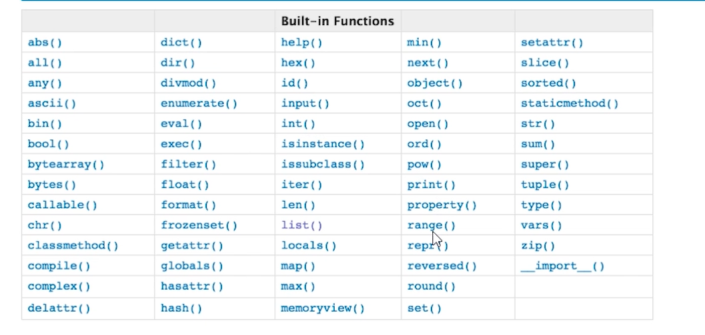

#### 数字类型(整型)
<hr>

##### 1. 整数
可以用十进制、二进制、八进制、十六进制表示
<hr>

##### 2. 浮点数
浮点数必须带有小数部分，小数部分可以是0。浮点数有两种表示方式，一般形式：123.456；科学计数法：1.23456e2或1.23456e+2，相当于1.23456x10<sup>2</sup>。
<hr>

#### 布尔类型
<hr>

##### 1. 布尔类型的值
**`bool`** 关键字表示布尔类型，只有两个值：True/False。
<hr>

#### 字符串
<hr>

##### 1. 通用功能
( 1 ) 获取字符串中的长度 ( 字符的个数 )
```python
v = '你好！'
print(len(v))
'''
3
'''
```
<hr>

( 2 ) 根据索引获取对应位置上的值
```python
s = input('输入字符串：')
s_len = len(s)
index = 0
while True:
    v = s[index]
    print(v)
    if index == s_len - 1:
        break
    index += 1
```
<hr>

( 3 ) 获取字符串中的片段
```python
v = 'thanlon'
print(v[1:3])  # 左开右闭
print(v[1:-1])
print(v[-2:-1])
print(v[1:])
print(v[:-1])
print(v[:])
'''
ha
hanlo
o
hanlon
thanlo
thanlon
'''
```
<hr>

( 4 ) 根据步长获取值
```python
v = 'thanlon'
print(v[0:7:2])
'''
taln
'''
```
<hr>

( 5 ) for 循环
```python
# coding:utf-8
v = 'thanlon'
for i in v:
    print(i)
'''
t
h
a
n
l
o
n
'''
```
<hr>

##### 2. 字符串独有功能
( 1 ) upper：将字符串转换为大写
```python
# coding:utf-8
v = 'Thanlon'
print(v.upper())
'''
THANLON
'''
```
( 2 ) lower：将字符串转为小写
```python
# coding:utf-8
v = 'Thanlon'
print(v.lower())
'''
thanlon
'''
```
( 3 ) split、rsplit：切割
```python
# coding:utf-8
'''
split、rsplit方法：切割
'''
msg = '你是个笨蛋吗？你是个笨蛋吗？你是个笨蛋吗？'
print(msg.split('？'))  # 从左向右切割所有
print(msg.split('？', 1))  # 从左向右切割，从第一个？开始切割
print(msg.rsplit('？'))  # 从右向左切割所有，从最后一个？开始切割
print(msg.rsplit('？', 1))  # 从右向左切割
'''
['你是个笨蛋吗', '你是个笨蛋吗', '你是个笨蛋吗', '']
['你是个笨蛋吗', '你是个笨蛋吗？你是个笨蛋吗？']
['你是个笨蛋吗', '你是个笨蛋吗', '你是个笨蛋吗', '']
['你是个笨蛋吗？你是个笨蛋吗？你是个笨蛋吗', '']
'''
```
( 4 ) strip：去除字符串左右多余的空格
```python
'''
strip()删除左右的空白字符串
lstrip()删除左右的空白字符串
lstrip()删除的空白字符串
'''
name = input('请输入用户名：')
print('---->' + name + '<----')
print('---->' + name.strip() + '<----')
print('---->' + name.lstrip() + '<----')
print('---->' + name.rstrip() + '<----')
'''
请输入用户名： thanlon 
----> thanlon <----
---->thanlon<----
---->thanlon <----
----> thanlon<----
'''
```
( 5 ) replace：替换
```python
# coding:utf-8
'''
replace方法：替换
'''
msg = '你是个笨蛋吗？你是个笨蛋吗？你是个笨蛋吗？'
print(msg)
print(msg.replace('笨蛋', '**'))  # 替换所有''笨蛋'
print(msg.replace('笨蛋', '**', 1))  # 只替换第一个''笨蛋'
'''
你是个笨蛋吗？你是个笨蛋吗？你是个笨蛋吗？
你是个**吗？你是个**吗？你是个**吗？
你是个**吗？你是个笨蛋吗？你是个笨蛋吗？
'''
```
( 6 ) isdigit：判断是否是数字
```python
# coding:utf-8
# isdigit：方法判断是否是数字
while True:
    print('''
    1.余额查询
    2.业务办理
    ''')
    num = input('请选择服务:')
    if num.isdigit():
        print(int(num))
    else:
        print('请输入数字！')
```
( 7 ) startswith
```python
# coding:utf-8
'''
startswith
'''
name = 'thanlon'
v = name[0:2]
if v == 'th':
    print('是以%s开头！' % v)
else:
    print('不是以%s开头！' % v)
'''
True
'''
```
```python
# coding:utf-8
'''
startswith与endswith
'''
v = 'thanlon'
flag = v.startswith('th')
print(flag)
'''
True
'''
```
( 8 ) endswith
```python
# coding:utf-8
'''
endswith
'''
name = 'thanlon'
v = name[5:]
if v == 'on':
    print('是以%s结尾！' % v)
else:
    print('不是以%s结尾！' % v)
'''
True
'''
```
```python
# coding:utf-8
'''
endswith
'''
name = 'thanlon'
flag = name.endswith('on')
if flag:
    print('是以on结尾！')
else:
    print('不是以on结尾！')
'''
True
'''
```
( 9 ) format
```python
# coding:utf-8
'''
format
'''
print('wow,{}'.format('thanlon'))
'''
wow,thanlon
'''
```
( 10 ) join
```python
name = 'thanlon'  # 解释器读取到内存后，按照unicode编码存储，占用7x4b=28b
r = '_'.join(name)
print(r)
'''
t_h_a_n_l_o_n
'''
```
( 11 ) encode
```python
name = 'thanlon'  # 解释器读取到内存后，按照 unicode 编码存储，占用7x4b=28b
v1 = name.encode('utf-8')
print(v1)
'''
b'thanlon'
'''
v2 = name.encode('gbk')
print(v2)
'''
b'thanlon
'''
```
<hr>

##### 3. 字符串练习题
( 1 ) 请将字符串反转（笔试题）
```python
# coding:utf-8
'''
方式1
'''
v = 'Thanlon'
index = len(v) - 1
while index >= 0:
    print(v[index])
    index -= 1
'''
方式2
'''
v = 'Thanlon'
print(v[::-1])  # 或print(v[-1::-1])
```
( 2 ) 判断字符串中是否含有敏感字符？
```python
info = 'thanlonkiku'
if 'kiku' in info:
    print('right!')
'''
right!
'''
```
( 3 ) 字符串按指定编码转字节
```python
v = '一问奈何'
v2 = 'thanlon'
data = v.encode('utf-8')
data2 = v2.encode('utf-8')
print(data)
print(data2)
'''
b'\xe4\xb8\x80\xe9\x97\xae\xe5\xa5\x88\xe4\xbd\x95'
b'thanlon'
'''
```
( 4 ) 字节按指定编码转字符串
```python
v = b'\xe4\xb8\x80\xe9\x97\xae\xe5\xa5\x88\xe4\xbd\x95'
v2 = b'thanlon'
data = v.decode('utf-8')
data2 = v2.decode('utf-8')
print(data)
print(data2)
'''
一问奈何
thanlon
'''
```
><fonr>字符串使用哪种编码方式编码，转成字节后要只有以这种编码方式才能解码转回字符串。</font>
<hr>

#### 列表
<hr>

##### 1. 通用功能
( 1 ) 获取列表的长度 ( 列表中元素的个数 )
```python
users = ['Thanlon', 'Kiku']
print(len(users))
'''
2
'''
```
( 2 ) 根据索引获取对应位置上的值
```python
users = ['Thanlon', 'Kiku']
print(users[1])
'''
Kiku
'''
```
( 3 ) 对列表进行切片
```python
users = ['Thanlon', 'Kiku']
print(users[0:1])
'''
['Thanlon']
'''
```
( 4 ) 对列表进行切片设置步长
```python
# coding:utf-8
users = ['Thanlon', 'Kiku','Haha']
print(users[0::2])
'''
['Thanlon']
'''
```
( 5 ) for 循环
```python
users = ['Thanlon', 'Kiku', 'Haha']
for i in users:
    print(i)
'''
Thanlon
Kiku
Haha
'''
```
<hr>

##### 2. 列表独有功能
( 1 ) append：在列表的最后追加一个元素
```python
users = []
users.append('Thanlon')
print(users)
'''
['Thanlon']
'''
```
( 2 ) insert：在指定索引位置插入元素
```python
users = ['thanlon']
users.insert(0, 'Kiku')  # 在第0个元素的位置加入
print(users)
'''
['Kiku', 'thanlon']
'''
```
( 3 ) pop：删除指定索引的元素
```python
users = ['Kiku', 'thanlon', 'Kiku']
users.pop(0)
print(users)
users.pop()  # 删除最后一个元素
print(users)
'''
['thanlon', 'Kiku']
['thanlon']
'''
```
( 4 ) remove：删除指定元素
```python
users = ['Kiku', 'thanlon', 'Kiku']
users.remove('Kiku')  # 只能删除第一个'Kiku'
print(users)
'''
['thanlon', 'Kiku']
'''
```
( 5 ) clear：删除所有元素
```python
users = ['Kiku', 'thanlon', 'Kiku']
print(users)
users.clear()
print(users)
'''
['Kiku', 'thanlon', 'Kiku']
[]
'''
```
( 6 ) extend：在列表中追加一个列表/元组
```python
users = ['Thanlon', 'Kiku']
ex = ['Haha', 1, 2]  # 或 ('Haha', 1, 2)
users.extend(ex)
print(users)
'''
['Thanlon', 'Kiku', 'Haha', 1, 2]
'''
```
( 7 ) del List[index]：删除指定索引的元素 ( 与 pop 方法不同的是必须得加索引 )
```python
users = ['Kiku', 'thanlon', 'Kiku']
del users[0]
print(users)
'''
['thanlon', 'Kiku']
'''
```
( 8 ) 列表的修改
```python
users = ['thanlon', 'Kiku']
users[0] = 'T'
users[1] = 'K'
print(users)
'''
['T', 'K']
'''
```
( 9 ) 将列表中的元素拼接为字符串
```python
name = [1, 2, 3, 4, 5, 6]
for item in range(0, len(name)):
    name[item] = str(name[item])
result = ''.join(name)
result2 = ','.join(name)
print(result)
print(result2)
'''
123456
1,2,3,4,5,6
'''
```
( 10 ) 反转列表 ( 列表中的元素逆向排列 )
```python
info = ['thnalon', 'kiku']
print(info)
info.reverse()
print(info)
'''
['thnalon', 'kiku']
['kiku', 'thnalon']
'''
```
( 11 ) 排序 ( 列表中是整型的数据 )
```python
info = [4, 2, 5]
print(info)
info.sort(reverse=False)  # 从小到大排列（默认）
print(info)
info.sort(reverse=True)  # 从大到小排列（默认）
print(info)
'''
[4, 2, 5]
[2, 4, 5]
[5, 4, 2]
'''
```
<hr>

##### 3. 列表练习题
( 1 ) 列表的嵌套
```python
users = ['thanlon', 'Kiku', [66, 'thanlon', 'Kiku', ['thanlon', 'Kiku']]]
print(users[-1])
print(users[-1][-1])
print(users[-1][-1][0])
print(users[-1][-1][0][0:-2])
'''
[66, 'thanlon', 'Kiku', ['thanlon', 'Kiku']]
['thanlon', 'Kiku']
thanlon
thanl
'''
```
( 2 ) 判断列表中是否含有敏感元素
```python
info = [1, 2, 3, 4, 5, 'thanlon']
if 1 in info:
    print('right!')
'''
right!
'''
```
<hr>

#### 元组
<hr>

##### 1. 通用功能
( 1 ) len
```python
# coding:utf-8
users = ('Thanlon', 'Kiku', 'Haha')
print(len(users))
'''
3
'''
```
( 2 ) 索引
```python
# coding:utf-8
users = ('Thanlon', 'Kiku', 'Haha')
print(users[0])
'''
Thanlon
'''
```
( 3 ) 切片
```python
# coding:utf-8
users = ('Thanlon', 'Kiku', 'Haha')
print(users[0:3])
'''
('Thanlon', 'Kiku', 'Haha')
'''
```
( 4 ) 步长
```python
# coding:utf-8
users = ('Thanlon', 'Kiku', 'Haha')
print(users[0:3:2])
'''
('Thanlon', 'Haha')
'''
```
( 5 ) for循环
```python
# coding:utf-8
users = ('Thanlon', 'Kiku', 'Haha')
for i in users:
    print(i)
'''
Thanlon
Kiku
Haha
'''
```
<hr>

##### 2. 元组独有功能
<hr>

##### 3. 元组练习题
判断元组中是否含有敏感元素?
```python
# coding:utf-8
info = (1, 2, 3, 4, 5, 'thanlon')
if 1 in info:
    print('right!')
'''
right!
'''
```
<hr>

#### 字典
<hr>

##### 1. 字典概述
帮助用户去表示一个事物的信息（事物有多个属性）。
```python
info = {'name': 'thanlon', 'age': 23, 'gender': '男'}  # 键值
```
<hr>

##### 2. 字典的键值类型
任何数据类型都可以作为字典的值，但字典中键的数据类型不可以是可变类型，如列表、字典（这两种数据类型是不可hash的）。其它数据类型的值内部是不可被修改的，也即是不可变类型，这些都是可以的作为字典的键。

<hr>

##### 3. 字典基本格式
```python
info = {键:值, 键:值, 键:值, 键:值,,,}
```
<hr>

##### 4. 公共功能
( 1 ) len：获取字典长度
```python
# coding:utf-8
'''
len()
'''
info = {'name': 'thanlon', 'age': 23, 'gender': '男'}
print(len(info))
'''
3
'''
```
( 2 ) 索引
```python
# coding:utf-8
'''
len()
'''
info = {'name': 'thanlon', 'age': 23, 'gender': '男'}
print(info['name'])
'''
thanlon
'''
```
( 3 ) 切片【无】

( 4 ) 步长【无】

( 5 ) for循环
```python
# coding:utf-8
'''
values()
'''
info = {'name': 'thanlon', 'age': 23, 'gender': '男'}
for key, value in info.items():
    print(key, value)
'''
name thanlon
age 23
gender 男
'''
```
( 6 ) 修改：存在就修改，不存在就添加
```python
# coding:utf-8
'''
修改
'''
info = {'name': 'thanlon', 'age': 23, 'gender': '男'}
info['name'] = 'Kiku'
info['age'] = 25
info['gender'] = '女'
print(info)
'''
{'name': 'Kiku', 'age': 25, 'gender': '女'}
'''
```
如果需要修改键，可以先删掉原来的键，再增加新的键，一般是不改键的。

( 7 ) 删除：删除键值
```python
# coding:utf-8
'''
删除
'''
info = {'name': 'thanlon', 'age': 23, 'gender': '男'}
del info['name']
print(info)
'''
{'age': 23, 'gender': '男'}
'''
```
<hr>

##### 5. 字典独有功能
( 1 ) keys()：获取字典中的所有键
```python
# coding:utf-8
'''
keys()
'''
info = {'name': 'thanlon', 'age': 23, 'gender': '男'}
for item in info:
    print(item)
print()
for item in info.keys():
    print(item)
'''
name
age
gender

name
age
gender
'''
```
( 2 ) values()：获取字典中的所有值
```python
# coding:utf-8
'''
values()
'''
info = {'name': 'thanlon', 'age': 23, 'gender': '男'}
for item in info.values():
    print(item)
print()
'''
thanlon
23
男
'''
```
( 3 ) items()：获取字典中的所有键值对
```python
# coding:utf-8
'''
values()
'''
info = {'name': 'thanlon', 'age': 23, 'gender': '男'}
for key, value in info.items():
    print(key, value)
'''
name thanlon
age 23
gender 男
'''
```
```python
info = {'name': 'thanlon', 'age': 23, 'gender': '男'}
for item in info.items():
    print(item)
'''
('name', 'thanlon')
('age', 23)
('gender', '男')
'''
```
( 4 ) get：获取字典中的值（公司里基本上使用此方式获取字典中的值）

通过索引去取值，如果没有所取的键，就会报错。但是，如果通过 get 方法，不会报错。
```python
# coding:utf-8
'''
get方法，None表示什么都没有，转为bool类型是False
'''
d = {'name': 'thanlon', 'age': 23}
# v1 = d['gender']  # 不存在此键，会报错
v2 = d.get('gender')
v3 = d.get('gender', '没有这个键！')
print(v2)  # 如果没有取到值，默认返回None
print(v3)
'''
None
没有这个键！
'''
```
```python
# coding:utf-8
d = {'name': 'thanlon', 'age': 23}
result = d.get('gender')
# print(result)#None
if result == None:
    print('不存在！')
if result:
    print('存在！')
else:
    print('不存在！')
'''
不存在！
不存在！
'''
```
( 5 ) pop：删除键值，并返回删除的值
```python
# coding:utf-8
info = {'name': 'thanlon', 'age': 23}
result = info.pop('age')
print(info, result)
'''
{'name': 'thanlon'} 23
'''
```
( 6 ) update：不存在添加，存在就更新
```python
# coding:utf-8
info = {'name': 'thanlon', 'age': 23}
info.update({'name': 'kiku', 'gender': '男'})
print(info)
'''
{'name': 'kiku', 'age': 23, 'gender': '男'}
'''
```
( 7 ) 知识点补充
```python
# coding:utf-8
s = '1,2'
print(s.split(','))  # ['1', '2']
v1, v2 = s.split(',')
print(v1, v2)
'''
['1', '2']
1 2
'''
```
```python
# coding:utf-8
v1, v2 = ['1', '2']
print(v1, v2)
'''
1 2
'''
```
```python
# coding:utf-8
v1, v2 = ('1', '2')
print(v1, v2)
'''
1 2
'''
```
<hr>

##### 6. 字典练习题
( 1 ) 用户输入键，系统根据输入的键输出对应的值?
```python
# coding:utf-8
'''
用户输入键，系统根据输入的键输出对应的值
'''
info = {'name': 'thanlon', 'age': 23, 'gender': '男'}
for k, v in info.items():
    print(k, v)
while True:
    key = input('请输入key：')
    print(info[key])
'''
name thanlon
age 23
gender 男
请输入key：name
thanlon
请输入key：age
23
'''
```
( 2 ) 给一个空字典，在空字典中添加数据
```python
# coding:utf-8
'''
给一个空字典，在空字典中添加数据
'''
info = {}
info['name'] = 'thanon'
info['age'] = 23
info['gender'] = '男'
print(info)
'''
{'name': 'thanon', 'age': 23, 'gender': '男'}
'''
```
( 3 ) 给一个空字典，输入key和value，将输入的key和value添加到字典中
```python
# coding:utf-8
'''
# coding:utf-8
'''
给一个空字典，输入key和value，将输入的key和value添加到字典中
'''
info = {}
k = input('Place input key：')
v = input('Place input value：')
info[k] = v
print(info)
'''
Place input key：name
Place input value：thanlon
{'name': 'thanlon'}
'''
```
( 4 ) 给一个空字典，让用户一直输入 key 和 value，将输入的 key 和 value 添加到字典中，直到用户输入N，则表示不再输入。
```python
# coding:utf-8
'''
给一个空字典，让用户一直输入key和value，将输入的key和value添加到字典中，直到用户输入N，则表示不再输入。
'''
info = {}
while True:
    k = input('Please input key：')
    if k == 'N':
        break
    v = input('Please input Value：')
    info[k] = v
print(info)
'''
Please input key：name
Please input Value：thanlon
Please input key：age
Please input Value：23
Please input key：N
{'name': 'thanlon', 'age': '23'}
'''
```
( 5 ) 使用代码实现：将字符串'k1|v1,k2|v2,k3|v3,…'转换为字典{'k1':'v1','k2':'v2',……}
```python
# coding:utf-8
'''
使用代码实现：
将这样的字符串'k1|v1,k2|v2,k3|v3,…'转换为这样的字典{'k1':'v1','k2':'v2',……}
'''
msg = 'k1|v1,k2|v2,k3|v3'
info = {}
for item in msg.split(','):
    k, v = item.split('|')
    info[k] = v
print(info)
'''
{'k1': 'v1', 'k2': 'v2', 'k3': 'v3'}
'''
```
( 6 ) 数据类型的嵌套
元组、列表、字典可以相互嵌套：
```python
# coding:utf-8
'''
从[1, 2, {'k1': 1, 'k2': 2, 'k3': (1, 2, 3), 'k4': [1, (4, 5, 6), 2]}, 3]中取值，取出k4中的6
'''

data = [1, 2, {'k1': 1, 'k2': 2, 'k3': (1, 2, 3), 'k4': [1, (4, 5, 6), 2]}, 3]
print(data[2]['k4'][1][2])
'''
6
'''
```
( 7 ) 创建一个用户列表，然后让用户输入用户名和密码进行登录
```python
# coding:utf-8
'''
创建一个用户列表，然后让用户输入用户名和密码进行登录
'''
# 构建用户列表
user_list = []
while True:
    user = input('请输入用户名：')
    if user == 'N':
        break
    pwd = input('请输入密码：')
    '''
    构建列表方式1
    '''
    # user_info = {}
    # user_info['user'] = user
    # user_info['pwd'] = pwd
    # # print(user_info)  # {'user': 'thanlon', 'pwd': '123'}
    # user_list.append(user_info)
    '''
      构建列表方式2
    '''
    user_info = {'user': user, 'pwd': pwd}
    user_list.append(user_info)
username = input('请输入用户名：')
pwd = input('请输入密码：')
msg = '登录失败！'
for item in user_list:
    if username == item['user'] and pwd == item['pwd']:
        print('登录成功！')
        break
print(msg)
```
( 8 ) 判断键、值、键值是否在字典中
```python
# coding:utf-8

'''

'''
v = {'k1': 'v1', 'k2': 'v2', 'k3': 'v3'}
if 'x' in v:  # 默认按照键来判断：判断x是否是字典的键
    pass

# 请判断：k1是否是字典中的键
if 'k1' in v:
    pass

'''
请判断：v1是否是字典中的值
方式1：循环判断
'''
# flag = '不存在'
# for v in v.values():
#     if v == 'v1':
#         flag = '存在！'
# print(flag)
'''
请判断：v1是否是字典中的值
方式1：强制转换成列表
'''
if 'v1' in list(v.values()):  # 迁至转换成列表：['v1', 'v2', 'v3']
    pass

'''
判断'k1':'v1'是否在字典中
'''
value = v.get('k1')
if value == 'v1':
    print('存在')
else:
    print('不存在')
```
( 9 ) 让用户输入任意字符串，判断此字符串是否包含指定的敏感字符
```python
# coding:utf-8
'''
让用户输入任意字符串，判断此字符串是否包含指定的敏感字符
'''
char_list = ['thanlon', 'kiku', 'haha']
content = input('请输入内容：')
success = True
for v in char_list:
    if v in content:
        success = False
        break
if success:
    print(content)
else:
    print('包含敏感字符！')
'''
请输入内容：thanlonthanlon
包含敏感字符！
'''
```
<hr>

#### 集合
<hr>

##### 1. 集合概述
集合是无序的且不重复的。
<hr>

##### 2. 空集合与其它空数据类型
```python
# coding:utf-8
None
# int
v1 = 123
v1 = int()  # 0
# bool
v2 = True  # v3 = False
v2 = bool()  # False
# str
v3 = ''
v3 = str()
# list
v4 = []
v4 = list()
# tuple
v5 = ()
v5 = tuple()
# dict
v6 = {}
v6 = dict()
# set
v7 = set()
```
<hr>

##### 3. 公共功能
( 1 ) len：获取集合元素的长度
```python
# coding:utf-8
v = {'thanlon', 'kiku'}
print(len(v))
'''
2
'''
```
( 2 ) for循环
```python
# coding:utf-8
v = {'thanlon', 'kiku'}
for i in v:
    print(i)
'''
kiku
thanlon
'''
```
( 3 ) 索引【无】

( 4 ) 步长【无】

( 5 ) 切片【无】

( 6 ) 删除【无】

( 7 ) 修改【无】

<hr>

##### 4. 独有功能
( 1 ) add：添加
```python
# coding:utf-8
'''
add方法
'''
v = {1, 2}
v.add('thanlon')
v.add('thanlon')  # 不重复，所以不被添加
print(v)
'''
{1, 2, 'thanlon'}
'''
```
( 2 ) discard
```python
'''
discard方法
'''
v = {1, 2, 'thanlon'}
v.discard('thanlon')
print(v)
'''
{1, 2}
'''
```
( 3 ) pop：从第一个索引的位置开始删除元素
```python
v = {1, 2, 'thanlon'}
v.pop()
print(v)
"""
{2, 'thanlon'}
"""
```
( 4 ) update
```python
'''
update方法
'''
v = {1, 2, 'thanlon'}
v.update({'kiku'})
v.update(['haha'])
print(v)
'''
{1, 2, 'thanlon', 'haha', 'kiku'}
'''
```
( 5 ) intersection：交集
```python
# coding:utf-8
'''
intersection方法:产生交集
'''
v = {1, 2, 'thanlon'}
result = v.intersection({1, 2, 'kiku'})
result2 = v.intersection([1, 2, 'kiku'])
print(result)
print(result2)
'''
{1, 2}
{1, 2}
'''
```
( 6 ) union：并集
```python
# coding:utf-8
'''
union:并集
'''
v = {1, 2, 'thanlon'}
result = v.union({1, 'kiku'})
result2 = v.union([1, 'kiku'])
print(result)
print(result2)
'''
{1, 2, 'thanlon', 'kiku'}
{1, 2, 'thanlon', 'kiku'}
'''
```
( 7 ) difference：差集
```python
# coding:utf-8
'''
difference:产生差集
'''
v = {1, 2, 'thanlon'}
result = v.difference({1, 2})
result2 = v.difference([1, 2])
print(result)
print(result2)
'''
{'thanlon'}
{'thanlon'}
'''
```
( 8 ) symmetric_difference：对称差集
```python
# coding:utf-8
'''
difference:对称差集
'''
v = {1, 2, 'thanlon'}
result = v.symmetric_difference({1, 'kiku'})
result2 = v.symmetric_difference([1, 'kiku'])
print(result)
print(result2)
'''
{2, 'kiku', 'thanlon'}
{2, 'kiku', 'thanlon'}
'''
```
<hr>

##### 5. 集合的嵌套
可变类型不可以放在集合中，列表、字典、集合均不能放在集合中，这三种数据类型是不可hash的，并且不能作为字典的key。
```python
info = {1,2,True,'thanlon',None,(1,2,3)}
```
在列表查找元素比较慢，在集合和字典中查找元素比较快。字典中会把key进行hash转换，查找元素的时候，直接根据k1，找到v1。而不是一个元素一个元素去找。集合和字典要比列表、元组查找速度快得多。
```python
# coding:utf-8
v = {
    1: 'thanlon',
    True: 'kiku'  # True还是1，值发生改变
}
print(v)
'''
{1: 'kiku'}
'''
```

<hr>

#### None
<hr>

##### 1. None数据类型
None数据类型，该类型表示空，无任何功能，专用于提供空值。比空字符串、空列表等更节省内存。

<hr>

#### 字节

##### 1. 字节类型
对于字符串 <font>v1 = "奈何"</font>，内部使用 unicode 编码，“奈” 与 “何” 分别占 4 个字节。<font>如果对它的字节进行编码，达到压缩的效果：</font><font>v2 = v.encode('utf-8')</font>，得到的 v2 是字节。

将字符串通过某种编码方式进行编码，编码后的叫做字节。字节类型显示一般有个特点：前面有个 “b”。写入文件、网络传输时，字符串 ( unicode 编码 ) 需要进行压缩，也就是编码成 utf-8 的类型，才能让用户进行文件操作和网络传输。
```python
f = open('log.txt', mode='wb')
v = '奈何'
data = v.encode('utf-8')
print(type(data), data)  # <class 'bytes'> b'\xe5\xa5\x88\xe4\xbd\x95'
f.write(data)
f.close()
```
```python
f = open('log.txt', mode='w', encoding='utf-8')  # 内部将 unicode 编码的字符串转换为utf-8的编码方便文件操作
data = '奈何'
f.write(data)  # data是字符串类型就可以
f.close()
```
<hr>

##### 2. pickle和json的dumps
pickle 与 json 的 dumps 方法会得到不同的类型：
```python
# coding:utf-8
import json, pickle

v = ['thanlon', '奈何']
val = pickle.dumps(v)
print(type(val), val)
'''
<class 'bytes'> b'\x80\x03]q\x00(X\x07\x00\x00\x00thanlonq\x01X\x06\x00\x00\x00\xe5\xa5\x88\xe4\xbd\x95q\x02e.'
'''
val2 = json.dumps(v)
print(type(val2), val2)
'''
<class 'str'> ["thanlon", "\u5948\u4f55"]
'''
```
如果是一个字符串，就说明是 unicode 编码的二进制。如果是字节，可能是 utf-8，可能是 gbk，也可能是其它编码的二进制。

<hr>

#### 数据类型内存的探讨
注意是内部修改了，还是重新赋值

( 1 ) 示例一（内部修改）
```python
# coding:utf-8
'''
练习：v1和v2指向同一存储空间
'''
v1 = [1, 2, 3]
v2 = v1
v1.append(4)
print(v1)
print(v2)
'''
[1, 2, 3, 4]
[1, 2, 3, 4]
'''
```
( 2 ) 示例二（重新赋值）
```python
# coding:utf-8
'''
练习：v1和v2指向同一存储空间
'''
v1 = [1, 2, 3]
v2 = v1
# v1.append(4)
v1 = [4, 5, 6]
print(v1)
print(v2)
'''
[4, 5, 6]
[1, 2, 3]
'''
```
( 3 ) 示例三（重新赋值）
```python
# coding:utf-8
'''
字符串内部是不可以修改的
'''
v1 = 'thanlon'
v2 = v1
v1 = 'kiku'
print(v2)
'''
thanlon
'''
```
( 4 ) 示例四

练习1（内部修改）
```python
# coding:utf-8
v = [1, 2, 3]
v2 = [1, 2, 3, v]
v.append('4')
print(v2)
'''
[1, 2, 3, [1, 2, 3, '4']]
'''
```
( 5 ) 练习2（内部修改）
```python
# coding:utf-8
v = [1, 2, 3]
v2 = [1, 2, 3, v]
v2[3].append(4)
print(v2)
'''
[1, 2, 3, [1, 2, 3, '4']]
'''
```
( 6 ) 练习3（重新赋值）
```python
# coding:utf-8
'''
重新赋值
'''
v = [1, 2, 3]
v2 = [1, 2, 3, v]
v = [4, 5, 6]
print(v2)
'''
[1, 2, 3, [1, 2, 3]]
'''
```
( 7 ) 练习五
```python
# coding:utf-8
v = [1, 2, 3]
v2 = [1, 2, 3, v]
v2[3] = 4
print(v)
'''
[1, 2, 3]
'''
```
( 8 ) 查看内存地址

修改内部元素：
```python
# coding:utf-8
v = [1, 2, 3]
v2 = v
print(id(v), id(v2))  # 指向同一地址
v.append(4)
print(id(v), id(v2))
'''
2375633494664 2375633494664
2375633494664 2375633494664
'''
```
( 9 )重新赋值：
```python
# coding:utf-8
v = [1, 2, 3]
v2 = v
print(id(v), id(v2))  # 指向同一地址
v = [4, 5, 6]
print(id(v), id(v2))
'''
2398328087176 2398328087176
2398328087240 2398328087176
'''
```
( 10 ) 内存地址特殊情况
```python
'''
v1 = [1, 2, 3]
v2 = [1, 2, 3]

v3 = [1, 2, 3]
v4 = [4, 5, 6]

v5 = [1, 2, 3]
v6 = v4
'''
```
按理说上面的 v1 与 v2，v3 与 v4，v5 与 v6 的内存地址是不同的，但特殊情况下有：

- 整型：-5~256

- 字符串：简单的字符串，如 'thanlon'，做缓存，不开辟内存。复杂点的如 'a_*~'* 大于1的数，一般都会开辟内存。

<font>这其实是 Python 为了提高性能，做的一些优化的方案。</font>

( 10 ) == 和 is 的区别（面试题）

==：用于比较值是否相等

is：用于比较内存地址是否相等
```python
# coding:utf-8
v1 = [1, 2, 3]
v2 = [1, 2, 3, 4]
print(v1 == v2)
print(v1 is v2)
'''
False
False
'''
```
```python
# coding:utf-8
v1 = [1, 2, 3]
v2 = [1, 2, 3]
print(v1 == v2)
print(v1 is v2)
'''
True
False
'''
```
```python
# coding:utf-8
v1 = [1, 2, 3]
v2 = v1
print(v1 == v2)
print(v1 is v2)
'''
True
True
'''
```
<hr>

#### 数据类型转换
<hr>

##### 1. 其它类型转换为数字类型
```py
# 字符串转数字类型
a = int('123')
print(type(a),a)
b = float('123.456')
print(type(b),b)
# 布尔类型转数字类型
c = int(True)
d = float(True)
print(type(c),c)
print(type(d),d)
```
`执行记录：`
```js
<class 'int'> 123
<class 'float'> 123.456
<class 'int'> 1
<class 'float'> 1.0
```
<hr>

##### 2. 其它类型转字符串
```py
# 数字类型转换为字符串类型
str1 = str(123)
str2 = str(123.456)
print(str1)
print(str2)
# 布尔类型转换为字符串类型
str3 = str(True)
str4 = str(False)
print(str3)
print(str4)
# 列表转字符串
str5 = str(["Thanlon","Kiku"])
print(type(str5),str5)
str6 = ''.join(['Thanlon','kiku']) # 将列表中元素通过join连接必须是字符串才可以
print(type(str6),str6)
# 元组转字符串
str7 = str((1,2,3,4,5,6))
print(type(str7),str7)
```
`执行记录：`
```js
123
123.456
True
False
<class 'str'> ['Thanlon', 'Kiku']
<class 'str'> Thanlonkiku
<class 'str'> (1, 2, 3, 4, 5, 6)
```
<hr>

##### 3. 其它类型转换为列表
```py
# 字符串转换为列表
str = 'thanlon'
print(list(str)) # ['t', 'h', 'a', 'n', 'l', 'o', 'n']
# 元组转换为列表
tuple1 = (1,2,3,4,5,6)
print(list(tuple1)) # [1, 2, 3, 4, 5, 6]
```
`执行记录：`
```js
['t', 'h', 'a', 'n', 'l', 'o', 'n']
[1, 2, 3, 4, 5, 6]
```
<hr>

##### 4. 其它类型转换为元组
```py
# 字符串转元组
str = 'thanlon' # ('t', 'h', 'a', 'n', 'l', 'o', 'n')
print(tuple(str))
# 列表转元组
lst = [123,'thanlon']
print(tuple(lst)) # (123, 'thanlon')
```
`执行记录：`
```js
('t', 'h', 'a', 'n', 'l', 'o', 'n')
(123, 'thanlon')
```
<hr>

##### 5. 其它类型转换为布尔
```py
# 只有数字0、空字符串，空列表，空元组转换为布尔是False，其它类型转布尔为True
print(bool(0)) # print(bool(0)),(0)就是数字0
print(bool(''))
print(bool([]))
print(bool(()))
```
`执行记录：`
```js
False
False
False
False
```
<font>常见的类型转换：字符串转数字，数字转字符串，列表转元组，元组转列表，其它转布尔</font>

<hr>

#### 有无序性
元组和列表是有序的，集合和字典是无序的，但是 Python3.6 之后字典是有序的。可以这样说，元组、列表和字典都是有序的，只有集合是无序的。

<hr>

#### 三元运算
<hr>

##### 1. 语法结构
```python
v = 前面 if 条件 else 后面
等价于：
if 条件:
    v = 前面
else:
    v = 后面
```
<hr>

##### 2. 三元运算示例
让用户输入一个值，如果值是整数，则转换成整数，否则赋值为None
```python
# coding:utf-8
'''
让用户输入一个值，如果值是整数，则转换成整数，否则赋值为None
'''
data = input('请输入一个值：')
if data.isdigit():
    value = int(data)
else:
    value = None
print(value)
'''
请输入一个值：666
666
'''
```
<hr>

#### 面向过程与函数式编程
<hr>

##### 1. 面向过程
```python
# coding:utf-8
role_name = input('请输入你的角色：')
if role_name == '管理员':
    pass
if role_name == '业务员':
    pass
if role_name == '……':
    pass
if role_name == '……':
    pass
```
pass 部分是实现发送邮件的一系列逻辑代码，不管是管理员、业务员还是其他角色的人均需要使用到这样重复代码的功能。这种面向过程的编程方式，导致代码的可读性差、可重用性降低。

<hr>

##### 2. 函数式编程
函数式编程的三大特性是：不可变数据、函数像变量一样的使用、尾递归优化 ( 每次递归都重用 stack，递归的深度非常深，可能导致堆栈溢出。但是，函数式编程每次递归都会用重用 stack。Python 是使用一个 stack，还是不支持的 ) 。

优点是：很容易并行运行、惰性求值、函数返回的结果是确定性。

使用面向函数编程，会在一定程度上使代码可读性好、可重用性增加：
```python
def send():
	pass
role_name = input('请输入你的角色：')
if role_name == '管理员':
    send()
if role_name == '业务员':
    send()
if role_name == '……':
    send()
if role_name == '……':
    send()
```
代码重复重复执行、代码量特别多超过一屏，可以选择使用函数进行代码的分割。

再看一个例子：计算列表中正数和的平均数。下面先给出一般的写法：
```python
num = [2,-5,9,7,-2,5,3,1,0,-3,8]
sum = 0
count = 0
for item in num:
    if item>0:
        sum += item
        count += 1
ave = sum/count # 得到的不是一个整数
print(ave)
```
使用函数式编程来做：
```python
from functools import reduce
num = [2,-5,9,7,-2,5,3,1,0,-3,8]
lst = list(filter(lambda x:x>0,num))
ave = reduce(lambda x,y:x+y,lst)/len(lst)
print(ave)
"""
5.0
"""
```
<hr>

#### 函数
<hr>

##### 1. 函数的结构
```python
# coding:utf-8
# 函数的定义
def 函数名():
    pass
```
<hr>

##### 2. 函数的执行
函数执行时，会创建一块内存保存自己函数执行的信息（可由此引出闭包）。函数每被执行一次就会开辟新的内存，每一次执行的函数之间互不干扰。

<hr>

##### 3. 函数的调用
函数如果不被调用，则内部代码永远不会被执行
```python
# 函数的执行
函数名()
```
函数如果不被调用示例：
```python
func_list = []
for i in range(10):
    func_list.append(lambda: x)  # 函数不被调用，内部永远不执行

print(func_list)
'''
[<function <lambda> at 0x0000026298C1C1E0>, <function <lambda> at 0x0000026298DCC7B8>, <function <lambda> at 0x0000026298DCC8C8>, <function <lambda> at 0x0000026298DCC840>, <function <lambda> at 0x0000026298DCC950>, <function <lambda> at 0x0000026298DCC9D8>, <function <lambda> at 0x0000026298DCCA60>, <function <lambda> at 0x0000026298DCCAE8>, <function <lambda> at 0x0000026298DCCB70>, <function <lambda> at 0x0000026298DCCBF8>]
'''
```
函数如果被调用示例：
```python
func_list = []
for i in range(10):
    func_list.append(lambda: i)  # 函数不被调用，内部永远不执行

func_list[0]()
func_list[1]()
func_list[2]()
func_list[3]()
func_list[4]()
func_list[5]()
func_list[6]()
func_list[7]()
func_list[9]()
```
<hr>

#### 函数的参数
<hr>

##### 1. 函数的参数
```python
# coding:utf-8
def get_list_data(data): # data是形式参数（形参）
    lst = ['thanlon', 'kiku']
    print(lst[data])
    
print(get_list_data(0)) # 0是实际参数（实参）
print(get_list_data(1)) # 1是实际参数（实参）
```
<hr>

##### 3. 函数参数的传递
( 1 ) 参数传递概念

参数可以传任意个数，可以是任意类型。实际参数要与形式参数个数一致，不能多，也不能少。函数

( 2 ) 位置传参 ( 执行 )

实参与形参按照位置顺序一次对应
```python
def func(a1, a2):
    pass
func(1, 2)
```
( 3 ) 关键字传参 ( 执行 )

采用关键字传参，参数位置可以调整，根据关键字名
```python
def func(a1, a2):
    pass
func(a1=1, a2=2)
```
( 4 ) 位置参数与关键字参数混合使用 ( 执行 )

关键字参数可以和位置参数混合使用，但是传入的顺序是位置参数在前，关键字参数在后。
```python
def func(a1, a2, a3):
    pass

func(1, 2, a3=3)
func(1, a2=2, a3=3)
func(a1=1, a2=2, a3=3)
'''
func(a1=1, 2, 3)  # 错误
func(a1=1, 2, a3=3)  # 错误
func(a1=1, a2=2, 3)  # 错误
'''
```
( 5 ) 默认参数 ( 定义 )

默认参数，可传可不传。如果传参，覆盖掉原来的值，否则使用默认值。
```python
def func(a1, a2, a3=3, a4=4):
    pass
func(1, 2)
func(1, 2, 3)
func(1, 2, 3, 4)
func(1, 2, 3, a4=44)
```
( 6 ) 万能参数

\*args：不确定可以传入多少参数时可以使用。\*args 参数不支持关键字传参，只支持位置传参，可以接收任意个数的位置参数，并将参数转换成元组。
```python
# coding:utf-8
'''
不确定可以传入多少参数，接收任意数量的参数，*args不支持关键字传参，只支持位置传参
'''
def func(*args):  # 一般情况下写args：参数
    print(args)

func(1)  # args = (1,)
func(1, 2)  # args=(1, 2)
func(1, 2, 'thanlon', [1, 2])  # args =(1, 2, 'thanlon', [1, 2])
func((1, 2, 3))  # args =((1, 2, 3),)
func(*(1, 2, 3))  # args =(1, 2, 3)
'''
'''
```
```python
def func2(a1, *args):  # 一般情况下写args：参数
    print(a1)

func2(a1=1)
# func2(a1=1,1)#违反位置参数在关键字参数后
```
```python
def func2(*args, a1):  # 一般情况下写args：参数
    print(a1)

func2(1, 2, 3, a1=4)
```
```python
def func(a1=1, *args, a2):  # 一般情况下写args：参数
    print(a1, args, a2)
    
func(11, 2, 3, a2=4)
'''
11 (2, 3) 4
'''
```
**kwargs：可以接收任意个数的关键字参数，并将参数转换成字典。
```python
# coding:utf-8
def fun(**kwargs):  # kwargs：键值参数
    print(kwargs)
    
fun(k1=1, k2='thanlon')  # kwargs看代码写结果？ = {'k1':1,'k2':'thanlon'}
fun(**{'k1': 'v1'})  # kwargs ={'k1': 'v1'}
```
\*args 与 **kwargs 的综合使用
```python
# coding:utf-8
def fun(*args, **kwargs):
    print(args, kwargs)

fun(1, 2, 3, k1=1, k2=2)  # (1, 2, 3) {'k1': 1, 'k2': 2}
# fun(k3=3, 1, 2, 3, k1=1, k2=2)  #错误
fun(*[1, 2, 3], 2, 3, k1=1, k2=2)  # (1, 2, 3, 2, 3) {'k1': 1, 'k2': 2}
# fun(**[1, 2, 3], 2, 3, k1=1, k2=2)  # 错误
fun(*[1, 2, 3], **{'k1': 1, 'k2': 2})  # (1, 2, 3) {'k1': 1, 'k2': 2}
fun(1, 2, 3 * [1, 2, 3], **{'k1': 1, 'k2': 2})  # (1, 2, [1, 2, 3, 1, 2, 3, 1, 2, 3]) {'k1': 1, 'k2': 2}
fun(1, 2, 3 * [1, 2, 3], k3=3,**{'k1': 1, 'k2': 2})  # (1, 2, [1, 2, 3, 1, 2, 3, 1, 2, 3]) {'k3': 3, 'k1': 1, 'k2': 2} ，特殊情况:违背位置参数在前面
```
( 7 ) 参数的重点 ( 工作常用到的 )
定义函数：
```python
def func1(a,b):
	pass
def func2(a,b=None):
	pass
def func3(*args,**kwargs):
	pass
```
调用函数：位置参数在关键字参数之前

( 8 ) 面试题 ( 概率高 )

<font>对于函数参数的默认值慎用可变类型，理解下面的例子，你就知道这个坑了……</font>
```python
'''
问题1：def func(a,b=[])有什么陷阱？
如果第二个参数没有传入，在函数作用域会使用空列表，空列表会一直存在；如果传入，在列表作用域中会使用传入的列表。
问题2：看代码写结果？
'''
def func(a, b=[]):
    if not b:
        b = []
    b.append(a)
    return b


lst01 = func(1, [1, 2, 3])  # 传递的参数是列表
lst02 = func(1)  # 此时b=[1]，但是返回的b是[1,2]，若多次调用时使用默认参数，默认参数会保留上次调用时的状态
lst03 = func(2)  # 此时b=[1,2]
print(lst01)
print(lst02)
print(lst03)
"""
[1, 2, 3, 1]
[1, 2]
[1, 2]
"""
```
为加深理解，再给一个例子：
```python
def func(a, b=[]):
    b.append(a)
    print(b)

func(1)
func(1, [1, 2, 3])
func(2)
'''
[1]
[1, 2, 3, 1]
[1, 2]
'''
```
<hr>

##### 2. 函数的参数练习
( 1 ) 写一个函数，函数计算指定列表 [11,22,33,44,55] 中所有元素的和
```python
# coding:utf-8
'''
写一个函数，函数计算指定列表[11,22,33,44,55]中所有元素的和
'''
def sum_list_item():
    lst = [11, 22, 33, 44, 55]
    sum = 0
    for item in lst:
        sum += item
    print(sum)

sum_list_item()
'''
165
'''
```
( 2 ) 写一个函数，函数计算制定列表种所有元素的和
```python
# coding:utf-8
'''
写一个函数，函数计算制定列表种所有元素的和
'''
def sum_list_item(lst):
    sum = 0
    for item in lst:
        sum += item
    print(sum)

sum_list_item([11, 22, 33, 44, 55])
'''
165
'''
```
( 3 ) 写一个函数，函数将两个列表拼接起来
```python
# coding:utf-8
'''
写一个函数，函数将两个列表拼接起来
'''
def sum_list_item(lst1, lst2):
    lst = []
    lst.extend(lst1)
    lst.extend(lst2)
    print(lst)

sum_list_item([11, 22, 33, 44, 55], [66, 77, 88, 99])
'''
[11, 22, 33, 44, 55, 66, 77, 88, 99]
'''
```
( 4 ) 计算一个列表的长度
```python
# coding:utf-8
'''
计算一个列表的长度
'''
def my_lenth(arg):
    count = 0
    for item in arg:
        count += 1
    print(count)
my_lenth([11, 22, 33, 44, 55])
'''
5
'''
```
<hr>

##### 3. 函数的参数传递的是(面试)
```python
'''
函数的参数传递的是什么？
函数的参数传递的是内存地址
'''
v = [1, 2, 3]

def fun(args): # args也指向v的地址，说引用
    print(id(args))  # 列表的内存地址

fun(v)
print(id(v))  # 列表的内存地址
'''
1602601902664
1602601902664
'''
```
<hr>

#### 函数的返回值
注意：无返回的函数实际返回None
<hr>

##### 1. 无参数无返回值
```python
# coding:utf-8
# 情况1：无参数、无返回值
def f1():
    pass
f1()
```
<hr>

##### 2. 有参数无返回值
```python
# 情况2：有参数、无返回值
def f1(arg):
    pass
    
f1(123)
```
<hr>

##### 3. 无参数有返回值
```python
# 情况3：无参数、有返回值
def f1():
    return 1
    
v1 = f1()
```
<hr>

##### 4. 有参数有返回值
```python
# 情况4:有返回值有参数的
def f1(arg):
    return 1
    
v2 = f1(123)
```
<hr>

##### 5. 返回元组(特殊情况)
```python
# coding:utf-8
'''
特殊：返回元组
'''
def func():
    return 1, 2, 3, 'thanlon'

v = func()
print(v)
'''
(1, 2, 3, 'thanlon')
'''
```
<hr>

##### 6. 参数传递练习题
( 1 ) 用户输入一段字符串，计算字符串中有多少个A字符？将这些A字符写入A.txt文件中
```python
# coding:utf-8
'''
用户输入一段字符串，计算字符串中有多少个A字符？将这些A字符写入A.txt文件中
'''
def get_str_count(arg):
    count = 0
    for item in arg:
        if item == 'A':
            count += 1
    return count

def write_str(data):
    if data == False:  # 或者len(data)==0
        return False  # 函数执行过程中，一旦遇到return，则停止函数的执行
    with open('A.txt', 'w', encoding='utf-8') as f:
        f.write(data)
    return True

content = input('请输入一段字符串：')
counter = get_str_count(content)
data = 'A' * counter
status = write_str(data)
if status:
    print('写入成功！')
else:
    print('写入失败！')
```
( 2 ) 写一个函数，计算列表中有多少个数字，并打印出列表中数字的个？
```python
# coding:utf-8
'''
问题：写一个函数，计算列表中有多少个数字，并打印出列表中数字的个
'''
def count_list_num(args):
    count = 0
    for item in args:
        if type(item) == int:
            count += 1
    print('列表中有%d个数字' % count)

count_list_num([1, 2, 3, 'thanlon'])
'''
列表中有3个数字
'''
```
( 3 ) 写一个函数，将一个列表中偶数索引位置的数据构造成另外一个列表
```python
# coding:utf-8
'''
写一个函数，将一个列表中偶数索引位置的数据构造成另外一个列表
方法1
'''
def get_data_list(arg):
    lst = []
    for i in range(len(arg)):
        if i % 2 == 0:
            lst.append(arg[i])
    return lst

data = get_data_list([1, 2, 3])
print(data)
'''
[1, 3]
'''
```
```python
# coding:utf-8
'''
写一个函数，将一个列表中偶数索引位置的数据构造成另外一个列表
方法2
'''
def get_data_list(arg):
    v = arg[::2]
    return v

data = get_data_list([1, 2, 3])
print(data)
'''
[1, 3]
'''
```
<hr>

#### 函数的作用域
<hr>

##### 1. 作用域分类
作用域分为全局作用域和部分作用域，函数的作用域属于局部作用域。在 python 中，python 文件是一个全局的作用域，函数是局部作用域。局部作用域可以用自己的数据，还可以用全局作用域中的。但是，全局作用只能用自己的数据。

<hr>

##### 2. 全局作用域与局部作用域
( 1 ) 全局变量以后必须大写

( 2 ) 一个函数就是一个作用域（其它语言不是，如：java是以代码块）

( 3 ) 作用域中查找数据规则：优先在自己的作用域中找数据，自己没有就去“父级”，还没有就去“父级”的“父级”，直到全局作用域。

全局作用只能用自己的数据，不能使用局部作用域的数据：
```python
# coding:utf-8
a = 1
def f():
    b = 2
print(b)  # NameError: name 'b' is not defined
```
局部作用域找数据优先在自己内部找，如没有到全局中找：
```pthon
# coding:utf-8
x = 10

def f1():
    x = 1
    print(x)

f1()
'''
1
'''
```
```python
# coding:utf-8
x = 1

def func():
    x = 2
    print(x)
    def func2():
        x = 3
        print(x)

    print(x)
    func2()
func()
'''
2
2
3
'''
```
```python
# coding:utf-8
x = 1

def func():
    x = 2
    print(x)
    def func2():
        print(x)
    x = 3
    func2()
    x = 10
    print(x)

func()
'''
2
3
10
'''
```
```python
# coding:utf-8
item = 4
for item in range(10):  # 这个item在全局也可以使用
    pass
print(item)  # 9
```
```python
# coding:utf-8
item = 10

def func():
    item = 8
    for item in range(10):  # 这个item在全局也可以使用
        pass
    print(item)

func()
print(item)
'''
9
10
'''
```
```python
# coding:utf-8
item = 10

def func():
    item = 8

    def inner():
        print(item)

    for item in range(10):  # 这个item在全局也可以使用
        pass
    inner()

func()
'''
9
'''
```
局部作用域既可以用自己的变量，也可以用全部作用域中的（自己没有的数据到全局作用域中找）：
```python
# coding:utf-8
a = 1
def f():
    print(c)
c = 2
f()
```
但是，当函数的局部作用域使用全局作用域中的数据，而全局作用域中的数据在调用函数的后面。这种情况局部作用域是不能使用全局作用域中的数据，如：
```python
# coding:utf-8
a = 1
def f():
    print(c)
f()
c = 2
```
函数之间可以调用，但是一个函数调用的函数只能是全局中有的函数：
```python
# coding:utf-8
def f1():
    def f3():
        pass

def f2():
    f1()
    f3()  # 不能调用f3函数
```
子作用域只能找到父级中的值，默认无法重新为父级的变量进行赋值：
```python
# coding:utf-8
'''
在自己的作用域再创建一个这样的值
'''
name = 'thanlon'

def func():
    name = '奈何'  # 在自己的作用域再创建一个这样的值
    print(name)

func()
print(name)
'''
奈何
thanlon
'''
```
全局变量可以读，但是修改时，变量需要是可变类型：
```python
# coding:utf-8
name = [1, 2, 3]

def func():
    name.append(4)#不是重新赋值，是修改可变类型变量的值
    print(name)

func()
print(name)
'''
[1, 2, 3, 4]
[1, 2, 3, 4]
'''
```
如果非要对全局的变量进行赋值，可使用global与nolocal关键字。

<hr>

##### 3. global与nolocal关键字
global关键字：找到全局的变量，方便修改变量
```python
# coding:utf-8
name = 'thanlon'

def func():
    global name
    name = 'kiku'
    print(name)

func()
print(name)
'''
kiku
kiku
'''
```
```python
# coding:utf-8
name = ['thanlon', 'kiku']

def func():
    global name
    name = [] # 想赋什么值赋什么值
    print(name)
    name = 'thanlon'

func()
print(name)
'''
[]
thanlon
'''
```
```python
# coding:utf-8
'''
global关键字的应用
'''
name = 'thanlon'

def func():
    name = 'kiku'
    def inner():
        global name
        name = 'haha'
    inner()
    print(name)

func()
print(name)
'''
kiku
haha
'''
```
<hr>

##### 4. nolocal关键字
找到上一级的变量，方便进行修改。
```python
# coding:utf-8
'''
nonlocal
'''
name = 'thanlon'

def func():
    name = 'kiku'
    def inner():
        nonlocal name  # 找到上一级（父级）变量name
        name = 'haha'
    inner()
    print(name)

func()
print(name)
'''
haha
thanlon
'''
```
<hr>

##### 5.  函数作用域练习(面试题)
看代码写结果：
```python
def func():
	for num in range(10):
		pass
	v4 = [lambda:num+10,lambda:num+100,lambda:num+100]
	result1 = v4[1]()
	result2 = v4[2]()
	print(result1,result2)
func()
"""
109 109
"""
```
```python
# coding:utf-8
def func():
    for num in range(10):
        pass
    v4 = [lambda: num + 10, lambda: num + 100, lambda: num + 100]
    result1 = v4[1]()
    num = 100
    result2 = v4[2]()
    print(result1, result2)

func()
'''
109 200
'''
```
<hr>

#### 函数初级
<hr>

##### 1. 函数名当作变量传递
```python
# coding:utf-8
# 将函数名赋值给一个变量
def func():
    print('func')

func2 = func
func2()
'''
func
'''
```
```python
# coding:utf-8
'''
函数可以当作列表中的元素
'''
def func():
    print('func')

func_list = [func, func, func]
func_list[0]()
func_list[1]()
func_list[2]()
'''
func
func
func
'''
```
```python
# coding:utf-8
'''
函数放集合中
'''
def func():
    print('func')

func_set = {func, func, func}
for item in func_set:
    item()
'''
func
'''
```
```python
# coding:utf-8
'''
函数放在字典中
'''
def func():
    print('func')

def bar():
    print('func')

func_dict = {'k1': func, 'k2': bar}
func_dict['k1']()
func_dict['k2']()

'''
func
func
'''
```
```python
# coding:utf-8
'''
函数也可以当作字典的key，但一般是当作v
'''
def func():
    print('func')
func_dict = {func: 'func()'}
```
```python
# coding:utf-8
def func():
    pass

func_list = [func, func, func]  # 函数的地址
func_list2 = [func(), func(), func()]  # 执行函数，列表中放函数的返回值
print(func_list)
print(func_list2)
'''
[<function func at 0x0000026D8E65C1E0>, <function func at 0x0000026D8E65C1E0>, <function func at 0x0000026D8E65C1E0>]
[None, None, None]
'''
```
```python
# coding:utf-8
def func():
    pass

info = {
    'k1': func,
    'k2': func()
}
print(info)
'''
{'k1': <function func at 0x000001A182EBC1E0>, 'k2': None}
'''
```
<hr>

##### 2. 函数名当作参数传递
```python
# coding:utf-8
def func(arg):
    print(arg)
def show():
    pass
func(show)  # 将函数地址传入
func(show())  # 首先执行函数，然后把函数的返回值传入
'''
<function show at 0x000001BEA551B7B8>
None
'''
```
```python
# coding:utf-8
def func(arg):
    print(arg())

def show():
    print(666)

func(show)
'''
666
None
'''
```
```python
# coding:utf-8
def func(arg):
    print(arg())

def show():
    print(666)

res = func(show)
print(res)
'''
666
None
None
'''
```
<hr>

##### 3. 函数初级练习题(面试题)
```python
# coding:utf-8
'''
根据用户选择编号执行对应的函数
'''
def func1():
    print('func1')

def func2():
    print('func1')

def func3():
    print('func1')

def func4():
    print('func1')

while True:
    choice = input('请输入要执行的函数名：')
    func_dict = {
        'func1': func1,
        'func2': func2,
        'func3': func3,
        'func4': func4
    }
    func_name = func_dict.get(choice)  # 找到返回value，找不到返回None
    if func_name:
        func_name()
    else:
        print('没有找到这个key!')
```
<hr>

#### lambda表达式
lambda 快速定义单行的最小函数，是行内的匿名函数。

<hr>

##### 1. lambda表达式结构
```python
函数名 = lambda 参数:函数返回值
```
<hr>

##### 2. 三元运算与lambda
( 1 ) 三元运算：为了解决简单的if else的情况，如：
```python
# coding:utf-8
if 1 == 1:
    a = 123
else:
    a = 456
    
a = 123 if 1 == 1 else 456
```
( 2 ) lambda表达式：为了解决简单函数的情况，如：
```python
# coding:utf-8
def func(a1, a2):
    return a1 + a2

func1 = lambda a1, a2: a1 + a2
print(func1)
print(func1(1, 2))
'''
<function <lambda> at 0x0000027F4BB5C7B8>
3
'''
```

<hr>

##### 3. lambda的使用
```python
func = lambda: 100
print(func())
'''
100
'''
```
```python
print((lambda: 100)()
"""
100
"""
```
```python
func = lambda x1: x1 ** 2
print(func)
print(func(10))
'''
<function <lambda> at 0x0000026AAD7EC1E0>
100
'''
```
```python
# coding:utf-8

func = lambda *args, **kwargs: len(args) + len(kwargs)
print(func)
print(func(10, 20, 'thanlon', {'k1': 'v1'}, {'k2': 'v2'}))
'''
<function <lambda> at 0x000001F1FF71C1E0>
5
'''
```
```python
# coding:utf-8

DATA = 100
func = lambda a1: a1 + DATA
print(func(100))
'''
200
'''
```
```python
# coding:utf-8
DATA = 10

def func():
    DATA = 100
    func2 = lambda a1: a1 + DATA
    v = func2(100)
    print(v)

func()
'''
200
'''
```
```python
# coding:utf-8

func = lambda n1, n2: n1 if n1 > n2 else n2
v = func(12, 13)
print(v)
'''
13
'''
```
<hr>

##### 4. lambda练习题
( 1 ) 练习一：
```python
# coding:utf-8
USER_LIST = []

def func(x):
    v = USER_LIST.append(x)  # 返回None，一般列表不返回新值
    return v

res = func('thanlon')
print(res)
'''
None
'''
```
( 2 ) 练习二：
```python
# coding:utf-8
def func(x):
    v = x.strip()
    return v

res = func('thanlon ')
print(res)
'''
thanlon
'''
```
( 3 ) 练习三：
```python
# coding:utf-8
USER_LIST = []

func = lambda x: USER_LIST.append(x)

res = func('thanlon')
print(res)
print(USER_LIST)
'''
None
['thanlon']
'''
```
( 4 )练习四：
```python
# coding:utf-8
func = lambda x: x.split('l')
v = func('thanlon')
print(v)
'''
['than', 'on']
'''
```
( 5 ) 练习五：
```python
# coding:utf-8
func_list = [lambda x: x.strip(), lambda y: y + 199, lambda x, y: x + y]
v1 = func_list[0]('thanlon')
v2 = func_list[1](1)
v3 = func_list[2](1, 2)
print(v1, v2, v3)
'''
thanlon 200 3
'''
```
<hr>

##### 5. 匿名函数(面试)
什么是匿名函数？
lamda表达式也称为匿名函数，<kbd>v = [lambda x:x+100,lambda x:x+100,]</kbd>。
下面不是匿名函数：
```python
def func():
	pass
```

<hr>

#### 内置函数
以上都是自定义函数，这里详细谈内置函数。

<hr>

##### 1. 常见内置函数


|调用语法|描述  |
|--|--|
| **abs(x)** | 返回数字的绝对值 |
|**all(iterable)**|对于迭代对象iterable中的每一个元素e，如果bool(e)为True,那么返回True|
|**any(iterable)**|对于迭代对象iterable中至少存在一个元素e，使bool(e)为True，那么返回True|
|**chr(integer)**|返回给定Unicode编码的字符|
|**divmod(x,y)**|如果x和y都是整数，返回元祖(x//y,x%y)|
|**hash(obj)**|对于对象obj返回一个整数的散列值|
|**id(obj)**|返回作为对象身份标识的唯一整数|
|**input(prompt)**|返回标准输入的字符串，prompt是可选的|
|**isinstance(obj,cls)**|确定对象是类的一个实例（或子类），如果是则返回True|
|**iter(iterable)**|为参数返回一个新的迭代对象|
|**len(iterable)**|返回给定迭代对象的元素个数|
|**map(f,iter1,iter2,……)**|返回迭代器产生的函数调用f(e1,e2,……)的结果，其中元素e1属于iter1，e2属于iter2，……|
|**max(iterable)**|返回给定迭代对象中的最大元素|
|**max(a,b,c,……)**|返回给定参数中最大的元素|
|**min(iterable)**|返回给定迭代对象中的最小元素|
|**min(a,b,c,……)**|返回给定参数中最小的元素|
|**next(iterable)**|通过迭代器返回下一个元素|
|**open(filename,mode)**|通过给定的模式和存储模式打开文件|
|**ord(char)**|返回给定字符的Unicode编码值|
|**pow(x,y)**|返回x^y的值(当x和y的类型为整型时值为整型)，等价于x**y|
|**pow(x,y,z)**|返回整型值（x^y mod z）|
|**print(obj1,obj2,……)**|打印参数，参数之间以空格分隔，打印完毕后换行|
|**range(stop)**|构造关于值0,1,……，stop-1的迭代|
|**range(start,stop)**|构造关于值start,start+1,……，stop-1的迭代|
|**range(start,stop,step)**|构造关于值start,start+step,start+2step,……,stop的迭代|
|**reversed(sequence)**|反向逆置序列|
|**round(x)**|返回最接近的int型值（省去小数点后面的数向偶数值靠近）|
|**round(x,k)**|返回最接近10^-k的近似值（返回类型匹配x）|
|**sorted(iterable)**|返回一个列表，它包含的元素是以顺序排序的iterable中的元素|
|**sum(iterable)**|返回iterable中元素的和(必须是数字)|
|**type(obj)**|返回实例obj所属的类|

iterable：表示可迭代类型的实例

序列类型：str、list、tuple

迭代类型：str、list、tuple、set、dict
<hr>

##### 2. 数学相关的内置函数
<kbd>abs()</kbd>：取绝对值
```python
# coding:utf-8
'''
abs()：取绝对值
'''
v = abs(-1)
print(v) # 1
```
<kbd>float()</kbd>：转换成浮点型（小数）
```python
# coding:utf-8
'''
float()：转换成浮点型（小数）
'''
v = float(55)
print(v)  # 55.0
```
<kbd>max()/min()</kbd>：找到最大值/最小值
```python
# coding:utf-8
'''
max():找到最大值
min():找到最小值
'''
lst = [1, 2, 3]
print(max(lst))
print(min(lst))
'''
3
1
'''
```
<kbd>sum()</kbd>：求和
```python
# coding:utf-8
lst = [1, 2, 3]
print(sum(lst))
'''
6
'''
```
<kbd>divmod()</kbd>：两数相除的商和余
```python
# coding:utf-8
'''
求商和余数
'''
res = divmod(1001, 3)
print(res)  # (200, 0)
a, b = divmod(1001, 3)
print(a, b)  # 333 2
```
<kbd>pow(a,b)</kbd>：求a的b次方
```python
# coding:utf-8
print(pow(2, 3))
```
<kbd>round(a,n)</kbd>：保留小数 ( 四舍五入 )
```python
print(round(1.205020, 2))  # 1.21
```
练习题：内置函数应用 ( 分页 )
```python
# coding:utf-8
'''
每页显示10页数据，用户根据输入的页面找到对应的数据
'''
every_data_count= 10
user_list = []
for i in range(0,105):
    temp = {
        'email':'20190801%s@sina.com'%i
    }
    user_list.append(temp)

sum_data = len(user_list)
max_page_num,a = divmod(sum_data,every_data_count)

if a>0:
    max_page_num +=1

page = int(input('您需要查看第几页：'))
if page>max_page_num or page<1:
    print('页码不合法，必须是1~%s'%max_page_num)
else:
    #第一页：[0,10]
    #第一页：[10,20]
    #第一页：[20,40]
    start = (page-1)*10
    end = page*10
    # print(user_list[start:end])
    for item in user_list[start:end]:
        print(item)
```
<hr>

##### 3. 输入输出的内置函数
- input()

- print()

<hr>

##### 4. 强制转换的内置函数
- dict()

- list()

- tuple()

- int()

- str()

- bool()

- set()

##### 5. 进制转换的内置函数
bin：将十进制转换为二进制
```python
# coding:utf-8
# 将十进制转换成二进制
v = 10
result = bin(v)
print(result) # 0b1010
```
oct：将十进制转换成八进制
```python
# coding:utf-8
# 将十进制转换成八进制
v = 10
result = oct(v)
print(result)  # 0o12
```
hex：将十进制转换成十六进制
```python
# coding:utf-8
# 将十进制转换成十六进制
v = 10
result = hex(v)
print(result)  # 0xa
```
int：将其它进制转换成十进制
```python
'''
默认转换成10进制
'''
# coding:utf-8
v = '123456'
result = int(v)  # 默认转换成10进制
print(result)  # 123456
```
```python
# coding:utf-8
# 将二进制转换为十进制
v = '0b1010'
result = int(v, 2)
print(result)  # 10
```
```python
# coding:utf-8
# 将八进制转换为十进制
v = '0o12'
result = int(v, 8)
print(result)  # 10
```
```python
# coding:utf-8
# 十六进制转换成十进制
v = '0xa'
result = int(v, 16)
print(result)  # 10
```
<hr>

##### 6. 编码相关的内置函数
( 1 ) 将十进制转换成unicode编码中的对应字符[chr(int)]

unicode包括ASCII码，chr函数在python3之后才是unicode，之前只能表示ASCII码。
```python
# coding:utf-8
v = chr(99)
print(v)  # c
```
( 2 ) 根据字符转换成unicode编码中对应的十进制[ord()]
```python
# coding:utf-8
'''
ord：根据字符在unicode编码中找到其对应的十进制
'''
v = ord('中')
print(v)  # 20013
```
```python
# coding:utf-8
'''
ord：根据字符在unicode编码中找到其对应的十进制
'''
v = '奈何'
for item in v:
    val = ord(item)
    print(val)  # 20013
'''
22856
20309
'''
```
( 3 ) 应用：随机验证码

<kbd>import random</kbd>：导入一个random模块

<kbd>v = random.randint(start,end)</kbd>：得到一个随机数
```python
# coding:utf-8
import random

def get_random_code(lenth=4):
    data_list = []
    for i in range(0, lenth):
        v = random.randint(65, 90)
        data_list.append(chr(v))
    # print(data_list)
    return ''.join(data_list)

print(get_random_code())
```
##### 7. 其它内置函数
- len()

- open()

- range()

- id()

- type()

##### 8. 内置函数相关应用
( 1 ) 面试热身（非面试题）

请将 ip = “192.168.0.1”中的每一个十进制数转换为二进制，并通过“,”（逗号）将二进制连接起来组成一个新的字符串（0b11000000,0b10101000,0b0,0b1）。
```python
# coding:utf-8
'''
ip = '192.168.0.1'------>'0b11000000,0b10101000,0b0,0b1'
'''
ip = '192.168.0.1'
ip_list = ip.split('.')
result = []
for item in ip_list:
    result.append(bin(int(item)))
print(','.join(result))
'''
0b11000000,0b10101000,0b0,0b1
'''
```
( 2 ) 面试题

请将 ip = “192.168.0.1”中的每一个十进制数转换位二进制，将得到的二进制（去掉中间的点）转换成十进制数。
```python
# coding:utf-8
'''
ip = '192.168.0.1'------>'11000000101010000000000000000001'->3232235521
'''
ip = '192.168.0.1'
ip_list = ip.split('.')
result = []
result_bin = ''
for item in ip_list:
    item_bin = bin(int(item))[2:]
    # print(item_bin)
    '''
    11000000
    10101000
    0
    1
    '''
    if len(item_bin) < 8:
        item_bin = '0' * (8 - len(item_bin)) + item_bin
    # print(item_bin)
    '''
    11000000
    10101000
    00000000
    00000001
    '''
    result_bin += item_bin
print('0b' + result_bin)  # 0b11000000101010000000000000000001（其实不加0b也是可以的）
print(int(result_bin, base=2))
'''
3232235521
'''
```
上面使用的是字符串，下面使用列表，当然使用列表还是使用字符串在这里不是重点：
```python
# coding:utf-8
'''
ip = '192.168.0.1'------>'0b11000000,0b10101000,0b0,0b1'
'''
ip = '192.168.0.1'
ip_list = ip.split('.')
result = []
result_bin = ''
for item in ip_list:
    item_bin = bin(int(item))[2:]
    # print(item_bin)
    '''
    11000000
    10101000
    0
    1
    '''
    if len(item_bin) < 8:
        item_bin = '0' * (8 - len(item_bin)) + item_bin
    # print(item_bin)
    '''
    11000000
    10101000
    00000000
    00000001
    '''
    result.append(item_bin)
print(result)  # ['11000000', '10101000', '00000000', '00000001']
result = '0b' + ''.join(result)
print(result)  # 0b11000000101010000000000000000001
print(int(result, base=2))
'''
3232235521
'''
```
<hr>

#### 函数中级
<hr>

##### 1. 函数可以做返回值
```python
def func1():
    print(123)
def func2():
    return func1
v = func2()
v()
```
```python
name = 'thnalon'
def func1():
    print(name)
def func2():
    return func1
v = func2()
v()  # thnalon
```
```python
name = 'thnalon'

def func():
    def inner():
        print(123)
    return inner

v = func()
v()
'''
123
'''
```
```python
name = 'thnalon'

def func():
    name = 'kiku'

    def inner():
        print(name)
    return inner

v = func()
v()
'''
kiku
'''
```
```python
name = 'thnalon'

def func(name):
    def inner():
        print(name)
    return inner

v = func('kiku')
v()
'''
kiku
'''
```

<hr>

##### 2. 闭包
闭包：为函数创建一块区域为其维护自己的数据，以后执行时方便调用。

闭包应用场景：装饰器/SQLALchemy源码

补充：只要函数名加()，就会在内存空间开辟一块内存。
```python
name = 'haha'

def func(name):
    def inner():
        print(name)
    return inner

v = func('kiku')  # 开辟内存，内存中{name = kiku，inner}为函数创建一块区域（内部变量供自己使用），为它以后执行提供数据。
v2 = func('thanlon')  # 开辟内存，内存中{name = thanlon，inner}
v() # 函数执行后，函数中的数据在内存中被销毁
v2() # 函数执行后，函数中的数据在内存中被销毁
'''
kiku
thanlon
'''
```
关于闭包可以记下面的例子：
```python
# coding:utf-8
'''
函数嵌套函数，并且第一层函数返回嵌套函数的函数名
'''
def func(name):
    def inner():
        print(name)
    return inner

print(func('th'))
'''
thanlon
'''
```
看下面一个例子，真正区分什么是闭包。封装了值，并且还要用，这样才是闭包。
```python
# 不是闭包，封装了name值，但是在内层函数中没有使用
def func(name):
    def inner():
        return 123

    return inner
```
```python
# 是闭包，封装了值，还需要在内层函数中使用
def func2(name):
    def inner():
        print(name)
        return 123

    return inner
```

<hr>

##### 3.  函数练习题
自己没有函数，执行父类中的函数:
```python
name = 'thanlon'

def base():
    print(name)

def func():
    name = 'kiku'
    base() # 自己没有base函数，执行父类中的base函数

func()
'''
thanlon
'''
```
```python
name = 'thanlon'

def func():
    name = 'kiku'
    def base():
        print(name)
    base()  # 自己没有base函数，执行父类中的base函数

func()
'''
kiku
'''
```
##### 4. 函数面试题
```python
# coding:utf-8
info = []

def func():
    print(item)

for item in range(10):
    info.append(func)
info[0]()
'''
9
'''
```
理解下面这个题，差不多就彻底明白了：
```python
# coding:utf-8
info = []

def func(i):
    def inner():
        print(i)
    return inner

for item in range(10):
    info.append(func(item))
info[0]()
info[1]()
info[2]()
'''
0
1
2
'''
```
##### 6. 总结
```python

def func(arg):
    def inner():
        return arg
    return inner

base_list = []
func_list = []
for i in range(10):
    base_list.append(base)
    func_list.append(func(i))
# print(base_list)
# print(func_list)
'''
base_list与func_list中分别保存什么？
base_list中存储的都是base函数
func_list中存储的都是inner函数，但是每个inner是在不同的地址创建的
'''
'''
如果循环打印什么？
'''
for data in base_list:
    v = data()
    print(v)  # 9 9 9 9...9
for data in func_list:
    v = data()
    print(v)  # 0 1 2 3 ... 9
```
- 传参：位置参数在前，关键字参数在后、
- 函数不被调用，内部代码永远不执行
- 每次调用函数时，都会为此次调用开辟一块内存，内存中保存自己以后以后想要用的值
- 函数是作用域，如果自己作用域中没有，则往上级作用域找

<hr>

#### 函数高级

<hr>

##### 1. map
<kbd>map(function,sequence)</kbd>：对序列 sequence 中的每一个元素 item 依次执行 function(item)，执行结果组成一个 list 返回。下面是几个例子：

例子1：计算列表中字符串元素的个数
```python
# 没有使用map
for i in ['1','12','123']:
    print(len(i))
# 使用map
print(map(len,['1','12','123'])) # <map object at 0x7fe498b7fc10>
print(list(map(len,['1','12','123']))) # [1, 2, 3]
```
例子2：使用 map 将列表中字符串元素转换成大写
```python
# 没有使用map
def upper(item):
    return item.upper()
lst = ['thanlon','kiku']
for item in lst:
    print(upper(item))
# 执行记录：
'''
THANLON
KIKU
'''
# 使用map
lst = ['thanlon','kiku']
print(list(map(lambda item:item.upper(),lst)))
# 执行记录
'''
['THANLON', 'KIKU']
'''
```
例子3：使用 map 对列表中的每个元素求平方
```python
# 不使用map
def foo(item):
    return item**2
lst = [1,2,3,4,5,6]
lst2 = []
for item in lst:
    lst2.append(foo(item))
print(lst2)
# 执行记录
'''
[1, 4, 9, 16, 25, 36]
'''
# 使用map
lst = [1,2,3,4,5,6]
print(list(map(lambda item:item**2,lst)))
# 执行记录
'''
[1, 4, 9, 16, 25, 36]
'''
```
<hr>

##### 2. filter
<kbd>filter(function,sequence)</kbd>：对序列 sequence 中的 item 依次执行 function(item)，将执行的结果为 True 的 item 组成一个list/string/tuple(取决于序列sequence的数据类型)返回。下面是一个filter的使用例子：
```py
number_list = list(range(-5,5))
print(number_list)
ret_list = list(filter(lambda x:x>0,number_list))
print(ret_list)
```
`执行记录：`
```py
[-5, -4, -3, -2, -1, 0, 1, 2, 3, 4]
[1, 2, 3, 4]
```
<hr>

##### 3. reduce
<kbd>reduce(function,sequence,starting_value)</kbd>：对序列中的 item 顺序迭代调用 function，如果有 starting_value，还可以作为初始值调用。下面写了一个 reduce 的例子：
```python
# 注意：reduce在Python3中已经不是内置函数了，这里需要导入这个函数
from functools import reduce
print(reduce(lambda x,y:x*y,range(1,4)))
print(reduce(lambda x,y:x*y,range(1,4),10))
```
`执行记录：`
```py
6
60
```
<hr>

##### 4. filter/map/reduce总结
filter：对序列中的元素进行筛选，最终获取符合条件的序列
```python
# coding:utf-8
v = [1, 2, 3, 'thanlon', 'kiku']

def func(x):
    return True
'''
如果函数返回True，将v中的元素添加到空列表中
'''
result = filter(func, v)
print(result)  # <filter object at 0x0000027D637CAC18>
print(list(result))  # [1, 2, 3, 'thanlon', 'kiku']
```
```python
# coding:utf-8
v = [1, 2, 3, 'thanlon', 'kiku']

def func(x):
    if type(x) == int:
        return True
    return False

'''
如果函数返回True，将v中的对应的元素添加到空列表中
'''
result = filter(func, v)
# print(result)  # <filter object at 0x0000027D637CAC18>
print(list(result))  # [1, 2, 3]
'''
[1, 2, 3]
'''
```
使用 lambda 表达式简化： 
```python
# coding:utf-8
v = [1, 2, 3, 'thanlon', 'kiku']

def func(x):
    # if type(x) == int:
    #     return True
    # return False
    # return type(x) == int
    return True if type(x) == int else False
'''
如果函数返回True，将v中的对应的元素添加到空列表中
'''
# result = filter(func, v)
# result = filter(lambda x:type(x) == int, v)
result = filter(lambda x: True if type(x) == int else False, v)
print(list(result))
'''
[1, 2, 3]
'''
```
map：循环每个元素（第二个参数），然后让每个元素执行函数（第一个参数），将每个函数执行的结果保存到新的列表中并返回。
```python
'''
每个元素增加100
'''
v = [1, 2, 3]
for i in range(0, len(v)):
    v[i] += 100
print(v)
'''
[101, 102, 103]
'''
```
```python
'''
每个元素增加100
map一执行会循环终端中每一个元素，会将返回值添加到空列表中[]。
'''
v = [1, 2, 3]

def func(args):
    print(args)
    return args + 100

# 第一个参数：必须是一个函数
# map第二个值：必须是可迭代类型（可迭代类型就是可以被for循环的，字符串、列表、字典、集合）

result = map(func, v)
# print(result)  # <map object at 0x000001C6EB12E908>
print(list(result))
'''
1
2
3
[101, 102, 103]
'''
```
使用 lambda 表达式简化： 
```python
# coding:utf-8
v = [1, 2, 3]

def func(args):
    return args + 100

# result = map(func, v)
result = map(lambda args: args + 100, v)
# print(result)  # 在python2中，是[101, 102, 103]
# print(result)  # 在python3中返回的是map对象，节省内存不展示，<map object at 0x00000225348DF908>
# 如果想拿到result中的值，转换成列表
print(list(result))
'''
[101, 102, 103]
'''
```
reduce：对序列内所有元素进行累计操作
```python
# coding:utf-8
import functools
v = [1, 2, 3]
def func(x, y):  # 需要有两个参数
    print(x, y)

result = functools.reduce(func, v)
print(result)
'''
1 2
None 3
None
'''
```
```python
# coding:utf-8
import functools

v = [1, 2, 3]

# 第一次函数参数是1和2
# 第二次函数参数是3和3
# 第一次函数返回什么，第二次函数中第一个参数就是什么
def func(x, y):  # 需要有两个参数
    return x + y

result = functools.reduce(func, v)
print(result)
'''
6
'''
```
```python
# coding:utf-8
import functools
v = ['I', 'Love', 'Kiku']

def func(x, y):  # 需要有两个参数
    return x + ' ' + y

result = functools.reduce(func, v)
print(result)
'''
I Love Kiku
'''
```
使用lambda表达式简化:
```python
# coding:utf-8
import functools

v = ['I', 'Love', 'Kiku']

result = functools.reduce(lambda x, y: x + ' ' + y, v)
print(result)
'''
I Love Kiku
'''
```
<hr>

##### 5. 偏函数
偏函数可以帮助我们自动传参。
```python
import functools

def index(a, b):
    return a + b

# 原来的调用方式
# ret = index(1, 2)
# print(ret)
#偏函数：自动传递参数
new_func = functools.partial(index, 1)  # “1”会被当作第一个参数传递进来
ret = new_func(2)  # “2”会被当作第二个参数传递进来
print(ret)
```
<hr>

#### 递归
<hr>

##### 1. 什么是递归
函数自己调用自己。函数的递归效率低，因为每次调用函数，都要新开辟一块内存，也就是说内存不断在消耗。递归可以用，但是不到非用不可就不用，尽量通过循环来做。

<hr>

##### 2. 默认递归限制的最大次数
```python
In [1]: import sys

In [2]: dir(sys)

In [3]: sys.getrecursionlimit()

Out[3]: 3000

```
Python 中默认递归限制的最大次数是 3000 次。

<hr>

##### 3. 递归例子
例1：
```python
def func(i):
    print(i)
    func(i+1)
func(1)
```
例2：
```python
# coding:utf-8
'''
使用递归产生斐波那契数列
'''
def func(a, b):
    print(b)
    func(b, a + b)

func(0, 1)
```
例3：
```python
# coding:utf-8
def func(a):
    if a == 5:
        return 100
    result = func(a + 1) + 10
    return result

val = func(1)
print(val)  # 140=100+10*4
'''
140
'''
```

<hr>

#### 装饰器
<hr>

##### 1. 装饰器的引入(一)
装饰器引入过程
```python
def func():
    pass
v = 10
v = func
print(v)
```
```python
def base():
    print('base')

def bar():
    print('bar')

bar = base
bar()
'''
base
'''
```
```python
def func():
    def inner():
        pass
    return inner
v = func()
print(v)
```
```python
def func(arg):
    def inner():
        print(arg)
    return inner
v1 = func(1)
v2 = func(2)
```
```python
def func(arg):
    def inner():
        arg()
    return inner

def f1():
    print(123)
    
v = func(f1)
v()
'''
123
'''
```
```python
def func(arg):
    def inner():
        arg()
    return inner

def f1():
    print(123)
    return 456

v = func(f1)
result = v()
print(result)
'''
123
None
'''
```
```python
def func(arg):
    def inner():
        return arg()
    return inner

def f1():
    print(123)
    return 456

v = func(f1)
result = v()
print(result)
'''
123
456
'''
```
```python
def func():
    print(123)
    
v = func
func = 456  # 修改func，但是v还是执行func函数的地址
```
<hr>

##### 2. 装饰器的引入(二)
( 1 ) 引入装饰器
```python
def func(arg):
    def inner():
        return arg()
    return inner

def index():
    print(123)
    return 456

v = index()
```
```python
def func(arg):
    def inner():
        return arg()
    return inner

def index():
    print(123)
    return 456

v2 = func(index)  # v2是inner函数
index = 789
v3 = v2()
```
```python
def func(arg):
    def inner():
        return arg()
    return inner

def index():
    print(123)
    return 456

v4 = func(index)
```
```python
def func(arg):
    def inner():
        return arg()
    return inner

def index():
    print(123)
    return 456

index = func(index)
index()
```
```python
def func(arg):
    def inner():
        print('before')
        v = arg()
        print('after')
        return v
    return inner

def index():
    print(123)
    return 456

index = func(index)
index()
```
```python
def func(arg):
    def inner():
        print('before')
        v = arg()
        print('after')
        return v
    return inner
'''
def index():
    print(123)
    return 456
index = func(index)
index()
'''
# 第一步：执行func函数并将下面的函数当作参数传递，相当于func(index)
# 第二部：将func(index)的返回值重新赋值给下面的函数名，相当于index = func(index)
def index():
    print(123)
    return 456

print(index)
v = index()
print(v)
print()

@func
def index():
    print(123)
    return 456

print(index)
v = index()
print(v)
'''
<function index at 0x0000022A5490C7B8>
123
456

<function func.<locals>.inner at 0x0000022A5490C840>
before
123
after
456
'''
```
( 2 ) 装饰器的目的

装饰器：在不过改变原函数内部代码的基础上，在函数执行前后自定义功能（在原函数执行之前和之后自动执行某个功能）。装饰器本质上是一个函数，而且使一个而双层函数。

( 3 ) 如何写装饰器
```python
def x(fun):  # 必须有一个参数
    def y():
        ret = fun()
        return ret
    return y
@x
def index():
    '''
    被装饰的函数
    :return: 
    '''
    pass
# 执行函数自动触发装饰器，函数返回值也能拿到
index()
v = index()
print(v)
```
( 4 ) 装饰器编写格式
```python
def 外层函数(参数):
	def 内层函数():
		return 参数()
	return 内层函数
```
( 5 ) 装饰器应用格式
```python
@外层函数
def 需要加装饰器的函数():
	pass
需要加装饰器的函数()
```
⑥ 为什么要加入*args和**wargs
原函数中有参数的情况下，需要在内部函数中加入*args和**wargs，可以接收任意参数，
```python
def 外层函数(参数):
	def 内层函数(*args,**kwargs):
		return 参数(*args,**kwargs)
	return 内层函数
@外层函数
def index(1,['thanlon'],{'k1':'v1','k2':'v2'}):
	pass
```
<hr>

##### 3. 装饰器需要注意的
( 1 ) 统一参数
统一参数的目的是为了给原函数（加装饰器的函数）传参，没有统一参数：
```python
def x(func):
    '''
    :param func: index()
    :return:inner
    '''
    def inner(a,b):
        data = func()
        return data
    return inner

@x
def index():
    pass

index(1, 2)
```
统一参数：
```python
def x(func):
    '''
    :param func: index()
    :return:inner
    '''
    def inner(a, b):
        data = func(a, b)
        return data
    return inner

@x
def index(a, b):
    return a + b

v = index(1, 2)
print(v)
```
如果给不同参数的函数统一装饰器，如何做？
```python
def x(func):
    '''
    :param func: index()
    :return:inner
    '''

    def inner(*args, **kwargs):
        data = func(*args, **kwargs)
        return data

    return inner
    
@x
def index():
    pass

print(index())

@x
def index(a, b):
    return a + b
    
print(index(1, 2))

@x
def index(a, b, c):
    return a * b * c

print(index(1, 2, 3))
'''
None
3
6
'''
```
( 2 ) 原函数执行前后执行其它操作

① 基本格式：
```python
def x(func):
    def inner(*args, **kwargs):
        print('调用原函数之前的操作')
        data = func(*args, **kwargs)  # 执行原函数并且获取返回值
        print('调用原函数之后的操作')
        return data
    return inner
@x
def index():
    return 'thanlon'
```
② 在原函数执行之前

练习1：请为以下函数编写装饰器，添加上装饰器后可以实现：执行read_ userinfo函数时，先检查文件路径是否存在，如果不存在则输入文件路径不存在，并且不再执行read_userinfo函数体中的内容，再将content变量赋值None，
```python
def read_userinfo(path):
    file_obj = open(path, mode='r', encoding='utf-8')
    data = file_obj.read()
    file_obj.close()
    return data
     
content = read_userinfo('E:\pycharmProjects\practice\log.txt')
```
为代码加装饰器：
```python
import os

def wrapper(func):
    def inner(*args, **kwargs):
        # 检查路径是否存在
        if not os.path.exists(args[0]):
            print('文件路径不存在')
            return None
        result = func(*args, **kwargs)

        return result

    return inner
@wrapper
def read_userinfo(path):
    file_obj = open(path, mode='r', encoding='utf-8')
    data = file_obj.read()
    file_obj.close()
    return data
    
content = read_userinfo('E:\pycharmProjects\practice\log.txt')
print(content)
```
③ 在原函数执行之后

练习2：请为以下函数编写一个装饰器，添加装饰器后可以实现：将被执行的函数执行5次，将每次执行函数的结果按照顺序放在列表中，最终返回列表：
```python
import random

def wrapper(func):
    def inner(*args, **kwargs):
        lst = []
        for i in range(5):
            data = func(*args, **kwargs)
            lst.append(data)
        return lst
    return inner
    
@wrapper
def func():
    return random.randint(1, 4)

result = func()
print(result)
'''
[2, 3, 3, 3, 4]
'''
```
( 3 ) 装饰器的建议写法(重要)
```python
def x(func):
    def inner(*args, **kwargs):
        data = func(*args, **kwargs)
        return data

    return inner
```
<hr>

##### 4. 装饰器的应用
( 1 ) 计算函数执行时间。不使用装饰器：代码量大
```python
# coding:utf-8
'''
没有使用装饰器
'''
import time

def func():
    time.sleep(3)

def func2():
    time.sleep(3)

def func3():
    time.sleep(3)

start_time = time.time()
func()
end_time = time.time()
print(end_time - start_time)

start_time = time.time()
func2()
end_time = time.time()
print(end_time - start_time)

start_time = time.time()
func3()
end_time = time.time()
print(end_time - start_time)
'''
3.0121190547943115
3.0035953521728516
3.010974407196045
'''
```
( 2 ) 使用装饰器：统一批量在函数之前和函数之后做操作
```python
# coding:utf-8
'''
没有使用装饰器
'''
import time

def wrapper(args):
    def inner():
        start_time = time.time()
        v = args()
        end_time = time.time()
        print(end_time - start_time)
        return v
    return inner

@wrapper
def func():
    time.sleep(3)

@wrapper
def func2():
    time.sleep(3)

@wrapper
def func3():
    time.sleep(3)

func()
func2()
func3()
```
<hr>

##### 5. 带参数的装饰器
( 1 ) 带参数的装饰器应用（没有普通装饰器重要）

flask框架、django缓存、写装饰器实现被装饰的函数要执行N次。

( 2 ) 带参数的装饰器示例
```python
'''
带参数的装饰器
'''
def x(name):
    print(name)
    
    def wrapper(func):
        print('wrapper')
        def inner(*args, **kwargs):
            data = func(*args, **kwargs)  # 执行原函数并获取返回值
            return data
        return inner
    return wrapper
    
'''
1. 执行x(9)，得到返回值wrapper
2. 把index函数当作参数传入wrapper函数[wrapper(index)]，并执行wrapper函数得到inner,然后index = inner
'''
@x('thanlon')  # index = x(9)(index)
def index():
    pass
# index() # 执行inner函数，也就是执行原函数index
# v = index() # 获取index函数的返回值
'''
thanlon
wrapper
'''
```
( 3 ) 带参数的装饰器练习（面试题用笔写）

练习1：写一个带参数的装饰器，实现参数是多少被装饰的函数就要执行多少次，把每次执行的结果添加到列表中，最终返回列表。
```python
'''
练习：写一个带参数的装饰器，实现参数是多少被装饰的函数就要执行多少次，把每次执行的结果添加到列表中，最终返回列表。
'''
def x(counter):
    def wrapper(func):
        def inner(*args, **kwargs):
            lst = []
            for i in range(counter):
                data = func(*args, **kwargs)
                lst.append(data)
            return lst

        return inner

    return wrapper

@x(6)
def index():
    return 666

v = index()
print(v)
'''
[666, 666, 666, 666, 666, 666]
'''
```
练习2：写一个带参数的装饰器，实现参数是多少被装饰的函数就要执行多少次，并返回最后依次执行的结果。(面试题)
```python
'''
练习：写一个带参数的装饰器，实现参数是多少被装饰的函数就要执行多少次，并返回最后依次执行的结果。
'''
def x(counter):
    def wrapper(func):
        def inner(*args, **kwargs):
            for i in range(counter):
                data = func(*args, **kwargs)
            return data

        return inner

    return wrapper
    
@x(6)
def index():
    return 666

v = index()
print(v)
'''
666
'''
```
<hr>

##### 6. 多个装饰器的执行顺序
在被装饰函数定义好后装饰器函数就立即执行了：
```python
def wrapper1(func):
    print('wrapper1')

    def inner(*args, **kwargs):
        print('****** wrapper1 start ******')
        data = func(*args, **kwargs)
        print('****** wrapper1 end ******')
        return data

    return inner


def wrapper2(func):
    print('wrapper2')

    def inner(*args, **kwargs):
        print('****** wrapper2 start ******')
        data = func(*args, **kwargs)
        print('****** wrapper2 end ******')
        return data

    return inner


@wrapper1
@wrapper2
def function():
    print('****** f ******')


"""
# 等价于
def function():
    print('****** f ******')

wrapper1(wrapper2(function))
"""
"""
wrapper2
wrapper1
"""
```
```python
def wrapper1(func):
    print('wrapper1')

    def inner(*args, **kwargs):
        print('****** wrapper1 start ******')
        data = func(*args, **kwargs)
        print('****** wrapper1 end ******')
        return data

    return inner


def wrapper2(func):
    print('wrapper2')

    def inner(*args, **kwargs):
        print('****** wrapper2 start ******')
        data = func(*args, **kwargs)
        print('****** wrapper2 end ******')
        return data

    return inner


@wrapper1
@wrapper2
def function():
    print('****** f ******')


function()
"""
# 相当于：
def function():
    print('****** f ******')
wrapper1(wrapper2(function)) # 等价于function()
"""
"""
# 输出：
wrapper2
wrapper1
****** wrapper1 start ******
****** wrapper2 start ******
****** f ******
****** wrapper2 end ******
****** wrapper1 end ******
"""
```
<hr>

#### 推导式
<hr>

##### 1. 列表推导式
( 1 ) 列表推导式的作用：方便生成一个列表

( 2 ) 基本格式
```python
v = [i for in 可迭代对象]
v = [i for in 可迭代对象 if 条件]
```
( 3 ) 列表推导式例子

<kbd>v = [i for i in 'thanlon']</kbd>
```python
v = [i for i in 'thanlon']
print(v)
'''
['t', 'h', 'a', 'n', 'l', 'o', 'n']
'''
```
<kbd>v = [i+100 for i in range(10)]</kbd>
```python
v = [i+100 for i in range(10)]
print(v)
'''
[100, 101, 102, 103, 104, 105, 106, 107, 108, 109]
'''
```
<kbd>v = ['thanlon' if i > 5 else 'kiku' for i in range(10)]</kbd>
```python
v = ['thanlon' if i > 5 else 'kiku' for i in range(10)]
print(v)
'''
['kiku', 'kiku', 'kiku', 'kiku', 'kiku', 'kiku', 'thanlon', 'thanlon', 'thanlon', 'thanlon']
'''
```
```python
def func():
    return 1

v = [func for i in range(10)]
print(v)
'''
[<function func at 0x000001976013C1E0>, <function func at 0x000001976013C1E0>, <function func at 0x000001976013C1E0>, <function func at 0x000001976013C1E0>, <function func at 0x000001976013C1E0>, <function func at 0x000001976013C1E0>, <function func at 0x000001976013C1E0>, <function func at 0x000001976013C1E0>, <function func at 0x000001976013C1E0>, <function func at 0x000001976013C1E0>]
'''
```
```python
v = [lambda: 100 for i in range(10)]
ret = v[3]()
print(ret)
'''
100
'''
```
```python
def func():
    return i

v = [func for i in range(10)]
ret = v[4]()
print(ret)
'''
9
'''
```
```python
v = [lambda :i for i in range(10)]
ret = v[4]()
print(ret)
'''
9
'''
```
( 4 ) 列表推导式筛选
```python
v = [i for i in range(10) if i > 5]
print(v)
'''
[6, 7, 8, 9]
'''
```
( 5 ) 面试题一（新浪微博面试题）
```python
# coding:utf-8
'''
新浪面试题：v是什么？v[0](2)的结果是什么？
'''
v = [lambda x: x + i for i in range(10)]  # 新浪面试题
# v是什么？一个包含对象的列表
print(v)
'''
[<function <listcomp>.<lambda> at 0x00000217B0BCC7B8>, <function <listcomp>.<lambda> at 0x00000217B0BCC8C8>, <function <listcomp>.<lambda> at 0x00000217B0BCC840>, <function <listcomp>.<lambda> at 0x00000217B0BCC950>, <function <listcomp>.<lambda> at 0x00000217B0BCC9D8>, <function <listcomp>.<lambda> at 0x00000217B0BCCA60>, <function <listcomp>.<lambda> at 0x00000217B0BCCAE8>, <function <listcomp>.<lambda> at 0x00000217B0BCCB70>, <function <listcomp>.<lambda> at 0x00000217B0BCCBF8>, <function <listcomp>.<lambda> at 0x00000217B0BCCC80>]
'''
print(v[0](2))  # 9+11
```
( 6 ) 面试题二
```python
# coding:utf-8
def num():
    return [lambda x: i * x for i in range(4)]

print(num())  # [函数,函数,函数,函数]
print([m(2) for m in num()])
'''
[<function num.<locals>.<listcomp>.<lambda> at 0x00000274ECEFC8C8>, <function num.<locals>.<listcomp>.<lambda> at 0x00000274ECEFC840>, <function num.<locals>.<listcomp>.<lambda> at 0x00000274ECEFC950>, <function num.<locals>.<listcomp>.<lambda> at 0x00000274ECEFC9D8>]
[6, 6, 6, 6]
'''
```
<hr>

##### 2. 集合推导式
集合推导式与列表推导式相似，将 [ ] 号换成 { }。

<kbd>v = { i for i in 'thanlon'}
print(v)</kbd>

<hr>

##### 3. 字典推导式
```python
v = {'k' + str(i): i for i in range(10)}
print(v)
```
<hr>

##### 4. 生成器推导式(面试题)
对于列表：<kbd>v = [i for i in range(10)]  # 列表推导式，立即循环创建所有元素</kbd>，等价于：
```python
# v = [i for i in range(10)]  # 列表推导式，立即循环创建所有元素
def func():
    result = []
    for i in range(10):
        result.append(i)
    return result
v = func()
```
对于生成器：
```python
v = (i for i in range(10))
print(v)
'''
<generator object <genexpr> at 0x0000027472A85570>
'''
```
<kbd>v = (i for i in range(10)) # 生成器推导式，创建一个生成器，循环生成器一个一个创建元素</kbd>，等价于：
```python
def func():
    for i in range(10):
        yield i
v = func()
print(v)
'''
<generator object <genexpr> at 0x0000027472A85570>
'''
for item in v:
	print(item)
```
**面试题：** 请比较 [i for i in range(10)] 和 (i for i in range(10)) 的区别？

<kbd>[i for i in range(10)]是列表推导式，内部生成列表；(i for i in range(10))是生成器推导式，一个生成生成器。</kbd>

例1：
```python
# v = [lambda: i for i in range(10)]
# for item in v:
#     print(item())
'''
等价于下面的
'''
def func():
    result = []
    for i in range(10):
        def f():
            return i
        result.append(f)
    return result

v = func()  # for循环执行完毕，但f函数没有执行，f执行时，自己没有i向上一级找i，i = 9
for item in v:
    print(item())
```
例2：
```python
# v = (lambda: i for i in range(10))
# for item in v:
#     print(item())
'''
等价于下面的
'''
def func():
    for i in range(10):
        def f():
            return i
        yield f

v = func()  # 生成器，内部代码没有执行
for item in v:  # 生成器执行循环的时候才执行
    print(item())
'''0
1
2
3
4
5
6
7
8
9
'''
```
<hr>

##### 5. 推导式总结
列表推导式常用一些，注意字典推导式写法。

<hr>

#### 迭代器
我们以后不会自己去写迭代器，只要学会使用迭代器就可以了。

<hr>

##### 1. 迭代器的作用
如果有这样的需求：展示列表中的所有数据。实现方法有：① while+索引+计数器；② 迭代
```python
# while+索引+计数
count = 0
lst = [1, 2, 3, 4]
while count < len(lst):
    item = lst[count]
    print(item)
    count += 1
```
```python
# 迭代
lst = [1, 2, 3, 4]
for i in lst:
    print(i)
```
迭代器：对可迭代对象 ( str、list、tuple、dict 和 set ) 中的元素进行逐一获取。表象：具有 <kbd>\_ \_ next \_ \_ ()</kbd> 方法且每次调用都从前到后一个个地获取可迭代对象中的元素。

<hr>

##### 2. 迭代器的使用
列表转换成迭代器方法一：使用内置函数 <kbd>iter()</kbd>
```python
v = iter([1, 2, 3, 4, 5, 6])
print(v, type(v))
'''
<list_iterator object at 0x000001EF6A0E95F8> <class 'list_iterator'>
'''
```
列表转换成迭代器方法二：使用 <kbd>\_ \_ iter\_ \_()</kbd> 方法
```python
v = [1, 2, 3, 4, 5, 6]
# val = iter(v) # 内部会调用__iter__方法
v2 = v.__iter__()
while True:
    val = v2.__next__()
    print(val)
```
迭代器获取每个值：反复调用 <kbd>val.\_ \_ next \_ \_()</kbd>
```python
v = iter([1, 2, 3, 4, 5, 6])
val1 = v.__next__()
val2 = v.__next__()
val3 = v.__next__()
val4 = v.__next__()
val5 = v.__next__()
val6 = v.__next__()
print(val1, val2, val3, val4, val5, val6)
'''
1 2 3 4 5 6
'''
```
```python
v = iter([1, 2, 3, 4, 5, 6])
while True:
    try:
        val = v.__next__()
        print(val)
    except Exception as e:
        break
```
直到报 StopIteration 错误
```python
v = iter([1, 2, 3, 4, 5, 6])
while True:
    val = v.__next__()
    print(val)
'''
1
2
3
4
5
6
StopIteration
'''
```
<hr>

##### 3. for循环与迭代器
for 循环的内部使用的是迭代器：
```python
v = ['thanlon', 'kiku']
'''
1. for循环内部会将v1转换成迭代器
2. 内部反复执行“迭代器.__next__()”方法,一个个取值
3. 取完值不报错
'''
for item in v:
    print(item)
'''
thanlon
kiku
'''
```
<hr>

##### 4. 可迭代对象
可以被 for 循环且对象中具有 <kbd> _ \_ iter _ _()</kbd> 方法，还要返回一个迭代器 ( 或生成器 )，
```python
v = [1, 2, 3]
result = v.__iter__()  # 有__iter__方法，且返回迭代器对象（result），所以v是迭代器对象
print(result)  # result = <list_iterator object at 0x000001E11CB795C0>
```
<hr>

##### 5. 可迭代对象与迭代器
<font>可迭代对象可以转换成迭代器，迭代器可以转换为可迭代对象。</font>

<hr>

##### 6. 写一个迭代器
```python
class Iterator(object):
    def __init__(self,data=[]):
        if data:
            self.data = data
        else:
            self.data = []
        self.num = 0
    def __iter__(self):
        return self
    def __next__(self):
        if self.num < len(self.data):
            ret = self.data[self.num]
            self.num += 1
            return ret
        else:
            raise StopIteration
iterator = Iterator([1,2,3,4,5])
print(iterator.__iter__())
print(iterator.__next__())
print(iterator.__next__())
print(iterator.__next__())
print(iterator.__next__())
print(iterator.__next__())
# for i in iterator:
#    print(i)
```
```js
<__main__.Iterator object at 0x7fba70d8e610>
1
2
3
4
5
```
<hr>

#### 生成器
<hr>

##### 1. 生成器函数
函数：
```python
def func():
    return 'thanlon'
func()
```
生成器函数（可以根据函数内部是否包含 yield 来判断是否是生成器函数）：
```python
# 生成器函数（内部是否包含yield）
def func():
    print('f1')
    yield 1
    print('f2')
    print('f2')
    yield 2
    print('f3')
    print('f3')
    print('f3')
    yield 3
    print('f4')
    print('f4')
    print('f4')
    print('f4')
    print('f4')
    
# 函数内部代码不会被执行，返回一个生成器对象
v = func()
print(v, type(v))
'''
<generator object func at 0x0000021BC91F5570> <class 'generator'>
'''
```
<font>生成器是可以被for循环的，一旦开始循环内部代码就会开始执行</font>：
```python
# 生成器函数（内部是否包含yield）
def func():
    print('f1')
    yield 1
    print('f2')
    print('f2')
    yield 2
    print('f3')
    print('f3')
    print('f3')
    yield 3
    print('f4')
    print('f4')
    print('f4')
    print('f4')
    print('f4')

v = func()
for item in v:
    print(item)
'''
f1
1
f2
f2
2
f3
f3
f3
3
f4
f4
f4
f4
f4
'''
```
<hr>

##### 2. yield from
yield from 是从当前生成器跳到另一个生成器。
```python
# coding:utf-8
def func():
    yield 3
    yield 4

def func2():
    yield 1
    yield 2
    yield from func()
    yield 5

result = func2()
for item in result:
    print(item)
```
```python
# coding:utf-8
def func():
    return 3

def func2():
    yield 1
    yield 2
    yield from func()
    yield 5

result = func2()
for item in result:
    print(item)
'''
TypeError: 'int' object is not iterable
'''
```
```python
# coding:utf-8
# 使用可迭代的列表类型
def func():
    return [3, 4]

def func2():
    yield 1
    yield 2
    yield func()
    yield 5

result = func2()
for item in result:
    print(item)
'''
1
2
[3, 4]
5
'''
```
```python
# coding:utf-8
def func():
    return [3, 4]

def func2():
    yield 1
    yield 2
    # yield func()  # 把[3, 4]当作整体拿过来
    yield from func()  # 把[3,4]拆开拿过来
    yield 5

result = func2()
for item in result:
    print(item)
'''
1
2
3
4
5
'''
```
<hr>

##### 3. 生成器举例
```python
# coding:utf-8
def func():
    return 1
    if 1 != 1:
        yield 2
        yield 3

v = func()
print(v, type(v))
'''
<generator object func at 0x000001D3974F5570> <class 'generator'>
'''
```
```python
# coding:utf-8
def func():
    while True:
        yield 1

val = func()
print(val)  # <generator object func at 0x000002CC842C5570>
for item in val:
    print(item)
```
```python
# coding:utf-8
def func():
    count = 1
    while True:
        yield count
        count += 1

val = func()
print(val)
for item in val:
    print(item)
```
```python
# coding:utf-8
def func():
    return 1
    yield 2
    yield 3

val = func()
for item in val:
    print(item)  # 由于return的作用，无内容
```
```python
# coding:utf-8
def func():
    yield 2
    return 111
    yield 3

val = func()
for item in val:
    print(item)
'''
2
'''
```
```python
# coding:utf-8
def func():
    count = 1
    while True:
        yield count
        count += 1
        if count == 101:
            return
           
val = func()
for item in val:
    print(item)
'''
打印1~100
'''
```
<hr>

##### 4. 生成器总结
函数中如果存在 yield（注意与 return 无关），那么这个函数就是一个生成器函数。调用一个生成器函数会返回一个生成器对象，生成器只有被 for 循环时，生成器函数内部的代码才会被执行，生成器每次循环都会获取 yield 返回的值。

<hr>

##### 5. 生成器应用示例
例1：读取文件的案例，分批读取文件，将文件的内容返回给调用者
```python
# coding:utf-8
def func():
    cursor = 0
    while True:
        f = open('log.txt', 'r', encoding='utf-8')
        f.seek(cursor)
        data_list = []
        for i in range(5):  # 每次读5条
            line = f.readline()
            if not line:
                return
            data_list.append(line)
        cursor = f.tell()  # 获取当前游标位置
        f.close()
        for row in data_list:
            yield row

for item in func():
    print(item)
```
例2：Redis源码：

安装第三方模块Redis：`pip install redis`
```python
import redis

conn = redis.Redis(host='……')
# scan_iter()是一个生成器函数
conn.scan_iter()
```
```python
def scan_iter(self, match=None, count=None):
    """
    Make an iterator using the SCAN command so that the client doesn't
    need to remember the cursor position.

    ``match`` allows for filtering the keys by pattern

    ``count`` allows for hint the minimum number of returns
    """
    cursor = '0'
    while cursor != 0:
        # 每次取100条数据
        # cursor：取完之后的游标位置
        # data：本次取出来的100条数据
        cursor, data = self.scan(cursor=cursor, match=match, count=count)
        for item in data:
            yield item
```
<hr>

##### 6. 生成器补充
生成器的两个作用：生成数据和迭代

生成器是特殊的迭代器，生成器有\_\_next\_\_方法：
```python
# coding:utf-8
def func():
    yield 1
    yield 2
    yield 3

v = func()  # v是生成器（对象）
# print(v, type(v))  # <generator object func at 0x0000023986405570> <class 'generator'>
# print(dir(v))  # 查看生成器v中都有哪些方法，dir(v)返回列表
for i in dir(v):
    print(i)
'''
__class__
__del__
__delattr__
__dir__
__doc__
__eq__
__format__
__ge__
__getattribute__
__gt__
__hash__
__init__
__init_subclass__
__iter__
__le__
__lt__
__name__
__ne__
__new__
__next__
__qualname__
__reduce__
__reduce_ex__
__repr__
__setattr__
__sizeof__
__str__
__subclasshook__
close
gi_code
gi_frame
gi_running
gi_yieldfrom
send
throw
'''
```
且每次调用都获取生成器对象中的元素：
```python
# coding:utf-8
def func():
    yield 1
    yield 2
    yield 3

v = func()  # v是生成器（对象）,也是特殊的迭代器对象
result = v.__next__()
print(result)
result = v.__next__()
print(result)
result = v.__next__()
print(result)
'''
1
2
3
'''
```
生成器是特殊的可迭代对象：生成器中有__iter__方法
```python
# coding:utf-8
'''
把v当做可迭代对象
'''
def func():
    yield 1
    yield 2
    yield 3

v = func()
result = v.__iter__()
print(result)
'''<generator object func at 0x00000237F7135570>'''
```
如果一个对象有\_\_iter\_\_方法且返回一个迭代器称这个对象是可迭代对象。如果一个对象，它有\_\_iter\_\_方法，它返回一个生成器，它也是可迭代对象。

<hr>

##### 7. 迭代器和生成器的优点
迭代器和生成器的优点是可以节省内存
<hr>

#### 文件操作
<hr>

##### 1. 文件操作基础知识
文件以什么编码写的，打开的时候就要以什么编码打开，否则会乱码。例如，使用 utf-8 编码写的文件，就不能以 gbk 编码方式打开。因为在 utf-8 中一个中文字符占用3位，而在 gbk 中占2位，如果以 gbk 方式打开，就会出现乱码。

打开 utf-8 编码存储的文件后，读取文件时把二进制 0101… 拿到内存中，在内存中系统自动转换成 unicode 编码。如果要想修改 unicode 编码的文件，需要以 utf-8 格式打开

<hr>

##### 2. 文件打开模式

r：只读

w：只写，会先清空文件（一般w用于新建文件）

a：只追加

r+：

- 读：默认从0光标开始读，也可通过seek调整光标的位置

- 写：从光标所在的位置写，也可以通过seek调整光标的位置

w+：

- 读：默认光标在写入的最后或0，也可通过seek调整光标的位置

- 写：先清空文件再写

a+：

- 读：默认光标最后，读可通过移动光标，需要通过seek调整光标位置

- 写：写的时候光标自动移动到最后，方便追加内容

rb：二进制方式读，无需设置编码

wb：二进制方式写，无需设置编码

ab：二进制方式追加，无需设置编码

<font>这六种模式中使用最多的就是 r 和 w。</font>

<hr>

##### 3. 文件操作
( 1 ) 文件操作格式
```python
# 打开文件
f = open('到打开文件的路径', mode='r/w/a/r+/w+/a+……', encoding='文件原来写入时的编码')
# 操作
data = f.read()  # 读取文件的所有内容到内存
f.write('要写入文件的内容!')
# 关闭文件
f.close()
```
( 2 ) 文件读操作
```python
'''
读取文件所有内容到内存
'''
fo = open('log.txt', mode='r', encoding='utf-8')
data = fo.read()
fo.close()
```
```python
'''
从当前光标所在位置向后读取文件两个字符
'''
fo = open('log.txt', mode='r', encoding='utf-8')
data = fo.read(2)
print(data)
fo.close()
```
```python
'''
读取文件的所有内容到内存，并按照文件内容的每一行分割到列表中
'''
fo = open('log.txt', mode='r', encoding='utf-8')
# data = fo.readline()  # 只读第一行
data_list = fo.readlines()  # 读取文件的所有内容到内存，并按照每一行进行分割到列表中
print(data_list)
fo.close()
'''
['奈何\n', '奈何']
'''
```
```python
'''
读取一个特别大的文件，需要使用一行一行的读入内存
'''
fo = open('log.txt', mode='r', encoding='utf-8')
for line in fo:
    print([line])
    line = line.strip()
    print(line)
fo.close()
'''
['奈何\n']
奈何
['奈何']
奈何
'''
```
( 3 ) 内部操作：读取硬盘文件中的二进制编码的内容，将二进制按照 encoding 指定的 utf-8 编码，转换成字符串：
```python
f = open('test.txt', mode='r', encoding='utf-8')
# 内部操作：读取硬盘文件中的二进制编码的内容，将二进制按照encoding指定的utf-8编码，转换成字符串
data = f.read()
f.close()
```
( 4 ) 直接读取到的是二进制数据：
```python
f = open('test.txt', mode='rb')
# 直接读取到的是二进制数据
data = f.read()
print(data)
f.close()
'''
b'\xe5\xa5\x88\xe4\xbd\x95\r\n\xe5\xa5\x88\xe4\xbd\x95'
'''
```
( 5 ) 文件写操作
```python
''''
写操作
'''
fo = open('log.txt', mode='w', encoding='utf-8')
fo.write('奈何\n')
fo.write('奈何')
```
文件打开后，修改文件操作不是直接修改。先把要修改的文件读到内存，在内存中做修改，保存之后向硬盘重新写一份。

例1：文字的写入
```python
f = open('test.txt', mode='w', encoding='utf-8')
'''
1. 将“你好”根据encoding指定的编码(utf-8)转换成二进制->“你好”占用6个字节，48位二进制数字
2. 将二进制写入到文件中
'''
f.write('你好')  # w打开文件，write传入的是字符串
f.close()
```
例3：图片、音频、视频、未知编码的写入
```python
f = open('test.txt', mode='wb')
# 1.把要写入的字符串转换成二进制
data = '你好'
content = data.encode('utf-8')  # 将字符串按照utf-8编码转换成二进制
# 2.在将二进制写入文件中
f.write(content)  # wb打开文件，write传入的是二进制
f.close()
```
( 6 ) write( ) 和 writelines ( ) 的区别

write( ) 需要传入一个字符串做为参数，而 writelines( ) 既可以传入字符串又可以传入一个字符序列,并将该字符序列写入文件。
```python

f = open("test.txt", "w")
seq = ["Erics\n", "23"]
f.writelines( seq )
f.close()
```
<hr>

##### 4. 文件操作例题
例1：将列表中的元素用下划线“_”连接，并写入文件中
```python
# coding:utf-8
'''
练习1：将列表中的元素用下划线“_”连接，并写入文件中
'''
user = ['thanlon', 'kuki']
data = '_'.join(user)
fo = open('user.txt', mode='w', encoding='utf-8')
fo.write(data)
fo.close()
```
例2：将列表中嵌套的字典的值通过下划线“_”连接，并写入到文件中
```python
# coding:utf-8
'''
练习2：将列表中嵌套的字典的值通过下划线“_”连接，并写入到文件中
'''
user = [
    {'name': 'Thanlon', 'age': 23},
    {'name': 'Kiku', 'age': 25}
]
fo = open('user.txt', 'w', encoding='utf-8')
for item in user:
    line = '%s_%s\n' % (item['name'], item['age'])
    fo.write(line)
fo.close()
```
例3：将例2中文件内容读取出来，并添加到一个列表中
```python
# 第一种实现
fo = open('user.txt', mode='r', encoding='utf-8')
content = fo.read()
# print([content])  # ['Thanlon_23\nKiku_25\n']
content = content.strip()  # 去掉量表的换行符
# print([content])
data = content.split('\n')
print(data)  # ['Thanlon_23', 'Kiku_25']
fo.close()
```
```python
# 第二种实现
usr_list = []
fo = open('user.txt', mode='r', encoding='utf-8')
for line in fo:
    line = line.strip()
    usr_list.append(line)
fo.close()
print(usr_list)
```
<hr>

##### 5. with as用法
有些任务可能事先设置，任务结束后做清理工作，如下面一段程序：
```python
f = open('tmp.txt')
data = f.read()
print(data)
```
很明显忘记关闭文件句柄，并且对文件读取可能发生的异常在程序中没有做任何处理。下面使用异常处理，
```python
f = open('tmp.txt')
try:
    data = f.read()
    print(data)
except BaseException as msg:
    print(msg)
finally:
    f.close()
```
虽然这段代码运行良好，但太过冗长，这里使用 with as 来写：
```python
with open('tmp.txt') as f:
    data = f.read()
    print(data)
```
<hr>

#### 深浅拷贝
遇到不可变类型，深浅拷贝都不会拷贝一份（重新开辟内存），用的都会是原来的那份。遇到可变类型，浅拷贝只拷贝第一层，里面的值都来自原来的那份。而深拷贝拷贝嵌套层次中的所有可变类型，里面的值来自原来的那份。

<hr>

##### 1. 不可变类型的拷贝
对于不可变类型，如数字、字符串、布尔类型、元组（无嵌套或嵌套不可变类型），不论浅拷贝还是深拷贝，拷贝的值都会是原来的那份（其实不应该是原来的那份，是由于python中小数据池的缘故）。如果被拷贝的值被修改，也就是原值指向其它地址，但拷贝的值不变，还是指向那个地址。
```python
# coding:utf-8
v1 = 123456 # 数字
# v1 = 'thanlon' # 字符串
# v1 = True # 布尔
# v1 = (1, 2, 3) # 无嵌套
# v1 = (1, 2, 3,(4,5,6)) # 嵌套不可变类型
import copy

# 浅拷贝
v2 = copy.copy(v1)
print(id(v1), id(v2))
# 深拷贝
v2 = copy.deepcopy(v1)
print(id(v1), id(v2))
'''
2765969462752 2765969462752
2765969462752 2765969462752
'''
```
<hr>

##### 2. 可变类型的拷贝
对于可变类型，如 list、set 和 dict，如果只有一层时，也就是里面没有嵌套，如[1,2,3]、{1，2，3}、{'name':'thanlon'}，浅拷贝与深拷贝都会将外层的列表（集合/字典）拷贝一份，里面的值是通过指向被拷贝值的地址。
```python
import copy

v1 = [1, 2, 3]
v2 = copy.copy(v1)
print(id(v1), id(v2))

v3 = copy.deepcopy(v1)
print(id(v1), id(v3))
'''
2983039081288 2983039159496
2983039081288 2983039299464
'''
```
对于可变类型中有嵌套时，如果嵌套的是不可变类型，浅拷贝和深拷贝都会将外层的列（集合/字典）拷贝一份，里面的值通过指向被拷贝值的地址。但是，如果嵌套的是可变类型，如列表里面嵌套列表。浅拷贝只拷贝一层，里面不管可变不可变，均不拷贝，通过地址指向。深拷贝会拷贝列表外层，不可变类型不会拷贝。但是会拷贝一份嵌套的列表（可变类型），列表里面的值指向被拷贝嵌套的列表的值。
```python
# coding:utf-8
v1 = [1, 2, 3, [4, 5, 6]]
import copy

# 浅拷贝:外层的列表拷贝一份，里面的所有值不拷贝，都指向被拷贝同一地址
v2 = copy.copy(v1)
print(id(v1), id(v2))
print(id(v1[3]), id(v2[3]), '\n')
# 深拷贝:外层的列表拷贝一份，里面的值是不可变类型指向，是可变类型的拷贝可变类型外层，拷贝后的可变类型里的值指向原可变类型里的值
v2 = copy.deepcopy(v1)
print(id(v1), id(v2))
print(id(v1[3]), id(v2[3]))
'''
2074813293256 2074815389000
2074813293192 2074813293192 

2074813293256 2074815516552
2074813293192 2074815387784
'''
```
特殊情况：如果元组中嵌套有可变类型的数据，浅拷贝不拷贝里面的值，用原来那份。但是深拷贝会把这个元组重新拷贝一份。
```python
import copy

v1 = (1, 2, 3, [4, 5, 6])
v2 = copy.copy(v1)
print(id(v1[3]), id(v2[3]))

v3 = copy.deepcopy(v1)
print(id(v1[3]), id(v3[3]))
'''
1659756292872 1659756292872
1659756292872 1659756367176
'''
```
<hr>
<!--回到顶部 start-->
<div style="width: 60px;height: auto;z-index: 99;bottom: 30%;position: fixed;right: 0" id="plug-ins">
    <div style="position: relative;float: right">
        <a target="" href="javascript:;" id="weibo"
           style="display: block;width: 40px;height: 40px;background-color: #c4351b;margin-top: 1px;">
            
        </a>
        <a target="_blank" href="http://wpa.qq.com/msgrd?v=3&uin=3330447288&site=qq&menu=yes" id="qq" style="display: block;width: 40px;height: 40px;background-color:#0e91e8;margin-top: 1px">
            
        </a>
        <a href="javascript:" id="wechat"
           style="display: block;width: 40px;height: 40px;background-color:#01b901;margin-top:1px">
            
        </a>
        <a href="javascript:" id="go_top"
           style="display: none;width: 40px;height: 40px;background-color: #b5b5b5;margin-top: 1px">
            
        </a>
    </div>
</div>
<!--回到顶部 stop-->
<!--左侧广告 start-->
<div style="width: auto;height: auto;z-index: 99;position: fixed;left: 0;top: 70px;" id="google_ads">
        <div>
            <div style="width: 180px;height: auto"></div>
            <!-- Vertical -->
            <ins class="adsbygoogle"
                 style="display:block"
                 data-ad-client="ca-pub-6937898095875663"
                 data-ad-slot="2927491642"
                 data-ad-format="auto"
                 data-full-width-responsive="true"></ins>
        </div>
</div>
<!--左侧广告 stop-->
<!--右侧广告 start-->
<div style="width: auto;height: auto;z-index: 99;position: fixed;right: 0;top: 70px;" id="google_ads">
        <div>
            <div style="width: 180px;height: auto"></div>
            <!-- Vertical -->
            <ins class="adsbygoogle"
                 style="display:block"
                 data-ad-client="ca-pub-6937898095875663"
                 data-ad-slot="2927491642"
                 data-ad-format="auto"
                 data-full-width-responsive="true"></ins>
        </div>
</div>
<!--右侧广告 stop-->